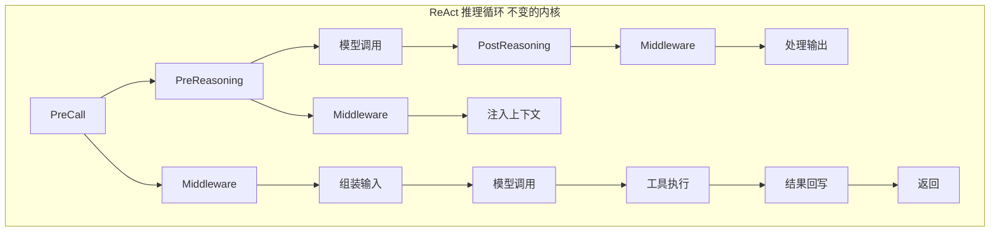
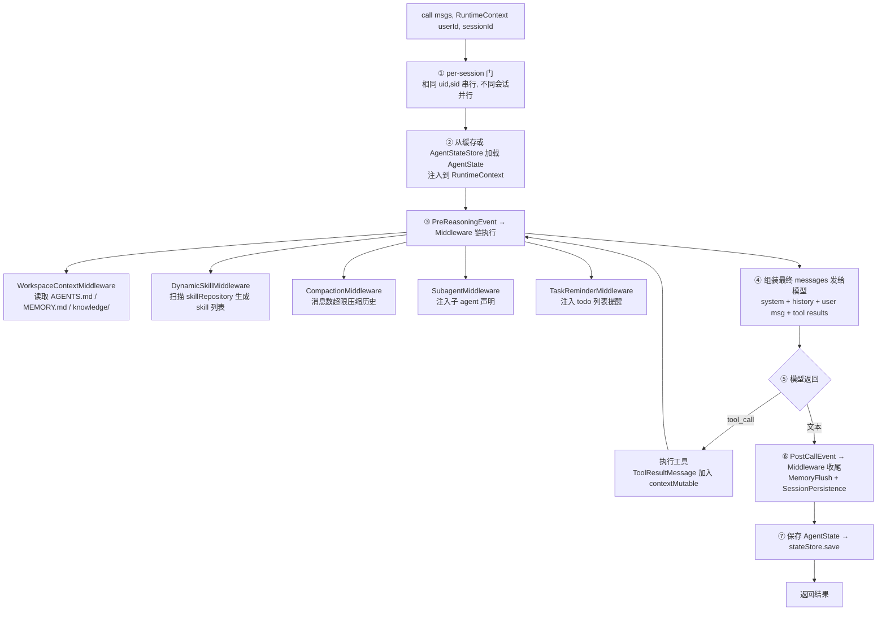
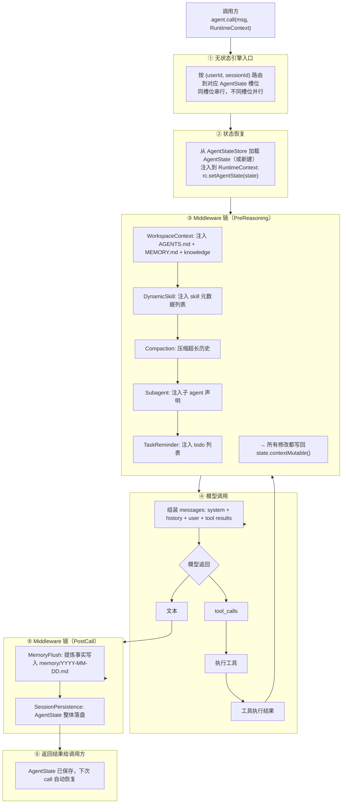

💠

- 1. [AgentScope](#agentscope)
- 2. [基础组件](#基础组件)
    - 2.1. [消息 事件](#消息-事件)
    - 2.2. [Model](#model)
    - 2.3. [权限系统](#权限系统)
    - 2.4. [Middleware](#middleware)
    - 2.5. [Tool](#tool)
    - 2.6. [AgentState](#agentstate)
- 3. [ReAct](#react)
    - 3.1. [Context](#context)
    - 3.2. [声明周期管理](#声明周期管理)
    - 3.3. [结构化输出](#结构化输出)
    - 3.4. [模型容错](#模型容错)
- 4. [Harness Agent](#harness-agent)
    - 4.1. [Skill](#skill)
    - 4.2. [SubAgent](#subagent)
    - 4.3. [Plan Mode](#plan-mode)

💠 2026-07-15 11:52:56
****************************************
# AgentScope

一个稳定的 ReAct 内核 + 一套灵活的 Middleware 插槽 + 一个统一的状态管理层, Plan Mode、Subagent、Skill、Memory 等所有高级能力，都是在这个根基上"组装"出来的

ReAct + Context + Middleware + State



> Middleware 链（可插拔能力层）

WorkspaceContextMiddleware  → 注入 AGENTS.md  
DynamicSkillMiddleware      → 注入 skill 列表  
CompactionMiddleware        → 上下文压缩  
PlanModeMiddleware          → Plan Mode 权限控制  
MemoryFlushMiddleware       → 长期记忆沉淀  
ToolResultEvictionMiddleware → 大工具结果卸载  
SubagentMiddleware          → 子 Agent 声明注入  
TaskReminderMiddleware      → todo 列表提醒  
... 自行扩展  

> AgentState（状态管理层）

contextMutable()      → 对话历史  
summary               → 压缩摘要  
planModeContext       → Plan Mode 状态  
permissionContext     → 权限规则  
tasksContext          → 任务清单  
toolContext           → 工具组激活状态  

> AgentStateStore（持久化层）

JsonFileAgentStateStore  → 单机开发  
RedisAgentStateStore     → 生产多副本  
MysqlAgentStateStore     → 审计报表  

# 基础组件
## 消息 事件
> 如果站在用户角度： 输入消息，输出事件

> [消息与事件 - AgentScope Java](https://java.agentscope.io/v2/zh/docs/building-blocks/message-and-event.html)  

> [AG-UI 协议集成 - AgentScope Java](https://java.agentscope.io/v1/zh/docs/task/agui.html)  

## Model
> 模型层采用两层结构：上层是 Credential（io.agentscope.core.credential），承载某个提供商的 API 鉴权字段；下层是 Chat Model，即在该凭证基础上对接的具体推理模型实现

## 权限系统
对工具行为拦截

## Middleware
中间件 扩展点

## Tool

## AgentState

`AgentState`（`io.agentscope.core.state.AgentState`）是 agent 当前"瞬时"运行状态的**完整快照**：

| `AgentState` 字段 | 内容 |
|---|---|
| `getContext()` / `contextMutable()` | 当前对话历史（用户输入、assistant 回复、工具调用、工具结果）|
| `getSummary()` | 压缩后的摘要（如果开了压缩）|
| `getPermissionContext()` | 工具权限规则 |
| `getPlanModeContext()` | Plan Mode 状态 |
| `getTasksContext()` | `todo_write` 维护的任务清单 |
| `getToolContext()` | 工具组激活状态（`activatedGroups`）|

************************

# ReAct

## Context

- AgentState：上下文的唯一持久化载体
- RuntimeContext：「当前这一次调用」相关的瞬态数据：tenant / userId / request-id、DB 连接、审计 logger、特性开关，等等


> 一次 `call(msg, RuntimeContext)` 的上下文经历了**7个阶段**：



**关键协议约定**：
- **状态存储不在每条消息后落盘，而是在 call 结束 / shutdown 时整体写入**——对后端吞吐压力很低 
- **Middleware 就地改写 `state.contextMutable()`**——压缩、Plan、todo_write、权限调整都在改它 

> Workspace 注入：System Prompt 的组装协议

每次推理前，`WorkspaceContextHook`（v1）或 `WorkspaceContextMiddleware`（v2）会自动把工作区文件拼入 system prompt：

**注入内容（按优先级顺序）**：
1. **`AGENTS.md`** —— 人格与行为约定（必须）
2. **`MEMORY.md`** —— 精炼长期记忆（后台周期性维护）
3. **`knowledge/`** —— 领域知识文件
4. **`skills/*/SKILL.md`** —— 可用技能列表（只注入元数据，不注入全文）
5. **当日记忆流水账** —— `memory/YYYY-MM-DD.md`

**注入时机**：在 `PreReasoningEvent` 触发时，middleware 读取工作区文件内容，动态拼接到 system prompt 中。这意味着**每一轮推理都能看到最新的工作区状态**——Agent 刚写进 MEMORY.md 的新记忆，下一轮立刻生效 


> 多轮工具调用的上下文 自动流转：

```
第1轮: UserMessage("帮我查天气")
  → 模型思考 → 决定调用 tool: query_weather("北京")
  → 工具执行 → 返回 ToolResultMessage("北京晴，25°C")
  → 这个 ToolResultMessage 自动加入 AgentState.contextMutable()

第2轮: 模型看到 [UserMessage, AssistantMessage(tool_call), ToolResultMessage]
  → 继续思考 → 决定调用 tool: send_notification("天气晴好")
  → 工具执行 → 返回 ToolResultMessage("已发送")
  → 再次自动加入 contextMutable()

第3轮: 模型看到完整历史 + 新工具结果
  → 生成最终回复: "已为您查询北京天气并发送提醒"
```

**协议保证**：每轮 ReAct 循环中，模型的 `tool_calls` 和工具的 `tool_results` 会成对出现在 `AgentState.getContext()` 中，形成完整的推理-行动-观察链条

> **跨调用恢复**：第二次 `call()` 时，框架自动从 `AgentStateStore` 加载上一次的 `AgentState`，包括：
- 完整的对话历史（`getContext()`）
- 压缩摘要（`getSummary()`）
- 权限状态、Plan Mode 状态、任务列表等

这意味着**多轮对话的连续性由框架自动保证**，你只需要传相同的 `RuntimeContext.sessionId` 

## 声明周期管理
中断，恢复


## 结构化输出


## 模型容错

************************

# Harness Agent

HarnessAgent（以及底层的 ReActAgent）采用**无状态引擎**设计。Agent 实例本身只持有**不可变配置**（system prompt、model、toolkit、middleware 链）。

> 无状态组件的 三个共享状态对象
- 所有 per-session 的可变数据都放在 `AgentState` 里，以 `(userId, sessionId)` 为索引key，持久化对应 AgentStateStore
- 当次运行时 RuntimeContext
- 工作区 Workspace


**一个 HarnessAgent 实例服务全部用户**——不需要 agent-per-user 注册表
**不同 `(userId, sessionId)` 完全并行**；相同的自动串行（FIFO），保证对话一致性
**状态完全内部化**——调用方不需要直接管理 state 对象 




## Skill

Skill 分层渐进式加载: Skill 是**按需加载**的——不是一开始就全塞进去，而是 Agent 看到 skill 列表后，自己判断需要哪个，再主动加载。这解决了"skill 太多导致 context 爆炸"的问题 

> 当 Builder.build() 时 
1. 扫描所有 skill 来源（skillRepository） 
    - FileSystemSkillRepository: workspace/skills/ 
    - ClasspathSkillRepository: classpath 资源 
    - NacosSkillRepository: Nacos 配置中心 
2. 收集每个 skill 的 name / description / 路径 
3. 注册 load_skill 工具到 toolkit 
4. 组装 system prompt 片段：  "可用技能列表：[name1: desc1], [name2: desc2]" 

> Agent 运行时

1. System prompt 中只看到 skill 的元数据列表: （name + description，不占多少 token）
2. Agent 决定需要某个 skill 时 → 调用 load_skill_through_path(skillId)
3. 工具返回该 skill 的完整 SKILL.md 内容
4. 内容作为 ToolResultMessage 加入上下文
5. 同时激活该 skill 绑定的 tool group（如有）
6. Agent 按 skill 指令用已有工具执行

> 动态更新Skill
- [ ] DynamicSkillMiddleware 应用


## SubAgent
简单来说就是可以解耦的任务拆分出子Agent不干扰主Agent，并且没有和主Agent有很多上下文的依赖关系（存在状态复制传递成本）。

例如实现一个Agent： 搜索数据，审校逻辑关系，输出结果  
其中审校逻辑关系需要读取搜索数据做大量额外数据的校验，如果都交给主Agent 会引入大量无关上下文，导致主Agent指令漂移，而且这个环节只需要输出一个审校结果，不关注审校过程，这个环节就很适合拆出 子Agent

## Plan Mode
> [计划模式（Plan Mode） - AgentScope Java](https://java.agentscope.io/v2/zh/docs/harness/plan-mode.html)  

Plan Mode 的设计哲学是"同一个 Agent、*同一个上下文*、分阶段控制权限"，不是"不同阶段不同上下文"

Plan Mode 依附于 ReAct 循环运行，但不改变循环结构。它用 AgentState 上的一个标志位 + 一个中间件 PlanModeMiddleware + 一组专用工具：plan_enter、plan_write、plan_exit、todo_write

| 维度           | **Plan Mode**                           | **Subagent**                             |
| ------------ | --------------------------------------- | ---------------------------------------- |
| **进程模型**     | 单进程，同一个 Agent 实例                        | 独立进程/实例，独立的 ReAct 循环                     |
| **上下文关系**    | **共享**同一个 `AgentState.contextMutable()` | **隔离**，子 Agent 从零开始或带精简输入                |
| **系统提示词**    | 同一套（AGENTS.md + 工作区注入）                  | 独立 system prompt（`subagents/<id>.md` 定义） |
| **工具集**      | 同一套 toolkit，只是权限被过滤                     | 独立 toolkit，可自定义                          |
| **skill 加载** | 加载后留在主上下文                               | 加载后留在子上下文，不影响父 Agent                     |
| **持久化**      | 计划文件在 `workspace/plans/`                | 子 Agent 有自己的 session 状态                  |
| **适用场景**     | "先想后做"的**阶段控制**                         | "专人专事"的**任务委派**                          |
| **设计哲学**     | 同一个厨师，先读菜谱再开火                           | 主厨 vs 配菜师，各自独立工作                         |
