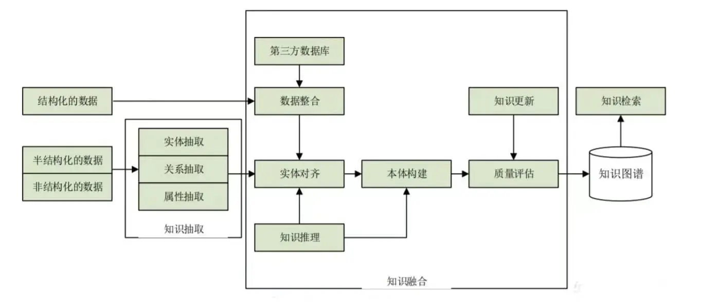

💠

- 1. [知识图谱](#知识图谱)
    - 1.1. [存储实现](#存储实现)
- 2. [案例实践项目](#案例实践项目)
    - 2.1. [医疗领域](#医疗领域)

💠 2026-07-08 16:02:50
****************************************
# 知识图谱
KnowledgeGraph 简称 KG

> [知识图谱 - 维基百科](https://zh.wikipedia.org/zh-cn/%E7%9F%A5%E8%AD%98%E5%9C%96%E8%AD%9C)  
> [知识图谱：关于知识图谱的理论、实践及思考](https://mp.weixin.qq.com/mp/appmsgalbum?__biz=MzAxMjc3MjkyMg==&action=getalbum&album_id=2016530030821998594&scene=126)  
> [事件图谱：关于事件、事理图谱的理论、实践及思考](https://mp.weixin.qq.com/mp/appmsgalbum?__biz=MzAxMjc3MjkyMg==&action=getalbum&album_id=2094954461629612036&scene=126)  
> [大模型RAG问答：关于知识增强的一些策略与范式](https://mp.weixin.qq.com/mp/appmsgalbum?__biz=MzAxMjc3MjkyMg==&action=getalbum&album_id=3276284267911856128&scene=173&subscene=227)  

> [WhyHow’s KG Studio Platform Beta for RAG Native Graphs | by Chia Jeng Yang | WhyHow.AI | Medium](https://medium.com/enterprise-rag/whyhow-ai-kg-studio-platform-beta-rag-native-graphs-1105e5a84ff2)  
> [The RAG Stack: Featuring Knowledge Graphs | by Chia Jeng Yang | WhyHow.AI | Medium](https://medium.com/enterprise-rag/understanding-the-knowledge-graph-rag-opportunity-694b61261a9c)  

> [知识图谱入门](https://klose911.github.io/html/ml/knowledge-graph/knowledge-graph.html)  

GraphRAG 2024 年中 Microsoft 发布，KG+LLM 最重要的整合

## 存储实现
> [Note: 图数据库](/Database/Graph.md)  

注意图谱的数据不一定只能用图数据库存储，只要能满足搜索要求都可以，ES Mongo等。

************************

# 案例实践项目

> [RomanGao/QAonMilitaryKG](https://github.com/RomanGao/QAonMilitaryKG)`MongoDB存储`  
> [liuhuanyong/ChainKnowledgeGraph: 上市公司图谱](https://github.com/liuhuanyong/ChainKnowledgeGraph?tab=readme-ov-file)  

## 医疗领域
> [Case Study: Turning Doctor Transcripts into Temporal Medical Record Knowledge Graphs](https://medium.com/enterprise-rag/case-study-turning-doctor-transcripts-into-temporal-medical-record-knowledge-graphs-cf624d4927eb)`解析病历数据入图数据库，自然语言提问，LLM+RAG回答`  
> [Medical Records Graph - WhyHow.AI](https://main--whyhowai.netlify.app/public/graph/673032011997e08c8849316c)`样例数据`  

[liuhuanyong/QASystemOnMedicalKG: 以疾病为中心的一定规模医药领域知识图谱](https://github.com/liuhuanyong/QASystemOnMedicalKG)`项目过于久远，依赖和环境有问题`  
[honeyandme/RAGQnASystem](https://github.com/honeyandme/RAGQnASystem)`改良版`  

> [GanjinZero/awesome_Chinese_medical_NLP: 中文医学NLP公开资源整理：术语集/语料库/词向量/预训练模型/知识图谱/命名实体识别/QA/信息抽取/模型/论文/etc](https://github.com/GanjinZero/awesome_Chinese_medical_NLP)  

