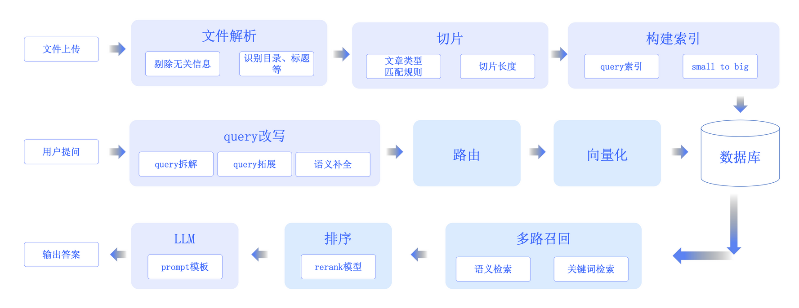

💠

- 1. [RAG](#rag)
    - 1.1. [Rag 评测](#rag-评测)
    - 1.2. [实践](#实践)
- 2. [难题](#难题)
    - 2.1. [无信息输入](#无信息输入)

💠 2025-07-21 20:20:05
****************************************
# RAG
> [[Large Language Models with Semantic Search] - 引言與關鍵字搜尋Keyword/lexical Search - HackMD](https://hackmd.io/@YungHuiHsu/rku-vjhZT)  

> [RAG预处理增强：让Fastgpt/Dify召回更多东西 - 53AI-AI知识库|大模型知识库|大模型训练|智能体开发](https://www.53ai.com/news/RAG/2024091558913.html)  
> [FlagOpen/FlagEmbedding: Retrieval and Retrieval-augmented LLMs](https://github.com/FlagOpen/FlagEmbedding)  
> [来自工业界的开源知识库 RAG 项目最全细节对比_开源rag知识库-CSDN博客](https://blog.csdn.net/hustyichi/article/details/140293940)  
> [大模型主流应用RAG的介绍——从架构到技术细节 | 我的学习笔记 | 土猛的员外](https://luxiangdong.com/2023/09/25/ragone/)  

> [如何在不微调的情况下提高 RAG 的准确性？ - 知乎](https://www.zhihu.com/question/638730143)  

> [基于大语言模型知识问答应用落地实践 – 知识库构建（上） | 亚马逊AWS官方博客](https://aws.amazon.com/cn/blogs/china/practice-of-knowledge-question-answering-application-based-on-llm-knowledge-base-construction-part-1/)  

> [InternLM/HuixiangDou: HuixiangDou: Overcoming Group Chat Scenarios with LLM-based Technical Assistance](https://github.com/InternLM/HuixiangDou?tab=readme-ov-file)  

> [基于大语言模型知识问答应用落地实践 – 知识库构建（上） | 亚马逊AWS官方博客](https://aws.amazon.com/cn/blogs/china/practice-of-knowledge-question-answering-application-based-on-llm-knowledge-base-construction-part-1/)  

> [检索增强生成：革命性技术还是过度承诺？_生成式 AI_InfoQ精选文章](https://www.infoq.cn/article/lvqs5lg7et17i3wxvtko)  
> [检索增强生成RAG（Retrieval-Augmented Generation）-阿里云Spring AI Alibaba官网官网](https://java2ai.com/docs/1.0.0-M5.1/tutorials/rag/)  

## Rag 评测
> [RAG 评测调研：框架、指标和方法 | EvalScope](https://evalscope.readthedocs.io/zh-cn/latest/blog/RAG/RAG_Evaluation.html)  

指标：召回率

## 实践

> [如何提升RAG知识库文档的召回准确率？ - 53AI-AI知识库|大模型知识库|大模型训练|智能体开发](https://www.53ai.com/news/RAG/2025031330416.html)  

1. 自然语言或文件 -> 解析 -> 拆分 -> embedding 入库
2. 召回内容 -> 拆解，拓展，语义补全，多轮改写 -> 搜索/向量匹配 -> rerank

- RAG之前先做query分类
- chunking方法很重要
- 选择支持混合检索的向量数据库(语义检索+关键词检索)
- 用文档检索文档能提升召回效果
- 文档重排效果显著
- 如果召回量很大，记得先摘要再生成
- 微调时混合相关和无关文档可以提升生成效果

> [RAG最佳实践 - 知乎](https://zhuanlan.zhihu.com/p/5834624096)  
> [Searching for Best Practices in Retrieval-Augmented Generation](https://arxiv.org/pdf/2407.01219)  

[RAG 全流程](https://waytoagi.feishu.cn/wiki/QBssw7z4oiGS40kDlltcjozBnxc)

# 难题
## 无信息输入
> 例如：给定了体检报告，然后用户提问：解读下这个报告。这句话在R阶段找不到有效的信息 模糊性太大
