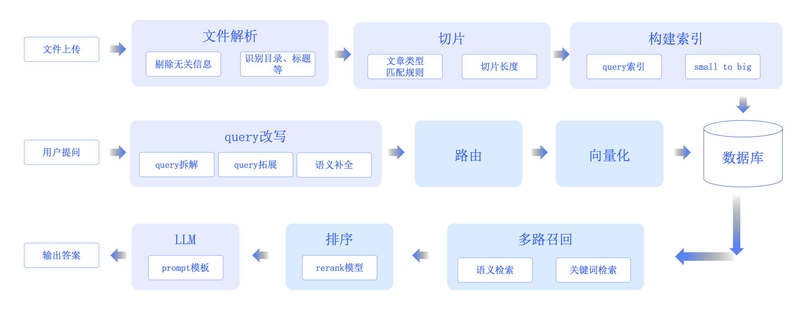

💠

- 1. [RAG](#rag)
    - 1.1. [Rag 评测](#rag-评测)
    - 1.2. [实践](#实践)
        - 1.2.1. [FastGPT](#fastgpt)
        - 1.2.2. [Dify](#dify)
- 2. [RAG 范式演进 (2024-2025)](#rag-范式演进-2024-2025)
    - 2.1. [GraphRAG](#graphrag)
    - 2.2. [Agentic RAG](#agentic-rag)
    - 2.3. [ColBERT 迟交互检索](#colbert-迟交互检索)
    - 2.4. [长上下文模型对 RAG 的冲击](#长上下文模型对-rag-的冲击)
- 3. [业务领域](#业务领域)
- 4. [难题](#难题)
    - 4.1. [用户无有效信息输入](#用户无有效信息输入)
    - 4.2. [专业性太强](#专业性太强)

💠 2026-07-08 16:02:50
****************************************
# RAG
> [[Large Language Models with Semantic Search] - 引言與關鍵字搜尋Keyword/lexical Search - HackMD](https://hackmd.io/@YungHuiHsu/rku-vjhZT)  

> [RAG预处理增强：让Fastgpt/Dify召回更多东西 - 53AI-AI知识库|大模型知识库|大模型训练|智能体开发](https://www.53ai.com/news/RAG/2024091558913.html)  
> [FlagOpen/FlagEmbedding: Retrieval and Retrieval-augmented LLMs](https://github.com/FlagOpen/FlagEmbedding)  
> [来自工业界的开源知识库 RAG 项目最全细节对比_开源rag知识库-CSDN博客](https://blog.csdn.net/hustyichi/article/details/140293940)  
> [大模型主流应用RAG的介绍——从架构到技术细节 | 我的学习笔记 | 土猛的员外](https://luxiangdong.com/2023/09/25/ragone/)  

> [如何在不微调的情况下提高 RAG 的准确性？ - 知乎](https://www.zhihu.com/question/638730143)  

> [基于大语言模型知识问答应用落地实践 – 知识库构建（上） | 亚马逊AWS官方博客](https://aws.amazon.com/cn/blogs/china/practice-of-knowledge-question-answering-application-based-on-llm-knowledge-base-construction-part-1/)  

> [InternLM/HuixiangDou: HuixiangDou: Overcoming Group Chat Scenarios with LLM-based Technical Assistance](https://github.com/InternLM/HuixiangDou?tab=readme-ov-file)  

> [基于大语言模型知识问答应用落地实践 – 知识库构建（上） | 亚马逊AWS官方博客](https://aws.amazon.com/cn/blogs/china/practice-of-knowledge-question-answering-application-based-on-llm-knowledge-base-construction-part-1/)  

> [检索增强生成：革命性技术还是过度承诺？_生成式 AI_InfoQ精选文章](https://www.infoq.cn/article/lvqs5lg7et17i3wxvtko)  
> [检索增强生成RAG（Retrieval-Augmented Generation）-阿里云Spring AI Alibaba官网官网](https://java2ai.com/docs/1.0.0-M5.1/tutorials/rag/)  

## Rag 评测
> [RAG 评测调研：框架、指标和方法 | EvalScope](https://evalscope.readthedocs.io/zh-cn/latest/blog/RAG/RAG_Evaluation.html)  

> “推荐”其实就是没有检索词输入时的搜索

> [推荐策略中的“召回”](https://www.woshipm.com/pd/2051274.html)  
> [精确率 召回](https://refusea.com/?p=1546)  

如果有 1000 邮件需要检测，算法检测出有 800 垃圾邮件，实际这 800 里真正的垃圾邮件是 600，同时算法还遗漏了 50 垃圾邮件。那么召回率和精确率是多少？怎么计算的？

在这个例子中，我们可以先定义以下几个概念：

    真正例（True Positive，TP）：算法正确地预测为垃圾邮件的邮件数量，即600封。
    假正例（False Positive，FP）：算法错误地预测为垃圾邮件的邮件数量，即800（算法预测为垃圾邮件的数量）- 600（真正的垃圾邮件数量）= 200封。
    假反例（False Negative，FN）：算法错误地预测为非垃圾邮件的邮件数量，即遗漏的垃圾邮件数量，即50封。

根据这些定义，我们可以计算召回率和精确率：

    召回率（Recall）= 真正例 / (真正例 + 假反例) = 600 / (600 + 50) = 0.923，或者说92.3%。
    精确率（Precision）= 真正例 / (真正例 + 假正例) = 600 / (600 + 200) = 0.75，或者说75%。

所以，这个垃圾邮件检测算法的召回率是92.3%，精确率是75%。

## 实践

> [如何提升RAG知识库文档的召回准确率？ - 53AI-AI知识库|大模型知识库|大模型训练|智能体开发](https://www.53ai.com/news/RAG/2025031330416.html)  

> 完整流程： 召回内容 -> 拆解，拓展，语义补全，多轮改写 -> 检索 -> rerank

- 检索方式： 全文搜索/规则处理/向量匹配
- 向量库搭建流程： 自然语言或文件 -> 解析 -> 拆分 -> embedding 入库

- RAG之前先做query分类
- chunking方法很重要
- 选择支持混合检索的向量数据库(语义检索+全文检索)
- 用文档检索文档能提升召回效果
- 文档重排效果显著
    - 重排的输入需要做截断。 RAG 系统优化的核心——“截断策略（Cut-off Strategy）”和“模型原理”。
- 如果召回量很大，记得先摘要再生成
- 微调时混合相关和无关文档可以提升生成效果

> [RAG最佳实践 - 知乎](https://zhuanlan.zhihu.com/p/5834624096)  
> [Searching for Best Practices in Retrieval-Augmented Generation](https://arxiv.org/pdf/2407.01219)  
> [RAG 全流程](https://waytoagi.feishu.cn/wiki/QBssw7z4oiGS40kDlltcjozBnxc)  

### FastGPT
> [知识库基础原理介绍](https://doc.fastgpt.cn/docs/introduction/guide/knowledge_base/RAG)  

使用PG实现向量存储，文档存储在MongoDB，可以二开增加全文检索（ES）

- 入库：规则切分段落，大模型理解生成QA对，QA对
- 向量化： 选择和更换对应模型，更换需要重新索引入向量库
- 召回：向量，全文，混合检索（可以单独设置 全文和向量的阈值）

### Dify

混合检索时，只能调节全文和向量的占比权重，无法单独设置阈值，只能设置统一阈值

************************

# RAG 范式演进 (2024-2025)

## GraphRAG

> 传统 RAG 在单文档事实检索上表现良好，但面对多跳推理（multi-hop）、全局摘要、跨实体关联等需要理解知识全局结构的任务时能力不足。GraphRAG 将知识图谱引入 RAG 管线，用图结构显式建模实体间的语义关系。

> [Welcome to GraphRAG](https://microsoft.github.io/graphrag/)
> [GraphRAG 详细介绍](https://www.microsoft.com/en-us/research/project/graphrag/)  
> [From Local to Global: A Graph RAG Approach to Query-Focused Summarization](https://arxiv.org/abs/2404.16130)

**核心流程：**
- 源文档 → 实体/关系抽取（LLM）→ 构建知识图谱（节点=实体，边=关系+描述）
- 图社区检测（Leiden 算法）→ 社区摘要生成（LLM 对每个社区生成描述性摘要）
- 检索模式：
    - **局部检索（Local Search）**：从实体出发，沿边扩散，适合"某实体相关的问题"
    - **全局检索（Global Search）**：遍历社区摘要 map-reduce，适合"整个数据集的宏观问题"
- 对比传统 RAG：多跳推理精度显著提升，但构建成本高（LLM 调用量大），适合知识密集型、跨文档推理场景

## Agentic RAG

> 传统 RAG 是"检索 → 生成"的单次管线，一旦检索结果不够好就直接影响最终答案。Agentic RAG 将 Agent 范式引入，赋予系统多步规划、工具调用、自反思验证的能力，形成闭环迭代。

**代表性工作：**
- **Self-RAG**（2024）：LLM 生成时通过特殊 token（`<Retrieve>` / `<Critique>`）自主决定何时检索，并对检索结果和生成内容进行多维度打分（相关性、支持度、有用性），按分数择优输出
    > [Self-RAG: Learning to Retrieve, Generate, and Critique through Self-Reflection](https://arxiv.org/abs/2310.11511)
- **Corrective RAG（CRAG）**：引入检索质量评估器，检索结果差时触发 Web 搜索或知识图谱补充；通过"检索→评估→纠正→生成"的闭环纠正错误，减少幻觉
    > [Corrective Retrieval Augmented Generation](https://arxiv.org/abs/2401.15884)
- **ReAct / Tool-use RAG**：Agent 自主规划子问题、按需调用检索+计算+API，多轮迭代直至收集足够信息，显著提升复杂多步任务的准确率

**核心变化：**
- 从 **"检索一次"** → **"什么时候检索、在哪检索、检索什么"由 Agent 动态决策**
- 从 **"直接生成"** → **"检索→验证→补充→生成"，引入反思和质量门控**

## ColBERT 迟交互检索

> 传统双塔模型将 query 和 document 各压缩为单一向量，点积计算相似度，速度快但损失 token 级语义交互；Cross-encoder 将 query-document 拼接后全注意力计算，精度高但无法预先索引，成本不可接受。ColBERT 的迟交互（Late Interaction）在两者之间取得平衡。

> [ColBERT: Efficient and Effective Passage Search via Contextualized Late Interaction over BERT](https://arxiv.org/abs/2004.12832)
> [ColBERT v2](https://arxiv.org/abs/2112.01488)  
> [RAGatouille: ColBERT 在 RAG 中的实践](https://github.com/AnswerDotAI/RAGatouille)

**核心机制：**
- **"早"交互**：Cross-encoder，query-document 全拼接注意力 → 精度最高但无法预索引
- **"无"交互**：双塔（Bi-encoder），query/doc 各自压缩为单向量 → 速度快但丢失细粒度语义
- **"迟"交互**：ColBERT 对 query 和 document 分别编码为**多向量**（每个 token 一个向量），索引时存储 document 的所有 token 向量，检索时用 query 每个 token 向量与 document token 向量做 MaxSim 求和
    - $\text{Score}_{q, d} = \sum_{i \in q} \max_{j \in d} (E_q[i] \cdot E_d[j])$

**在 RAG 中的定位：**
- 检索质量接近 Cross-encoder，但可以在 GPU 上高效索引和检索（ColBERTv2 配合 PLAID 引擎）
- 特别适合需要**精确匹配、多义项消歧**的检索场景
- 实践中可用于替代 embedding + rerank 的两段式管线，在检索阶段直接获得接近 rerank 的精度

## 长上下文模型对 RAG 的冲击

> 2024-2025 年，Gemini 1.5 Pro（1M tokens）、GPT-4 Turbo（128K）、Claude 3（200K）等长上下文模型广泛落地，"直接把所有文档塞进 prompt"成为技术上可行的替代方案。这是否意味着 RAG 不再需要？

**长上下文模型的优势：**
- 短文档/小规模知识库场景下，直接将全部文档放入上下文，省略检索/索引/分块的全部工程开销
- 避免了检索失败导致的信息遗漏，模型能看到"完整画面"
- 对于对话历史、长文档理解等天然长上下文的任务极为契合

**RAG 仍然不可替代的场景：**
- **信息密度 vs 上下文长度**：当知识库规模远超上下文窗口（TB 级企业知识库），必须用检索做粗筛
- **"大海捞针"（Needle in a Haystack）**：长上下文模型在中间位置的信息召回率仍会下降（lost-in-the-middle），精准检索仍然是关键
- **成本与延迟**：100K+ token 的推理成本和首 token 延迟显著高于"检索 → 少量上下文 → 生成"的流水线
- **引用溯源和幻觉治理**：RAG 提供明确的检索来源（chunk 级引用），可审计、可追溯，纯长上下文的归因可信度更难保障

**2024-2025 年新范式：长上下文 + RAG 融合**
- 长上下文**没有消灭 RAG，而是重新定义了 RAG 的角色**：从"记忆补全"变为"精准定位"，检索更多上下文给长窗口模型做综合推理
- Hybrid 趋势：RAG 负责从海量数据中"找出最相关的 N 个段落"，长上下文模型负责在更大的检索结果集合上做深度理解和多跳推理
- 不再纠结 chunk size 必须小于 512/1024 token —— 每个检索结果可以更大、更完整
- 关键问题从"怎么把有限的上下文用好"变成"怎么从海量数据中精准召回最有价值的内容"

> [Can Long-Context Language Models Subsume Retrieval, RAG, SQL, and More?](https://arxiv.org/abs/2406.13121)  
> [Retrieval Augmented Generation or Long-Context LLMs?](https://arxiv.org/abs/2407.16833)

************************

# 业务领域
在医疗/科研领域的 RAG 系统中，**语义相关性（Semantic Relevance）**只是基础，**时效性（Recency）和权威性（Authority）**对于答案的质量至关重要。

************************

# 难题
## 用户无有效信息输入
> 例如：没有对话前文时，给定了体检报告文件，然后用户提问：解读下这个报告。

- 这句话在R阶段找不到任何有效的信息 模糊性太大，即使做改写也没有方向可以调整,导致G阶段出现幻觉
    - 考虑：改写阶段 结合任何可以利用的特异信息（用户档案，地域，报告元数据：类别，疾病）
    - 考虑：报告预处理精简为一段，R阶段无有用信息时，也能将精简信息给到G阶段

## 专业性太强
