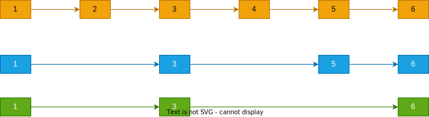

💠

- 1. [线性表](#线性表)
    - 1.1. [顺序表](#顺序表)
    - 1.2. [链表](#链表)
        - 1.2.1. [跳表](#跳表)

💠 2024-03-30 11:43:28
****************************************
# 线性表

## 顺序表
数组 内存连续

## 链表

### 跳表
> [参考: 跳表SkipList ](http://www.cnblogs.com/xuqiang/archive/2011/05/22/2053516.html)  
> [Skip lists: a probabilistic alternative to balanced trees](https://www.epaperpress.com/sortsearch/download/skiplist.pdf)

有序链表变化而来, 在部分节点上存储跨越了多个节点距离的节点指针(索引)

> 例如: 同节点不同的跨度,可以理解为不同的索引层   

优势: 
- 结构简单，操作成本低, Redis中Zset有使用到

劣势: 
- 更新时,节点会随机成为多层索引节点, 指针修改成本高, 索引层是一个不稳定的数据结构
- 不适合做磁盘层索引，对IO不友好，存储太零散没法批量读，所以MySQL索引会选用B+

