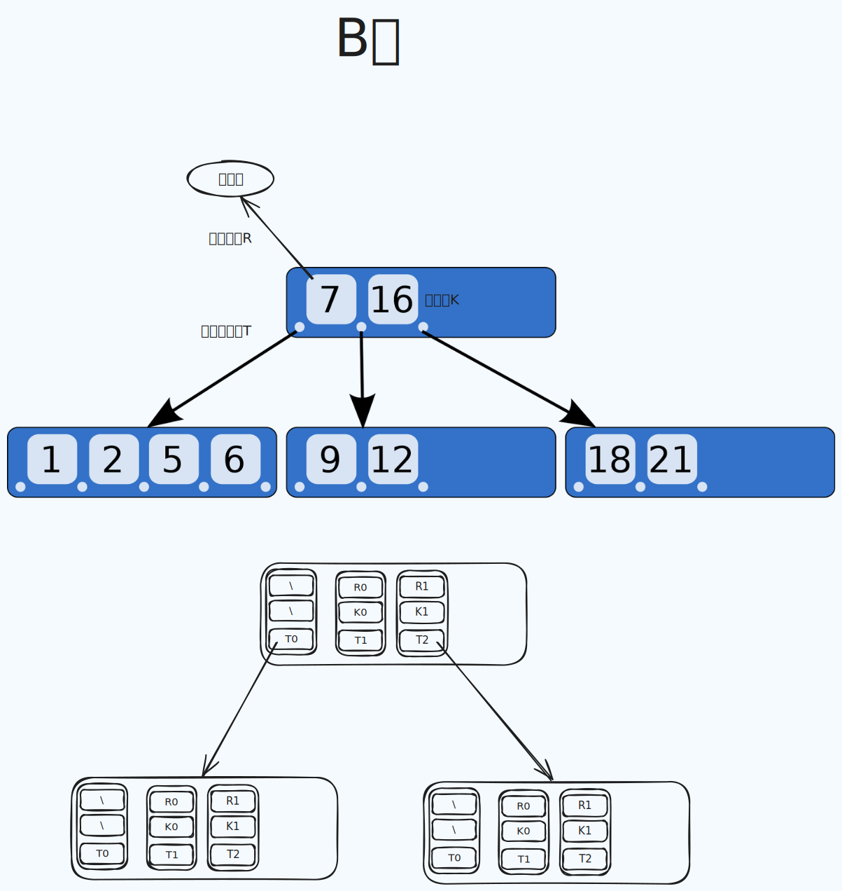

💠

1. [树](#树)
   1. [二叉树](#二叉树)
   2. [二叉搜索树](#二叉搜索树)
   3. [AVL树](#avl树)
   4. [红黑树](#红黑树)
   5. [多叉树](#多叉树)
   6. [BTree](#btree)
   7. [B+Tree](#b+tree)

💠 2023-10-03 20:23

---

# 树

- [一文搞懂二叉搜索树、B树、B+树、AVL树、红黑树](https://zhuanlan.zhihu.com/p/258078863)

树是一种特殊的无环连通图

## 二叉树

## 二叉搜索树

AVL,红黑树都是基于二叉搜索树做了不同的限制而来

特点

- 任意节点左子树不为空,则左子树的值均小于根节点的值.
- 任意节点右子树不为空,则右子树的值均大于于根节点的值.
- 任意节点的左右子树也分别是二叉查找树.
- 没有键值相等的节点.

在查找数据时, 最优情况是 O(logn) 最坏是O(n) 即树退化成了链表

## AVL树
> 平衡二叉搜索树

最早提出的平衡树, 应用不甚广泛, Windows对进程地址空间的管理有使用到 AVL 树

特点：
- 二叉搜索树的前提增加平衡性条件约束：任意节点的左子树和右子树的高度差小于2

## 红黑树

> 对称二叉 B 树

平衡二叉树, 广泛使用在各种语言的基本容器中, Java 的 TreeSet TreeMap  HashMap, C++ 的 map set

红黑树具有以下5种性质：

1. 节点是红色或黑色。
2. 根节点是黑色。
3. 每个叶节点（NIL节点，空节点）是黑色的。
4. 每个红色节点的两个子节点都是黑色。(从每个叶子到根的所有路径上不能有两个连续的红色节点)
5. 从任一节点到其每个叶子的所有路径都包含相同数目的黑色节点。

红黑树的时间复杂度为O(log n)，与树的高度成正比。
红黑树每次的插入、删除操作都需要做平衡，平衡时有可能会改变根节点的位置，颜色转换，左旋，右旋等。

## 多叉树

每个节点下可以有多个子节点, 实际上二叉树是多叉树的特例(子节点只有两个)

- 多叉树转二叉树： 左节点是孩子节点 右节点是兄弟节点

## BTree
- [B Tree](https://en.wikipedia.org/wiki/B-tree)

用在磁盘文件索引和数据库索引等

## B+Tree
> [B+ tree](https://en.wikipedia.org/wiki/B%2B_tree)

