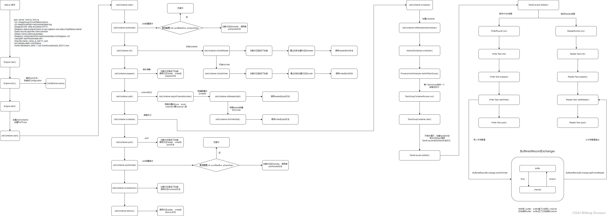

💠

- 1. [Data Integration](#data-integration)
- 2. [Datax](#datax)
    - 2.1. [使用](#使用)
        - 2.1.1. [Tips](#tips)
    - 2.2. [设计](#设计)
    - 2.3. [组件](#组件)
        - 2.3.1. [Reader](#reader)
        - 2.3.2. [Writer](#writer)
- 3. [SeaTunnel](#seatunnel)
- 4. [FlinkX ChunJun](#flinkx-chunjun)
- 5. [Flink CDC](#flink-cdc)
- 6. [Kettle](#kettle)

💠 2024-10-08 11:23:38
****************************************
# Data Integration
数据集成

# Datax
> [Github](https://github.com/alibaba/DataX)  阿里云DataWorks的开源版 | [HashData](https://github.com/HashDataInc/DataX/) 增加了插件支持

> **注意** 这是一次性的开源项目，bug基本需要自己处理，从代码行数提交情况和issue，PR的活跃情况可以看出
- [Clickhouse reader writer](https://github.com/alibaba/DataX/pull/264)
- [Kafka writer](https://github.com/alibaba/DataX/pull/1856)

离线数据同步框架， 扩展读/写 Plugin 以支持多种数据源。  
核心框架负责处理流控，缓存，并发，自定义的[数据转换Transformer](https://github.com/alibaba/DataX/blob/master/transformer/doc/transformer.md)等。

- 特性
    - 轻量： 一份JSON配置启动一个Java进程
    - 支持线程级并发同步，按指定分批字段拆分数据 **限制分批字段整型或字符串**
    - 运行时定期展示流量，行数等进度信息
    - 支持脏数据探测，failfast
    - 支持流控策略配置 字节数，行数
- 限制
    - 不支持实时增量，离线增量需要手动调整JSON配置实现
    - 单进程模式，无法集群式同步，资源利用不够高(单任务在做好读端和写端的优化话是可以打满网卡的)

## 使用
> [使用手册](https://github.com/alibaba/DataX/blob/master/userGuid.md)


### Tips
- 配置的json文件要`严格按照案例JSON来配置`，因为他不是按对象解析是按无结构json来**顺序遍历字段**去解析的
    - 踩过一个坑就是writer部分在reader部分前面，然后驱动加载出问题了，查看对应源码和jvm的加载类发现是有的，很隐蔽的报错，完全想不到是json配置顺序问题。

> [为什么不建议使用DataX读写GreenPlum](https://www.modb.pro/db/52542) 不建议用 postgresqlwriter,可以用 [HashData DataX](https://github.com/HashDataInc/DataX) 的 gpdbwriter 插件替代  
> 打包指定模块 mvn clean package -DskipTests assembly:assembly -pl plugin-rdbms-util -am

************************

## 设计
> [DataX 3.0 源码解析一](https://www.cnblogs.com/yaozhenfa/p/13840134.html)  | [DataX核心源码流程](https://blog.csdn.net/ooeeerrtt/article/details/123779721)



- Job 管理子任务： JobContainer 和 TaskGroupContainer
    - Reader将全部数据拆分成若干任务，在TaskGroupContainer中消费完(包含错误重试，并发限制，超时提示)
- Task 执行读写： TaskGroupContainer.TaskExecutor 
    - readerThread writerThread 实现多线程的生产者消费者模型 通过 Communication 通信
    - 读写线程的逻辑实现为 ReaderRunner 和 WriterRunner

## 组件
### Reader
- table模式： 只配置源表的 column，不灵活（需要源表对目标表字段名和类型一致）但支持并发。
- querySQL模式：配置源表查询SQL，可以join，别名，函数计算。更灵活但是**不支持并发**，同步性能差

> 并行同步： 通过splitPk:拆分字段`只支持Long，字符串` 和 speed.channel: 并发数 去拆分上游数据
- `SingleTableSplitUtil#genPKSql`
    - 查询出 分片字段在上游表的最小和最大值，确认拆分的边界
- `SingleTableSplitUtil#splitSingleTable`
	- 参数 expectSliceNumber 的来源于Datax.json的直接指定和 限速channel，限速速率等取较小值。
	- 由于拆分是按ascii实现（先将字符串按ascii转为超大整数BigInteger，做完分段拆分后将若干段的边界值（超大整数）转回ascii字符），这个方式是有风险的 问题如下。 
- `TaskGroupContainer#start` 拆分出的若干SQL，包装为 TaskExecutor 绑定读写线程后启动 
    - 依据前文拆分的若干分片SQL，while true 顺序遍历依据限制的并发值启动线程执行, 并对失败任务重试
    - 注意绑定的读写线程都通过设置线程对象的 setContextClassLoader 来实现对各种插件的加载，且和Datax主JVM进程的类加载器隔离
    - 每条SQL均是游标查询方式 CommonRdbmsReader.Task#startRead `ResultSet query(Connection conn, String sql, int fetchSize)`

- 问题
    1. 超大整数转ascii字符时，转出了单引号但是未转义，然后直接拼到SQL里，导致SQL语法错误。
    1. 分段后数据范围有交叉导致同步的数据量大于上游数据总量，是概率性出现问题，因为这个字符转int的做法导致了字符的边界互相影响了，范围SQL产生了交集:
        - 从ascii码来计算的完整切分分段，在GP执行时会有问题，因为GP的字符串比较方式并不是严格按照字符ascii的值
        - [Comparison Functions and Operators](https://www.postgresql.org/docs/current/functions-comparison.html)
        ```java
        int channel = 5;
        List<String> result = List<String> result = RdbmsRangeSplitWrap.splitAndWrap("P010", "P024", channel * 5, "prodcode", "'", DataBaseType.PostgreSQL);
        // 按Datax逻辑来说分段有26段，其中有4段的条件都命中了 P010 的数据， 导致了P010这个部分的数据重复了。
        // 例如这两段SQL： 在GP里面 select 'P010' > 'P01<'; 返回为True
        // 'P01<' <= prodcode AND prodcode < 'P01B'
        // 'P010' <= prodcode AND prodcode < 'P016'

        List<String> result = RdbmsRangeSplitWrap.splitAndWrap("2016-02-06", "2024-05-06", 4, "period", "'", DataBaseType.PostgreSQL);
        // 结果的数组中有元素的字面值包含了控制字符 \r. 将生成的SQL去查数据库没有问题，拆分的四段只有13段能查出数据 24段数据为空
        ```
- 扩展
    - 特定优化思路：将拆分列查出全部的去重值 构造出分批in的SQL。 优点：将以该列的数据分布情况并发同步，贴合数据的业务特点。缺点：如果该列的去重值非常多，SQL会超长。

### Writer
- CommonRdbmsWriter.Task#startWriteWithConnection **模板类** 消费Reader的数据 批量写入目标库
    - 错误重试机制 相关配置项为 `core.container.task.failOver`
        - 当一个批次遇到任意SQLException时，都会将这个批次的数据做事务回滚，逐条事务写入（估计是为了规避事务死锁）
        - 但是这个机制*没有考虑下游数据源不支持事务*的情况，此时这个机制就引发下游出现重复数据了。

> 两个参数，任一条件满足就执行一次insert
- batchSize 默认2048
- batchByteSize 默认32mib 
	- 该参数值需要谨慎设置，此大小是每个Task都需要的缓存区大小，如果设置过大，会发生OOM
	- 例如设置堆内存1G 5并发 该值200Mib时，刚开始同步就会触发OOM，因为堆内存不够，没有留空间给datax自身

************************

# SeaTunnel
> [Github](https://github.com/apache/seatunnel) | [关于 SeaTunnel](https://seatunnel.apache.org/zh-CN/docs/about)  

> [首个国人主导的开源数据集成工具：揭秘 Apache 顶级项目 SeaTunnel 背后的故事](https://36kr.com/p/2311155472330244)

使用 Spark、Flink 作为底层数据同步引擎使其具备分布式执行能力，开放并完善的插件体系和API集成。  
核心流程为 Source -> Transform -> Sink 。 Source 和 Sink 统称为Connector 负责读写数据库， Transform负责数据转换：别名映射，函数处理过滤。  

这个架构设计将读和转换分离了，就没有Datax的两个模式所面临的问题，既支持读数据时做别名，也支持并发。

************************

> [并行读取](https://seatunnel.apache.org/zh-CN/docs/connector-v2/source/Jdbc#parallel-reader) 支持 数值，字符串，日期 类型字段
- 生成拆分列逻辑  ChunkSplitter#generateSplits 字符串类型字段采用的是hash后取模方式 ` JdbcDialect#hashModForField` pg,oracle,mssql。
- 执行数据拆分 FixedChunkSplitter#createSplitStatement

************************

# FlinkX ChunJun
> [Github](https://github.com/DTStack/chunjun)  

# Flink CDC
> [Github](https://github.com/apache/flink-cdc)  


************************

# Kettle
> [Github](https://github.com/pentaho/pentaho-kettle)  
> [web kettle](https://github.com/JoeyBling/webkettle)  

[kettle java源码 kettle源码分析](https://blog.51cto.com/u_16213668/8667940)

************************

> [Kettle大量数据快速导出的解决方案](https://www.cnblogs.com/47Gamer/p/13993373.html)`奇怪的是SpringBoot项目同样Fetch方式加流式Excel导出，整体导出效率低很多`
- 关联源码在 org.pentaho.di.trans.steps 下的 tableinput 和 excelwriter 包
