💠

- 1. [解决方案](#解决方案)
    - 1.1. [书籍](#书籍)
    - 1.2. [Topic](#topic)
- 2. [消息推送](#消息推送)
- 3. [用户体系](#用户体系)
    - 3.1. [账号安全认证体系](#账号安全认证体系)
- 4. [独立功能](#独立功能)
    - 4.1. [延迟消息](#延迟消息)

💠 2024-05-06 19:59:21
****************************************
# 解决方案
> 关于问题的解决方案

> [饿了么交易系统 5 年演化史 ](http://mp.weixin.qq.com/s?__biz=MzU4NzU0MDIzOQ==&mid=2247489228&idx=1&sn=9baeb5d2cfef853c80068ce8e830ccb2&chksm=fdeb24acca9cadba8ab2055243a97a13b561ee4b3ab0ffba1ab2c8fa7caeae2de0f13b80213e&mpshare=1&scene=1&srcid=&sharer_sharetime=1587047061042&sharer_shareid=246c4b52c1cb45eaa580c985c95107f3#rd)

## 书籍
淘宝技术这十年
亿级流量网站架构核心技术

## Topic
1. 完整设计一个支持数十亿规模的用户系统
1. 如何设计一个支持千万设备推送的消息系统
1. 简单实现一个消息中间件保证消息不重复不丢失
1. 如何设计供应链正逆向系统
1. 如何设计财务对账系统

************************

# 消息推送
站内信： [站内信设计思路之己见（基于上百万用户）](http://www.cnblogs.com/x-xk/archive/2012/11/17/2770935.html)

************************
# 用户体系

## 账号安全认证体系
> [被脱裤也不怕 - 反馈总结](https://blog.coderzh.com/2016/01/13/password-security-additional/)

************************
# 独立功能
## 延迟消息
> [ 手把手实现一条延时消息 ](https://www.cnblogs.com/crossoverJie/p/11605814.html)

