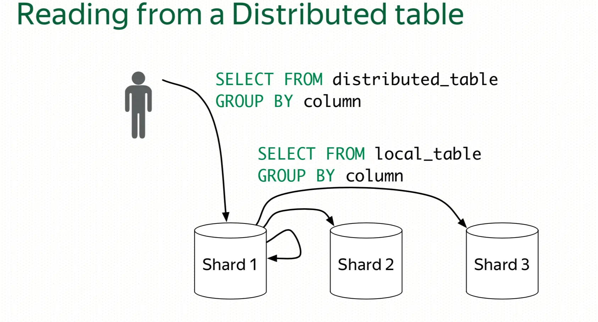
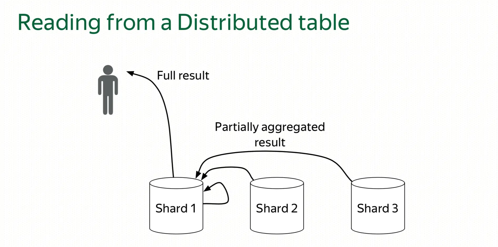

💠

- 1. [Clickhouse](#clickhouse)
    - 1.1. [安装](#安装)
    - 1.2. [数据类型](#数据类型)
        - 1.2.1. [bitmap](#bitmap)
        - 1.2.2. [Decimal](#decimal)
    - 1.3. [聚合函数](#聚合函数)
- 2. [数据库引擎](#数据库引擎)
- 3. [表引擎](#表引擎)
    - 3.1. [MergeTree 引擎家族](#mergetree-引擎家族)
    - 3.2. [分布式表引擎 Distributed](#分布式表引擎-distributed)
- 4. [表](#表)
    - 4.1. [分区表](#分区表)
- 5. [客户端](#客户端)
    - 5.1. [Java](#java)
- 6. [Explain](#explain)
- 7. [Tips](#tips)

💠 2024-10-17 10:43:43
****************************************
# Clickhouse 
> [Official Site](https://clickhouse.com)  

> [What is ClickHouse? ](https://medium.com/doublecloud-insights/what-is-clickhouse-a-comprehensive-guide-for-getting-started-5aae9afd38b0)

- 关联开源项目： Sentry [clickvisual](https://github.com/clickvisual/clickvisual)

************************
## 安装
> [Docker compose 安装](https://github.com/ClickHouse/examples/blob/main/docker-compose-recipes/README.md)  
> [Clickhouse cluster built with docker-compose.](https://github.com/tetafro/clickhouse-cluster)  

> 例如以下配置为 两个分片，每个分片两个副本
```xml
    <?xml version="1.0" encoding="UTF-8"?>
    <yandex>
        <clickhouse_remote_servers>
            <default_cluster>
                <shard>
                    <internal_replication>false</internal_replication>
                    <replica>
                        <host>10.0.3.27</host>
                        <port>9000</port>
                    </replica>
                    <replica>
                        <host>10.0.3.41</host>
                        <port>9000</port>
                    </replica>
                </shard>
                <shard>
                    <internal_replication>true</internal_replication>
                    <replica>
                        <host>10.0.3.46</host>
                        <port>9000</port>
                    </replica>
                    <replica>
                        <host>10.0.3.26</host>
                        <port>9000</port>
                    </replica>
                </shard>
            </default_cluster>
        </clickhouse_remote_servers>
        <zookeeper-servers>
            <node>
                <host>10.0.3.12</host>
                <port>2181</port>
            </node>
            <node>
                <host>10.0.3.3</host>
                <port>2181</port>
            </node>
            <node>
                <host>10.0.3.23</host>
                <port>2181</port>
            </node>
        </zookeeper-servers>
    </yandex>
```

************************

## 数据类型
> [ClickHouse Data Types](https://clickhouse.com/docs/en/sql-reference/data-types)

注意Ck中建表时字段类型默认是非Null的，和常见的业务数据库MySQL等相反，支持Null数据需要显式指定，例如： Nullable(Int)

### bitmap
> 并没有这个类型定义，只是在使用时由数据存储方式存在，类似于Redis的bitmap。

位图对象有两种构造方法。一个是由聚合函数groupBitmapState构造的，另一个是由Array Object构造的。同时还可以将位图对象转化为数组对象`bitmapToArray()`。

[Roaring bitmaps](https://github.com/RoaringBitmap/CRoaring)  
[BitMap及其在ClickHouse中的应用](https://zhuanlan.zhihu.com/p/480345952)`CK针对数据的分布情况做了一些优化`  

### Decimal
> [Data TypesDecimal](https://clickhouse.com/docs/en/sql-reference/data-types/decimal)

| min | max | type |
|:---|:---|:---|
|  1 | 9  | Decimal32  |
| 10 | 18 | Decimal64  |
| 19 | 38 | Decimal128 |
| 39 | 76 | Decimal256 |

> Tips
- [cast as decimal is very slow](https://github.com/ClickHouse/ClickHouse/issues/30542) `Decimal128 256 相较于 64和32 有较大的性能差距，可以用其中SQL做测试`
    - `SELECT sum(CAST(number + 1., 'Decimal(17, 1)'))　FROM numbers(100000000);` 自建的CK集群内看到128耗时是64的三倍 **实际情况实际分析，仅供参考**
    - 因为从Decimal128类型开始CK都要模拟计算来提高精度，CPU成本更大
    - CK22.3.5.5版本上 `ROUND(cast(AVG(ifNull(sale_amount, 0)) AS Decimal(76,38)), 4)` Round会不起作用，计算结果仍是很长的小数位

> `SELECT sumWithOverflow(CAST(number + 1., 'Decimal(3, 1)')) as res , toTypeName(res)　FROM numbers(1000000);`
- 在做sum计算时，表的源字段大小不够时会自动增长类型， 但是如果使用 sumWithOverflow 就不会扩大类型，因此计算结果也是错误的

************************

## 聚合函数
> [List of Aggregate Functions](https://clickhouse.com/docs/en/sql-reference/aggregate-functions/reference)

- 注意avg函数固定返回Float64类型，需要按数据要求做类型转换处理规避后续计算的精度损失问题

************************

# 数据库引擎
- Atomic
- MySQL 关联远程库表
- MaterializedMySQL 原生实现MySQL引擎 支持从MySQL全量及增量实时同步
- Lazy
- PostgreSQL 关联远程库表
- MaterializedPostgreSQL 原生实现PG引擎
- Replicated
- SQLite

# 表引擎
> [doc: Table Engines](https://clickhouse.com/docs/en/engines/table-engines)

分为：MT家族，外部表（集成）引擎，日志引擎，特殊引擎（Distributed，File,URL,Memory等等）

## MergeTree 引擎家族


## 分布式表引擎 Distributed
> [doc: distributed](https://clickhouse.com/docs/en/engines/table-engines/special/distributed)  

这种表不存储数据，可以当作关联的表的一层代理，实现并行查询和数据写入分发.

查询Distributed表引擎的过程是： 先查接收请求节点本地的表（和当前节点同分片下的Replication副本节点**不会接收到查询的请求**），对剩余全部分片发送请求（分片中的一个随机副本），然后再聚合各个分片返回的数据，最后返回最终结果。




```sql
    -- 查看复制表数量
    select database,count(*) cnt
            ,sum(case when engine ='ReplicatedMergeTree' then 1 else 0 end) cnt_rmt
    from clusterAllReplicas('default_cluster', 'system.tables')
    group by database order by count(*) desc

    -- 查看复制表明细
    select name ,engine, hostname(), metadata_modification_time, total_rows, total_bytes
    from clusterAllReplicas('default_cluster', 'system.tables')
    where database = 'db' and engine = 'ReplicatedMergeTree';
```
************************

> [ClickHouse案例：查询结果不一致](https://cloud.tencent.com/developer/article/1748216)  
> 注意 设置有副本的集群，分布式表都需要关联副本表 Replicated MergeTree 作为数据表，如果使用普通的MT表引擎，会导致查询和写入都会遇到奇怪的问题。
- 写入： 会有部分节点上没有数据，但是全部节点的数据总量是对的
- 查询： 一条SQL每次查询的结果都不一样（各个分片内随机选择副本再合并查询结果而导致的）

************************
# 表
> [doc: create table](https://clickhouse.com/docs/en/sql-reference/statements/create/table)

## 分区表
> [What is the actual use of partitions in clickhouse?](https://stackoverflow.com/questions/75439190/what-is-the-actual-use-of-partitions-in-clickhouse)`数据有明显的分区特征（例如时间序列数据），按分区做TTL，查询时通常不会跨多个分区，分区数在100以内（分区很多时很影响读写性能）`  

************************

# 客户端
> [snuba](https://github.com/getsentry/snuba)`Sentry开发， CK的一个查询层`

## Java
> [Connecting ClickHouse to external data sources with JDBC](https://clickhouse.com/docs/en/integrations/jdbc/jdbc-with-clickhouse)  
> JDBC的驱动实现是通过HTTP协议和Clickhouse通信 [Github: clickhouse-java](https://github.com/ClickHouse/clickhouse-java)`com.clickhouse.client.internal.apache.hc.client5.http.impl.io.DefaultManagedHttpClientConnection`  

低版本驱动没有实现负载均衡，需要在数据节点前加一层 [chproxy](https://github.com/ContentSquare/chproxy), 但是实际上也可以自己实现负载均衡算法(例如：依据某个时间窗口内所有节点的负载，连接等情况来选择合适的节点)

```java
        Properties properties = new Properties();
        properties.setProperty("socket_keepalive", "true"); //socket_timeout时间由系统设置
        properties.setProperty("auto_discovery", "true"); // 节点自动发现
        properties.setProperty("load_balancing_policy", "roundRobin"); // 负载均衡
        properties.setProperty("health_check_interval", "1000"); // 健康检查间隔(以毫秒为单位)
        properties.setProperty("health_check_query", "select 1"); // 健康检查语句
        properties.setProperty("node_check_interval", "1000"); // 节点检查间隔(以毫秒为单位)
        properties.setProperty("failover", "2"); // 发生故障转移最大次数
        properties.setProperty("retry", "2"); // 故障重试最大次数

        // 客户端负载均衡的方式
        String url = "jdbc:clickhouse://h1:p1,h2:p2,h3:p3,h4:p4/default?socket_timeout=6000000";
        ClickHouseDataSource dataSource = new ClickHouseDataSource(url, properties)
```

> 实践：
- 出现 `The target server failed to respond code: 1002` 报错 
    - [Validate stale connection to fix the bug: failed to respond](https://github.com/ClickHouse/clickhouse-java/pull/760)`增加活跃连接校验逻辑，降低客户端获取到关闭连接的概率`
    - [BatchUpdateException during inserts with jdbc driver](https://github.com/ClickHouse/clickhouse-java/issues/1444) `驱动作者认为： 关键点在于边界值，如果客户端设置的和服务端一样或者更大，就会出现客户端认为连接未超时可复用，但是服务端认为超时于是就关闭了连接`
    - JDBC URL优化 socketTimeout参数 （ck0.6.0默认是30s）, **应明显小于服务端**的 tcp_keep_alive_timeout （ms）值， `select * from system.settings where name like '%keep%';`
    - JDBC 驱动版本低， 从0.2.4 升级到0.6.0后问题出现概率小很多 因为 [host failed to respond](https://github.com/ClickHouse/clickhouse-java/issues/452) 0.2.5 主动获取了服务端设置值
    - 注意socketTimeout参数同样作用于查询时间，如果SQL执行时间大于该值会报错 read timeout [http read timeout 30](https://github.com/ClickHouse/clickhouse-java/issues/159)

- [驱动内错误码定义](https://github.com/ClickHouse/ClickHouse/blob/master/src/Common/ErrorCodes.cpp)
    - 注意CK驱动从0.3左右开始，ClickHouseException不继承SQLException

************************

# Explain 
> [Clickhouse: Explain](https://clickhouse.com/docs/en/sql-reference/statements/explain)  
> [Using Explain to analyze and improve Clickhouse queries performance](https://medium.com/datadenys/using-explain-to-analyze-and-improve-clickhouse-queries-performance-23dbcdf55a97)  

相比于MySQL的Explain，CK设计Explain能查看更多维度的指标

JSON格式查看 `EXPLAIN json = 1, indexes = 1 SQL`
- 关注最内层的Indexes结构里的 **Initial Parts** 全部块 **Selected Parts** 读取的块 **Initial Granules** 全部粒度 **Selected Granules** 读取的粒度。 
- 读取的指标越小越好，因此表要基于使用情况设计好分区利于查询效率

************************

# Tips

- 合理使用排序键让数据均匀分片，避免数据倾斜导致集群计算时出现短板效应
- 数据大量查询导入导出时
    - [ClickHouse SQL基本语法和导入导出实战](https://cloud.tencent.com/developer/article/1979184)
    - 导出时需要注意传统的 limit offset 会导致结果集 重复和丢失，追加 order by 子句可以降低发生概率，但是排序字段不唯一的话还是会有可能出现重复或丢失的问题。

- 多表关联 如果能确认范围过滤的数据只会从一个表返回可以避免join来过滤, 转用in, 避免分布式的做数据复制，导致资源消耗放大
- Global 优化 join 和in 避免读放大

> BUG
- [22.3.5.5](https://github.com/ClickHouse/ClickHouse/releases/tag/v22.3.5.5-lts)版本上 使用 UNION ALL 连接 A 和 B两段SQL时，CK偶现出现B段SQL没有正确的groupby聚合（有些数据没有聚合），导致整体执行结果条目数变多，非期望数据

