💠

- 1. [Redis底层数据结构](#redis底层数据结构)
    - 1.1. [SDS](#sds)
        - 1.1.1. [Redis存储数值的方式](#redis存储数值的方式)
    - 1.2. [链表](#链表)
        - 1.2.1. [源码实现](#源码实现)
        - 1.2.2. [实现特点](#实现特点)
        - 1.2.3. [Redis中的使用场景](#redis中的使用场景)
    - 1.3. [字典](#字典)
        - 1.3.1. [源码实现](#源码实现)
        - 1.3.2. [实现特点](#实现特点)
        - 1.3.3. [Redis中的使用场景](#redis中的使用场景)
    - 1.4. [跳表](#跳表)
    - 1.5. [整数集合](#整数集合)
        - 1.5.1. [源码实现](#源码实现)
        - 1.5.2. [实现特点](#实现特点)
        - 1.5.3. [升级过程示例](#升级过程示例)
        - 1.5.4. [Redis中的使用场景](#redis中的使用场景)
    - 1.6. [压缩列表](#压缩列表)
        - 1.6.1. [源码实现](#源码实现)
        - 1.6.2. [节点结构（entry）](#节点结构entry)
        - 1.6.3. [实现特点](#实现特点)
        - 1.6.4. [Redis中的使用场景](#redis中的使用场景)
    - 1.7. [对象](#对象)
        - 1.7.1. [源码实现](#源码实现)
        - 1.7.2. [对象类型（type）](#对象类型type)
        - 1.7.3. [编码方式（encoding）](#编码方式encoding)
            - 1.7.3.1. [String对象的编码](#string对象的编码)
            - 1.7.3.2. [List对象的编码](#list对象的编码)
            - 1.7.3.3. [Set对象的编码](#set对象的编码)
            - 1.7.3.4. [Zset对象的编码](#zset对象的编码)
            - 1.7.3.5. [Hash对象的编码](#hash对象的编码)
        - 1.7.4. [多态实现](#多态实现)
        - 1.7.5. [内存管理](#内存管理)
        - 1.7.6. [Redis中的使用场景](#redis中的使用场景)
        - 1.7.7. [编码选择策略](#编码选择策略)
- 2. [Redis常用命令](#redis常用命令)
    - 2.1. [过期](#过期)
    - 2.2. [事务](#事务)
    - 2.3. [ACL](#acl)
    - 2.4. [服务器](#服务器)
- 3. [数据安全和性能](#数据安全和性能)
    - 3.1. [Latency](#latency)
    - 3.2. [big key](#big-key)
    - 3.3. [hot key](#hot-key)
    - 3.4. [Key eviction](#key-eviction)
- 4. [Lua](#lua)
    - 4.1. [FUNCTION](#function)
    - 4.2. [应用](#应用)
- 5. [Tip](#tip)
    - 5.1. [禁用 O(N) 命令](#禁用-on-命令)
    - 5.2. [错误分析](#错误分析)
- 6. [部署方式](#部署方式)
    - 6.1. [Run Configuration](#run-configuration)
    - 6.2. [单机](#单机)
    - 6.3. [主从](#主从)
    - 6.4. [哨兵](#哨兵)
    - 6.5. [Cluster 集群](#cluster-集群)
- 7. [Redis 持久化](#redis-持久化)
- 8. [命令实现原理](#命令实现原理)
    - 8.1. [Scan](#scan)

💠 2026-01-16 15:35:48
****************************************
# Redis底层数据结构
## SDS
> 简单动态字符串 [sds: Simple Dynamic Strings](https://github.com/antirez/sds)

### Redis存储数值的方式

以下场景展示了在Java客户端 set不同值时的存储差异：

```
0           00110000                    (1字节: 0x30 = ASCII '0')
(short 0)   0011000001010011            (2字节: 0x30 0x53 = "0S")
0L          0011000001001100            (2字节: 0x30 0x4C = "0L")
""          0010001000100010            (2字节: 0x22 0x22 = 两个双引号)
new byte[0] 011110000010011100100111    (3字节: 0x78 0x30 0x30 = "x00")
```

为什么存储长度不同？

**核心原因：Redis的String类型存储的是字节序列，而不是Java的数据类型**

1. **`0` (1字节)**
   - 存储的是字符 `'0'` 的ASCII码 (0x30)
   - 如果作为整数存储，Redis会使用**整数编码（int编码）**，占用更少空间
   - 但如果作为字符串字面量 `"0"` 存储，就是1个字节

2. **`(short 0)` (2字节)**
   - 存储的是字符串 `"0S"` (0x30 '0' + 0x53 'S')
   - 这不是Java的short类型，而是**字符串字面量**，包含类型后缀字符
   - Redis无法识别这是数值类型，只能作为普通字符串存储

3. **`0L` (2字节)**
   - 存储的是字符串 `"0L"` (0x30 '0' + 0x4C 'L')
   - 包含Java的long类型后缀 `L`，Redis将其作为字符串存储
   - 比纯数字 `0` 多1个字节（类型后缀字符）

4. **`""` (2字节)**
   - 存储的是两个双引号字符 `""` (0x22 0x22)
   - 这是空字符串的引号表示，不是真正的空字符串
   - 真正的空字符串在Redis中只占用SDS头部信息

5. **`new byte[0]` (3字节)**
   - 存储的是字符串 `"x00"` (0x78 'x' + 0x30 '0' + 0x30 '0')
   - 这是Java代码的字符串表示，不是实际的byte数组
   - 包含了完整的字符串内容，所以最长

Redis的编码优化

Redis会对String类型进行编码优化：

- **int编码**：当值可以表示为整数且在范围内（-2^63 到 2^63-1）时，使用整数编码，只占用8字节（存储long值）
- **embstr编码**：短字符串（≤44字节）使用embstr，字符串和SDS结构连续存储
- **raw编码**：长字符串使用raw编码，SDS结构单独分配

**关键点：**
- Redis存储的是**字符串的字节表示**，不是Java的数据类型
- 如果字符串包含非数字字符（如 `L`、`S`、`x`），Redis无法识别为数值，只能作为字符串存储
- 要使用Redis的整数编码优化，需要存储纯数字字符串（如 `"0"`），而不是带类型后缀的字符串（如 `"0L"`）

> 参考：
> - [Redis String编码](https://redis.io/docs/data-types/strings/)

## 链表

Redis使用**双向链表（adlist）**作为底层数据结构。

### 源码实现

```C
// 链表节点
typedef struct listNode {
    struct listNode *prev;  // 前置节点
    struct listNode *next;  // 后置节点
    void *value;            // 节点值（void* 支持存储任意类型）
} listNode;

// 链表结构
typedef struct list {
    listNode *head;         // 表头节点
    listNode *tail;         // 表尾节点
    unsigned long len;      // 链表长度
    void *(*dup)(void *ptr);           // 节点值复制函数
    void (*free)(void *ptr);           // 节点值释放函数
    int (*match)(void *ptr, void *key); // 节点值对比函数
} list;
```

### 实现特点

1. **双向链表**：每个节点都有prev和next指针，支持双向遍历
2. **无环**：表头节点的prev和表尾节点的next都指向NULL
3. **带表头表尾指针**：O(1)时间复杂度访问头尾节点
4. **带长度计数器**：O(1)时间复杂度获取链表长度
5. **多态**：使用void*保存节点值，可以保存不同类型的值

### Redis中的使用场景

1. **List类型**（元素较多时）
   - 当List的元素数量较多或元素较大时，使用链表作为底层实现
   - 支持LPUSH、RPUSH、LPOP、RPOP等操作
   - 小列表会使用压缩列表（ziplist）优化

2. **发布订阅（Pub/Sub）**
   - 维护订阅某个频道的客户端列表
   - 使用链表存储订阅者信息

3. **慢查询日志**
   - 使用链表保存慢查询日志记录

4. **监视器（Monitor）**
   - 保存所有监视Redis命令执行的客户端

5. **其他内部用途**
   - 保存多个数据库的键空间
   - 保存客户端输出缓冲区

## 字典

Redis使用**哈希表（dict）**作为字典的底层实现，类似于Java的HashMap。

### 源码实现

```C
// 哈希表节点（键值对）
typedef struct dictEntry {
    void *key;              // 键
    union {
        void *val;          // 值（可以是各种类型）
        uint64_t u64;
        int64_t s64;
        double d;
    } v;
    struct dictEntry *next; // 指向下一个节点（解决哈希冲突，使用链地址法）
} dictEntry;

// 哈希表
typedef struct dictht {
    dictEntry **table;      // 哈希表数组
    unsigned long size;     // 哈希表大小（桶的数量）
    unsigned long sizemask; // 哈希表大小掩码，用于计算索引值（size-1）
    unsigned long used;     // 已有节点数量
} dictht;

// 字典
typedef struct dict {
    dictType *type;         // 类型特定函数（用于多态）
    void *privdata;         // 私有数据
    dictht ht[2];          // 两个哈希表，用于渐进式rehash
    long rehashidx;        // rehash索引，-1表示未进行rehash
    int16_t pauserehash;   // rehash暂停标志
} dict;
```

### 实现特点

1. **链地址法解决冲突**：使用链表连接哈希值相同的键值对
2. **渐进式rehash**：
   - 使用两个哈希表（ht[0]和ht[1]）
   - 在rehash过程中，新数据写入ht[1]，查询时同时查找两个表
   - 逐步将ht[0]的数据迁移到ht[1]
   - 避免一次性rehash造成服务阻塞
3. **哈希表扩容**：当负载因子（used/size）≥1时触发扩容，新大小为第一个≥used*2的2的幂
4. **哈希表收缩**：当负载因子<0.1时触发收缩

### Redis中的使用场景

1. **Hash类型**
   - Hash类型的底层实现
   - 存储字段-值的映射关系

2. **Set类型**（元素较多时）
   - 当Set元素较多时，使用字典存储
   - 字典的键就是Set的元素，值为NULL
   - 小集合使用整数集合（intset）优化

3. **Zset类型**（元素较多时）
   - 使用字典存储member到score的映射
   - 配合跳表实现有序集合
   - 小有序集合使用压缩列表优化

4. **数据库的键空间（keyspace）**
   - Redis数据库本身就是一个字典
   - 键空间存储所有数据库的键值对
   - 键是数据库的键，值是数据库的值对象

5. **过期键字典**
   - 存储所有设置了过期时间的键及其过期时间
   - 键是数据库的键，值是过期时间戳

6. **其他内部用途**
   - 保存客户端状态
   - 保存命令表（command table）
   - 保存Lua脚本的缓存


## 跳表
> [跳表基础](/Skills/CS/DS/LinearList.md)

> [Redis设计与实现: 跳跃表的实现](http://redisbook.com/preview/skiplist/datastruct.html)

Redis 的跳跃表由 redis.h/zskiplistNode 和 redis.h/zskiplist 两个结构定义， 其中 zskiplistNode 结构用于表示跳跃表节点  
而 zskiplist 结构则用于保存跳跃表节点的相关信息， 比如节点的数量， 以及指向表头节点和表尾节点的指针 等等。

```C
    typedef struct zskiplistNode 
    {
        // 后退指针
        struct zskiplistNode *backward;
        // 分值
        double score;
        // 成员对象
        robj *obj;

        // 层
        struct zskiplistLevel {
            // 前进指针
            struct zskiplistNode *forward;
            // 跨度
            unsigned int span;
        } level[];
    } zskiplistNode;
```
## 整数集合

整数集合（intset）是Set类型的底层实现之一，用于存储**有序、无重复的整数集合**。

### 源码实现

```C
// 整数集合
typedef struct intset {
    uint32_t encoding;  // 编码方式：INTSET_ENC_INT16/INT32/INT64
    uint32_t length;    // 集合包含的元素数量
    int8_t contents[];  // 保存元素的数组（按值的大小有序排列，无重复）
} intset;
```

### 实现特点

1. **有序存储**：contents数组中的元素按值的大小有序排列
2. **无重复**：集合中不存在重复的元素
3. **动态编码升级**：
   - 初始编码为`INTSET_ENC_INT16`（16位整数）
   - 当添加的元素超出当前编码范围时，自动升级编码
   - 升级过程：INT16 → INT32 → INT64
   - **升级后不支持降级**，即使删除大元素也不会降级
4. **二分查找**：由于有序，查找操作使用二分查找，时间复杂度O(log n)

### 升级过程示例

```C
// 初始：INTSET_ENC_INT16，存储 [1, 2, 3]
// 添加 32768（超出int16范围）
// 1. 分配新空间（每个元素从2字节扩展到4字节）
// 2. 将原有元素转换为新编码并重新排列
// 3. 添加新元素
// 结果：INTSET_ENC_INT32，存储 [1, 2, 3, 32768]
```

### Redis中的使用场景

1. **Set类型**（元素较少且都是整数时）
   - 当Set满足以下条件时使用intset：
     - 所有元素都是整数
     - 元素数量不超过`set-max-intset-entries`配置（默认512）
   - 不满足条件时转换为字典（dict）实现

2. **优势**
   - 内存效率高：整数直接存储，不需要额外的指针和对象头
   - 查找效率高：有序数组+二分查找

3. **限制**
   - 只能存储整数
   - 元素数量有限制
   - 升级后不支持降级，可能造成空间浪费

## 压缩列表

压缩列表（ziplist）是Redis为了**节省内存**而设计的顺序型数据结构，用于存储小规模的列表或哈希表。

### 源码实现

压缩列表是一块**连续的内存空间**，没有使用结构体，而是通过特殊编码实现：

```
<zlbytes> <zltail> <zllen> <entry> <entry> ... <entry> <zlend>
```

- **zlbytes**：uint32_t，整个压缩列表占用的内存字节数
- **zltail**：uint32_t，到达表尾节点的偏移量（用于快速定位尾节点）
- **zllen**：uint16_t，节点数量（当值<65535时有效，否则需要遍历）
- **entry**：列表节点，长度可变
- **zlend**：uint8_t，特殊值0xFF，标记压缩列表的末端

### 节点结构（entry）

每个节点由三部分组成：

```
<prevlen> <encoding> <data>
```

- **prevlen**：前一个节点的长度（用于反向遍历）
  - 如果前一个节点长度<254字节，使用1字节
  - 否则使用5字节（第一个字节为0xFE，后4字节存储长度）
- **encoding**：编码方式，记录节点的数据类型和长度
  - 1字节、2字节、5字节的整数
  - 字符串（1字节、2字节、5字节长度前缀）
- **data**：节点的实际数据

### 实现特点

1. **内存连续**：所有数据存储在一块连续内存中，减少内存碎片
2. **变长编码**：根据数据大小选择最合适的编码方式
3. **连锁更新**：插入或删除节点可能导致后续节点的prevlen字段需要更新
   - 最坏情况下时间复杂度O(n²)
   - 但实际场景中很少发生，因为需要连续多个节点长度在250-253字节之间

### Redis中的使用场景

1. **List类型**（元素较少且较小时）
   - 当List满足以下条件时使用ziplist：
     - 所有字符串元素长度<`list-max-ziplist-value`（默认64字节）
     - 元素数量<`list-max-ziplist-entries`（默认512）
   - 不满足条件时转换为双向链表（linkedlist）实现

2. **Hash类型**（字段较少且较小时）
   - 当Hash满足以下条件时使用ziplist：
     - 所有键值对的键和值长度<`hash-max-ziplist-value`（默认64字节）
     - 键值对数量<`hash-max-ziplist-entries`（默认512）
   - 不满足条件时转换为字典（dict）实现

3. **Zset类型**（元素较少且较小时）
   - 当Zset满足以下条件时使用ziplist：
     - 所有元素长度<`zset-max-ziplist-value`（默认64字节）
     - 元素数量<`zset-max-ziplist-entries`（默认128）
   - 不满足条件时转换为跳表+字典实现

4. **优势**
   - 内存占用小：紧凑存储，无额外指针开销
   - 适合小数据：小列表/哈希表的内存效率高

5. **劣势**
   - 查找效率低：需要遍历，时间复杂度O(n)
   - 修改效率低：插入/删除可能触发连锁更新

## 对象

Redis使用**对象系统**来统一管理不同的数据类型，所有键值对的值都是对象（robj）。

### 源码实现

```C
// Redis对象
typedef struct redisObject {
    unsigned type:4;        // 对象类型（4位）：STRING, LIST, SET, ZSET, HASH等
    unsigned encoding:4;    // 编码方式（4位）：int, embstr, raw, ziplist, linkedlist等
    unsigned lru:LRU_BITS; // LRU时间戳或LFU计数器（用于内存淘汰）
    int refcount;           // 引用计数（用于内存回收）
    void *ptr;              // 指向底层数据结构的指针
} robj;
```

### 对象类型（type）

- **REDIS_STRING**：字符串对象
- **REDIS_LIST**：列表对象
- **REDIS_SET**：集合对象
- **REDIS_ZSET**：有序集合对象
- **REDIS_HASH**：哈希对象

### 编码方式（encoding）

不同对象类型可以使用不同的编码方式：

#### String对象的编码

1. **int编码**：整数值，直接存储在ptr中（ptr不再是指针，而是整数值）
2. **embstr编码**：短字符串（≤44字节），SDS和redisObject连续存储
3. **raw编码**：长字符串，SDS单独分配内存

#### List对象的编码

1. **ziplist编码**：压缩列表实现（小列表）
2. **linkedlist编码**：双向链表实现（大列表）
3. **quicklist编码**（Redis 3.2+）：双向链表+压缩列表的组合

#### Set对象的编码

1. **intset编码**：整数集合实现（小集合，且都是整数）
2. **hashtable编码**：字典实现（大集合或包含非整数）

#### Zset对象的编码

1. **ziplist编码**：压缩列表实现（小有序集合）
2. **skiplist编码**：跳表+字典实现（大有序集合）
   - 跳表：按score排序，支持范围查询
   - 字典：member到score的映射，O(1)查找score

#### Hash对象的编码

1. **ziplist编码**：压缩列表实现（小哈希表）
2. **hashtable编码**：字典实现（大哈希表）

### 多态实现

通过type和encoding的组合，Redis实现了多态：

```C
// 同一个命令可以处理不同类型的对象
// 例如：DEL命令可以删除任何类型的对象
void delCommand(redisClient *c) {
    delGenericCommand(c, server.lazyfree_lazy_user_del);
}
```

### 内存管理

1. **引用计数**：通过refcount实现对象共享和内存回收
   - 创建对象时refcount=1
   - 对象被引用时refcount++
   - 对象不再被引用时refcount--
   - refcount=0时释放对象

2. **LRU/LFU**：通过lru字段实现内存淘汰策略
   - LRU：记录最后访问时间
   - LFU：记录访问频率

### Redis中的使用场景

1. **所有键值对的值都是对象**
   - 数据库的键空间存储的是`robj*`指针
   - 所有命令操作的都是对象

2. **编码转换**
   - 根据数据大小和类型自动选择最优编码
   - 数据变化时可能触发编码转换（如ziplist→linkedlist）

3. **对象共享**
   - 0-9999的整数对象会被共享（refcount>1）
   - 减少内存占用

4. **类型检查**
   - 通过type字段检查对象类型
   - 命令执行前会检查类型是否匹配

### 编码选择策略

Redis会根据数据特征自动选择最优编码：

- **小数据**：优先使用内存紧凑的编码（ziplist、intset、embstr）
- **大数据**：优先使用性能更好的编码（linkedlist、hashtable、skiplist、raw）
- **动态转换**：数据变化时自动转换编码


************************

# Redis常用命令
> [Commands | Docs](https://redis.io/docs/latest/commands/)  


- 关闭数据库 `shutdown` 该命令会在关闭数据库前保存数据
- 保存内存中数据到文件 `save`
- 认证 `auth 口令` 
- 测试联通性 `ping` 连接成功会返回pong

- 模糊删除 
    - 删除 2 数据库中`detail-2018-07-0*`模式的数据: `./redis-cli -p 6666 -n 2 keys "detail-2018-07-0*" | xargs  ./redis-cli -p 6666 -n 2 del`

> [redis-stat](https://github.com/junegunn/redis-stat)

## 过期
- `expire key seconds` 设置键的过期时间
- `PTTL/TTL key ` 查看键剩余过期时间（生存时间） ms/s
    -  -1 表示永久 -2 表示没有该key

## 事务

- `DISCARD` 取消事务，放弃执行事务块内的所有命令。
- `EXEC`
    - 执行所有事务块内的命令。假如某个(或某些) key 正处于 WATCH 命令的监视之下，且事务块中有和这个(或这些) key 相关的命令，
    - 那么 EXEC 命令只在这个(或这些) key 没有被其他命令所改动的情况下执行并生效，否则该事务被打断(abort)。
- `MULTI` 标记一个事务块的开始。事务块内的多条命令会按照先后顺序被放进一个队列当中，最后由 EXEC 命令原子性(atomic)地执行。
- `UNWATCH` 
    - 取消 WATCH 命令对所有 key 的监视。如果在执行 WATCH 命令之后， EXEC 命令或 DISCARD 命令先被执行了的话，那么就不需要再执行 UNWATCH 了。
    - 因为 EXEC 命令会执行事务，因此 WATCH 命令的效果已经产生了；而 DISCARD 命令在取消事务的同时也会取消所有对 key 的监视，因此这两个命令执行之后，就没有必要执行 UNWATCH 了。
- `WATCH key [key ...]`
    - 监视一个(或多个) key ，如果在事务执行之前这个(或这些) key 被其他命令所改动，那么事务将被打断。

## ACL
> [ACL | Docs](https://redis.io/docs/latest/operate/oss_and_stack/management/security/acl/)`Redis6开始支持用户权限控制`  

- ACL LIST
    - 新建的Redis能看到以下输出 `user default on nopass ~* +@all` 默认用户 无密码，操作所有key，拥有所有命令权限
- ACL SETUSER 新建和修改用户
    - 用户alice对cached前缀key只有get命令权限： ` ACL SETUSER alice on >p1pp0 ~cached:* +get `
    - cached前缀的key拥有全部命令权限：` ACL SETUSER alice on >p1pp0 ~cached:* +@all `
    - 注意在脚本使用方面 `+@all` 也不是全部权限，需要额外声明，例如Redisson中的锁使用到的命令 
        - `ACL SETUSER <your_username> on >password +@all ~* &* +@scripting +@pubsub +EVAL +EVALSHA +PUBLISH +SUBSCRIBE +SCRIPT|EXISTS +SCRIPT|LOAD +SCRIPT|FLUSH`
- ACL whoami 


## 服务器

- CLIENT  
- CONFIG 
- BGREWRITEAOF
- SAVE
- BGSAVE
- FLUSHALL
- FLUSHDB
- INFO
    - [参考: redis info 命令查看redis使用情况](https://blog.csdn.net/kexiaoling/article/details/51810919)
    - info stats 中 total_commands_processed 是实际请求, 还是说redis自己执行的命令 TODO 
- LASTSAVE
- [MONITOR](https://redis.io/docs/latest/commands/monitor/)
    - debug命令，可以将Redis执行的每一条指令都回传并输出，可以用来做Redis流量复制，注意对性能影响很大，生产慎用。
    - [Redis 流量复制、流量回放、流量镜像](http://www.kailing.pub/article/index/arcid/342.html)
- PSYNC
- SHUTDOWN
- SLAVEOF
- SLOWLOG
- SYNC
- TIME

************************

# 数据安全和性能
## Latency
缓存最重要的性能指标就是延迟，但是延迟会受到多项业务或功能影响。[Redis为什么变慢了？一文讲透如何排查Redis性能问题 ](https://mp.weixin.qq.com/s?__biz=Mzg4Nzc3NjkzOA==&mid=2247486198&idx=1&sn=e4b34ef7889bb95260e3a636662a7192&chksm=cf847933f8f3f025a1b00fc965781a33024158a4275ebaf2da393c403500a86d9c04af16ce40#rd)

- 60 秒内的最大响应延迟 `redis-cli -h 127.0.0.1 -p 6379 --intrinsic-latency 60`
- 间隔 1 秒，采样 Redis 的平均操作耗时 `redis-cli -h 127.0.0.1 -p 6379 --latency-history -i 1`

> SLOWLOG
- 命令执行耗时超过 5 毫秒，记录慢日志 `CONFIG SET slowlog-log-slower-than 5000`
- 只保留最近 500 条慢日志 `CONFIG SET slowlog-max-len 500`
- 查看最近5条慢日志 `SLOWLOG get 5`

## big key
bigkey 在很多场景下都会产生性能问题，因此业务应用尽量避免写入。

例如，bigkey 在分片集群模式下，对于数据的迁移也会有性能影响，以及我后面即将讲到的数据过期、数据淘汰、透明大页，都会受到 bigkey 的影响。

- `redis-cli --bigkeys`
    - 对线上实例进行 bigkey 扫描时，Redis 的 OPS 会突增，为了降低扫描过程中对 Redis 的影响，最好控制一下扫描的频率，指定 -i 参数即可，它表示扫描过程中每次扫描后休息的时间间隔，单位是秒
    - 扫描结果中，对于容器类型（List、Hash、Set、ZSet）的 key，只能扫描出元素最多的 key。但一个 key 的元素多，不一定表示占用内存也多，你还需要根据业务情况，进一步评估内存占用情况
- `memory usage key` 返回字节数
- `debug object key`
- `redis-memory-for-key -s localhost -p 6667 key`
    - pip install rdbtools

- 如果Redis 是 4.0 以上版本，用 UNLINK 命令替代 DEL，此命令可以把释放 key 内存的操作，放到后台线程中去执行，从而降低对 Redis 的影响
- 如果Redis 是 6.0 以上版本，可以开启 lazy-free 机制（lazyfree-lazy-user-del = yes），在执行 DEL 命令时，释放内存也会放到后台线程中执行

## hot key

> [大Key/热Key分析/过期Key扫描](https://support.huaweicloud.com/dcs_faq/dcs-faq-0805001.html)

************************

## Key eviction
> [Key eviction](https://redis.io/docs/latest/develop/reference/eviction/)  

当Redis使用内存达到 maxmemory 时会依据**驱逐策略**(LRU，LFU等)删除key，回收内存。

> 参考：[Redis实例的数据逐出策略是什么？](https://support.huaweicloud.com/dcs_faq/dcs-faq-0427031.html)

************************

# Lua
> [Scripting with Lua](https://redis.io/docs/latest/develop/interact/programmability/eval-intro/)

- EVAL 
    - eval script keyNum key* arg* ： keyNum是指key的数量 key和 arg 都是多值， 可以把eval理解为lambda函数，函数操作传入的key和变量
    - 注意第一次执行后就会将脚本缓存起来，后续可以替换为 EVALSHA 命令执行了
    - 可以看到 spring-redis 的 DefaultScriptExecutor#eval 优先会执行evalsha，由脚本内容计算出sha1
- SCRIPT LOAD
    - 注意 EVAL执行的脚本都会缓存在Redis的缓存中 通过INFO查看 used_memory_scripts_eval 和 number_of_cached_scripts， 所以动态拼接的脚本是不合理的，应该将变化都封装成参数
        - 所以将脚本复用会更高效（复用缓存，降低命令长度），SCRIPT LOAD 会返回一个SHA1信息摘要 可以用sha1sum命令验证返回值
    - 注意 该脚本缓存**是不可靠的**，Redis重启，Cluster模式,主从切换，故障恢复，SCRIPT FLUSH命令的执行，都会导致脚本缓存丢失，所以需要在EVALSHA做容错，缓存丢失后重新LOAD
        - 所以通用的方案是 正常执行 EVALSHA 如果报错了就再Load一次，再执行 EVALSHA
- EVALSHA
    - 与EVAL用法一致，但是脚本参数替换为了 LOAD 返回的 sha1
- SCRIPT FLUSH
- SCRIPT EXISTS SHA1 1存在 0不存在
- SCRIPT KILL 停止长时间运行的脚本
- SCRIPT DEBUG 

> 注意

- Lua脚本在Redis执行时是原子性的，所以可用来做分布式锁等强一致性场景 [Why locks in Lua?](https://redis.io/ebook/part-3-next-steps/chapter-11-scripting-redis-with-lua/11-2-rewriting-locks-and-semaphores-with-lua/11-2-1-why-locks-in-lua/)
- [Redis functions](https://redis.io/docs/latest/develop/interact/programmability/functions-intro/) 从Redis7开始支持通过Lua扩展出自定义函数 FCALL 方式调用自定义函数
- 当Redis是Cluster模式部署时，lua脚本操作的所有key需要保证在同一个slot中。`CROSSSLOT Keys in request don’t hash to the same slot`
    - [Redis Pipeline中调用Lua脚本报错JedisMoveDataException的问题](https://blog.csdn.net/minghao0508/article/details/130827658)

## FUNCTION
> [Redis functions | Docs](https://redis.io/docs/latest/develop/interact/programmability/functions-intro/)`Redis7开始使用FUNCTION系列命令`  


## 应用

> 限制数量的令牌桶限流机制 Java实现
```java
    public static final String JUDGE_SCRIPT = "local cnt = redis.call('incr', KEYS[1]);" +
            "  if (tonumber(cnt) > tonumber(ARGV[1]) ) then redis.call('decr', KEYS[1]); return 0;" +
            " else return 1; end";

    public void acquireBlock(String key, int maxConcurrency) {
        while (!this.acquire(key, maxConcurrency)) {
            try {
                TimeUnit.MILLISECONDS.sleep(500);
            } catch (Exception e) {
                log.error("", e);
            }
        }
    }

    public int runCount(String key) {
        Object val = redisTemplate.opsForValue().get(key);
        if (Objects.isNull(val)) {
            return 0;
        }
        return Integer.parseInt(val.toString());
    }

    public boolean acquire(String key, int maxConcurrency) {
        // 指定 lua 脚本，并且指定返回值类型
        DefaultRedisScript<Integer> redisScript = new DefaultRedisScript<>(JUDGE_SCRIPT, Integer.class);
        // 参数一：redisScript，参数二：key列表，参数三：arg（可多个）
        Object lockB = redisTemplate.execute(redisScript, Collections.singletonList(key), maxConcurrency);
        if (Objects.isNull(lockB)) {
            return false;
        }
        return Integer.parseInt(lockB.toString()) > 0;
    }

    public Long release(String key) {
        return redisTemplate.opsForValue().decrement(key);
    }
```

************************

# Tip
## 禁用 O(N) 命令
keys flushdb flushall
 
- List： lindex、lset、linsert
- Hash： hgetall、hkeys、hvals
- Set： smembers、sunion、sunionstore、sinter、sinterstore、sdiff、sdiffstore
- Sorted Set： zrange、zrevrange、zrangebyscore、zrevrangebyscore、zremrangebyrank、zremrangebyscore

在 redis.conf 中通过配置 rename-command 进行禁用

## 错误分析

1. `JedisConnectionException:  Could not get a resource from the pool` cause by `java.util.NoSuchElementException: Unable to validate object`
    - 多种原因, 由于设置了 testOnBorrow 为 true, 那么在每次获取数据时, 就会先测试性的获取一个数据, 然后校验能否正常拿到该数据 如果拿不到就抛出这个异常, 原因可能有:
        1. 根本没有连接上Redis, 配置有问题 端口 bind 什么的
        1. Redis 存放数据的 rdb 文件所在目录 没有存储空间了
        1. 没有内存空间了, 由于执行save操作时, 会进行fork子进程 然后进行持久化 TODO 验证
1. `ERR 'EVAL' command keys must in same slot`
    - 由于Lua脚本执行在Cluster模式下需要保证操作的key在相同的slot中。
    - 解决方案 强制加入花括号 指定计算slot的部分，保证key会分配到相同的slot。例如：`{prefix}a` 和 `{prefix}b`

************************

# 部署方式
> [参考: redis哨兵、集群](https://blog.csdn.net/u012129558/article/details/77146287)  

## Run Configuration	
- *slaveof*
    - `redis-server --port 9999 --slaveof 127.0.0.1 6379` 启动一个9999端口作为6379的从服务器进行同步
    - 或者服务启动后执行 `slaveof host port`（如果已经是从服务器，就丢去旧服务器的数据集，转而对新的主服务器进行同步）
    - 从服务变成主服务 `slaveof no one` (同步的数据集不会丢失，迅速替换主服务器)

- *loglevel*
    - `./redis-server /etc/redis/6379.conf --loglevel debug	`


## 单机
- 优点：
    1. 架构简单，部署方便；
    1. 高性价比：缓存使用时无需备用节点（单实例可用性可以用supervisor或crontab保证），当然为了满足业务的高可用性，也可以牺牲一个备用节点，但同时刻只有一个实例对外提供服务；
    1. 高性能，单线程多路复用。

- 缺点：
    1. 不保证数据的可靠性；
    1. 在缓存使用，进程重启后，数据丢失，即使有备用的节点解决高可用性，但是仍然不能解决缓存预热问题，因此不适用于数据可靠性要求高的业务；
    1. 高性能受限于单核CPU的处理能力（Redis是单线程机制），CPU为主要瓶颈，所以适合操作命令简单，排序、计算较少的场景。也可以考虑用Memcached替代。

## 主从
Redis多副本，采用主从（replication）部署结构，相较于单副本而言最大的特点就是主从实例间数据实时同步，并且提供数据持久化和备份策略。
主从实例部署在不同的物理服务器上，根据公司的基础环境配置，可以实现同时对外提供服务和读写分离策略。

- 优点：
    1. 高可靠性：一方面，采用双机主备架构，能够在主库出现故障时自动进行主备切换，从库提升为主库提供服务，保证服务平稳运行；另一方面，开启数据持久化功能和配置合理的备份策略，能有效的解决数据误操作和数据异常丢失的问题；
    1. 读写分离策略：从节点可以扩展主库节点的读能力，有效应对大并发量的读操作。

- 缺点：
    1. 故障恢复复杂，如果没有 Redis HA 系统（需要开发），当主库节点出现故障时，需要手动将一个从节点晋升为主节点，同时需要通知业务方变更配置，并且需要让其它从库节点去复制新主库节点，整个过程需要人为干预，比较繁琐；
    1. 主库的写能力受到单机的限制，可以考虑分片；
    1. 主库的存储能力受到单机的限制，可以考虑Pika；
    1. 原生复制的弊端在早期的版本中也会比较突出
        - 如：Redis复制中断后，Slave会发起psync，此时如果同步不成功，则会进行全量同步，主库执行全量备份的同时可能会造成毫秒或秒级的卡顿；
        - 又由于COW机制，导致极端情况下的主库内存溢出，程序异常退出或宕机；主库节点生成备份文件导致服务器磁盘IO和CPU（压缩）资源消耗；发送数GB大小的备份文件导致服务器出口带宽暴增，阻塞请求，建议升级到最新版本。

************************

## 哨兵
 
Redis Sentinel是社区版本推出的原生高可用解决方案，其部署架构主要包括两部分：Redis Sentinel集群和Redis数据集群。  
其中Redis Sentinel集群是由若干Sentinel节点组成的分布式集群，可以实现故障发现、故障自动转移、配置中心和客户端通知。  
Redis Sentinel的节点数量 推荐 2n+1（n>=1）的奇数个。[为什么redis推荐奇数个节点](https://blog.csdn.net/qq32933432/article/details/105785571) 其主要原因还是从成本上考虑的，因为奇数个节点和偶数个节点允许宕机的节点数是一样的

- 优点：
    1. Redis Sentinel 集群部署简单；
    1. 能够解决Redis主从模式下的高可用切换问题；
    1. 很方便实现Redis数据节点的线形扩展，轻松突破Redis自身单线程瓶颈，可极大满足Redis大容量或高性能的业务需求；
    1. 可以实现一套Sentinel监控一组Redis数据节点或多组数据节点。

- 缺点：
    1. 部署相对Redis主从模式要复杂一些，原理理解更繁琐；
    1. 资源浪费，Redis数据节点中slave节点作为备份节点不提供服务；
    1. Redis Sentinel主要是针对Redis数据节点中的主节点的高可用切换，对Redis的数据节点做失败判定分为主观下线和客观下线两种，对于Redis的从节点有对节点做主观下线操作，并不执行故障转移。
    1. 不能解决读写分离问题，实现起来相对复杂。

- 注意
    1. 部署的各个节点服务器时间尽量要同步，否则日志的时序性会混乱。
    1. Redis建议使用pipeline和multi-keys操作，减少RTT次数，提高请求效率。
    1. 自行搞定配置中心（zookeeper），方便客户端对实例的链接访问。

************************

## Cluster 集群
> [cluster-tutorial](https://redis.io/docs/manual/scaling/) | [docker-compose 部署](https://gitee.com/gin9/DockerfileList/tree/master/docker-compose/redis-cluster/third-nodes)

Redis Cluster是社区版推出的Redis分布式集群解决方案，主要解决Redis分布式方面的需求，比如，当遇到单机内存，并发和流量等瓶颈的时候，Redis Cluster能起到很好的负载均衡的目的。  
Redis Cluster集群节点最小配置6个节点以上（3主3从），其中主节点提供读写操作，从节点作为备用节点，不提供请求，只作为故障转移使用。  
Redis Cluster采用虚拟槽分区，所有的键根据哈希函数映射到0～16383个整数槽内，每个节点负责维护一部分槽以及槽所印映射的键值数据。  


- 优点：
    1. 无中心架构；
    1. 数据按照slot存储分布在多个节点，节点间数据共享，可动态调整数据分布；
    1. 可扩展性：可线性扩展到1000多个节点，节点可动态添加或删除；
    1. 高可用性：部分节点不可用时，集群仍可用。通过增加Slave做standby数据副本，能够实现故障自动failover，节点之间通过**gossip**协议交换状态信息，用投票机制完成Slave到Master的角色提升；
    1. 降低运维成本，提高系统的扩展性和可用性。

- 缺点：
    1. Client实现复杂，驱动要求实现Smart Client，需缓存slots mapping信息并及时更新，提高了开发难度，客户端的不成熟影响了业务的稳定性。
    1. 节点会因为某些原因发生阻塞（阻塞时间大于clutser-node-timeout），被判断下线，这种failover是没有必要的。
    1. 数据通过异步复制，不保证数据的强一致性。
    1. 多个业务使用同一套集群时，无法根据统计区分冷热数据，资源隔离性较差，容易出现相互影响的情况。
    1. Slave在集群中充当“冷备”，不能缓解读压力，当然可以通过SDK的合理设计来提高Slave资源的利用率。
    1. Key批量操作限制，如使用mset、mget目前只支持具有相同slot值的Key执行批量操作。对于映射为不同slot值的Key由于Keys**不支持跨slot**查询，所以执行mset、mget、sunion等操作支持不友好。
    1. Key事务操作支持有限，只支持多key在同一节点上的事务操作，当多个Key分布于不同的节点上时无法使用事务功能。
    1. Key作为数据分区的最小粒度，不能将一个很大的键值对象如hash、list等映射到不同的节点。
    1. 不支持多数据库空间，单机下的redis可以支持到16个数据库，集群模式下只能使用1个数据库空间，即db 0。
    1. 复制结构只支持一层，从节点只能复制主节点，不支持嵌套树状复制结构。
    1. 避免产生hot-key，导致主库节点成为系统的短板。
    1. 避免产生big-key，导致网卡撑爆、慢查询等。
    1. 重试时间应该大于cluster-node-time时间。
    1. Redis Cluster不建议使用pipeline和multi-keys操作，减少max redirect产生的场景。

> 业务使用时注意事项： 操作多key时，需要保证多个key要在一个slot内（例如Lua脚本实现的一些复杂操作）

cluster 命令使用：
- 查看key的slot `cluster keyslot key`
- 查看slot和Node关系 `cluster slots`

cluster info 
cluster nodes

Redis7.0+ 自动检测「槽位偏差 > threshold」→ 自动 rebalance

************************

# Redis 持久化
[Redis persistence](https://redis.io/docs/management/persistence/)

由于Redis的数据都存放在内存中，如果没有配置持久化，redis重启后数据就全丢失了，于是需要开启redis的持久化功能，将数据保存到磁盘上，当redis重启后，可以从磁盘中恢复数据。
Redis提供两种方式进行持久化
1. RDB（原理是将Reids在内存中的数据库记录定时dump到磁盘上的RDB持久化）
    - RDB是指在指定的时间间隔内将内存中的数据集快照写入磁盘，实际操作过程是fork一个子进程，先将数据集写入临时文件，写入成功后，再替换之前的文件，用二进制压缩存储。
1. AOF（append only file）持久化（原理是将Reids的操作日志以追加的方式写入文件 类似于 MySQL binlog）
    - AOF持久化以日志的形式记录服务器所处理的每一个写、删除操作，查询操作不会记录，以文本的方式记录，可以打开文件看到详细的操作记录。
    - 



- RDB的优势
    1. 一旦采用该方式，那么你的整个Redis数据库将只包含一个文件，这对于文件备份而言是非常完美的。比如，你可能打算每个小时归档一次最近24小时的数据，同时还要每天归档一次最近30天的数据。通过这样的备份策略，一旦系统出现灾难性故障，我们可以非常容易的进行恢复。
    1. 对于灾难恢复而言，RDB是非常不错的选择。因为我们可以非常轻松的将一个单独的文件压缩后再转移到其它存储介质上。
    1. 性能最大化。对于Redis的服务进程而言，在开始持久化时，它唯一需要做的只是fork出子进程，之后再由子进程完成这些持久化的工作，这样就可以极大的避免服务进程执行IO操作了。
    1. 相比于AOF机制，如果数据集很大，RDB的启动效率会更高。

- RDB的劣势
    1. 如果你想保证数据的高可用性，即最大限度的避免数据丢失，那么RDB将不是一个很好的选择。因为系统一旦在定时持久化之前出现宕机现象，此前没有来得及写入磁盘的数据都将丢失。
    1. 由于RDB是通过fork子进程来协助完成数据持久化工作的，因此，如果当数据集较大时，可能会导致整个服务器停止服务几百毫秒，甚至是1秒钟。

- AOF的优势
    1. 该机制可以带来更高的数据安全性，即数据持久性。Redis中提供了3中同步策略，即每秒同步、每修改同步和不同步。
        - 事实上，每秒同步也是异步完成的，其效率也是非常高的，所差的是一旦系统出现宕机现象，那么这一秒钟之内修改的数据将会丢失。
        - 而每修改同步，我们可以将其视为同步持久化，即每次发生的数据变化都会被立即记录到磁盘中。可以预见，这种方式在效率上是最低的。至于无同步，无需多言，我想大家都能正确的理解它。
    1. 由于该机制对日志文件的写入操作采用的是append模式，因此在写入过程中即使出现宕机现象，也不会破坏日志文件中已经存在的内容。
        - 然而如果我们本次操作只是写入了一半数据就出现了系统崩溃问题，不用担心，在Redis下一次启动之前，我们可以通过redis-check-aof工具来帮助我们解决数据一致性的问题。
    1. 如果日志过大，Redis可以自动启用rewrite机制。即Redis以append模式不断的将修改数据写入到老的磁盘文件中，同时Redis还会创建一个新的文件用于记录此期间有哪些修改命令被执行。因此在进行rewrite切换时可以更好的保证数据安全性。
    1. AOF包含一个格式清晰、易于理解的日志文件用于记录所有的修改操作。事实上，我们也可以通过该文件完成数据的重建。

- AOF的劣势
    1. 对于相同数量的数据集而言，AOF文件通常要大于RDB文件。RDB 在恢复大数据集时的速度比 AOF 的恢复速度要快。
    1. 根据同步策略的不同，AOF在运行效率上往往会慢于RDB。总之，每秒同步策略的效率是比较高的，同步禁用策略的效率和RDB一样高效。

二者选择的标准，就是看应用场景是愿意牺牲一些性能，换取更高的缓存一致性（aof），还是愿意写操作频繁的时候，不启用备份来换取更高的性能，待手动运行save的时候，再做备份（rdb）。rdb这个就更有些 eventually consistent 的意思了。


# 命令实现原理
## Scan
> [Doc: Scan](https://redis.io/commands/scan/) 

由于 Redis 是单线程多路复用机制(Redis6引入多线程)，使用 O(n) 复杂度的命令容易阻塞进程，因此需要 scan 命令来实现分批执行 (`注意 scan如果模式匹配的范围比较大，同样有 keys 一样的影响`)
