💠

- 1. [Go](#go)
    - 1.1. [Go Modules](#go-modules)
        - 1.1.1. [配置](#配置)
        - 1.1.2. [go get](#go-get)
        - 1.1.3. [go.mod](#gomod)
            - 1.1.3.1. [单个Git仓库发布多个包](#单个git仓库发布多个包)
        - 1.1.4. [go.work](#gowork)
        - 1.1.5. [现存问题](#现存问题)
        - 1.1.6. [模板项目初始化](#模板项目初始化)
    - 1.2. [数据类型](#数据类型)
        - 1.2.1. [string](#string)
        - 1.2.2. [int](#int)
        - 1.2.3. [Array](#array)
        - 1.2.4. [Slice](#slice)
        - 1.2.5. [Map](#map)
        - 1.2.6. [Set](#set)
    - 1.3. [基本语法](#基本语法)
        - 1.3.1. [标准输入输出](#标准输入输出)
        - 1.3.2. [时间处理](#时间处理)
    - 1.4. [泛型](#泛型)
        - 1.4.1. [丑陋设计](#丑陋设计)
    - 1.5. [函数](#函数)
        - 1.5.1. [参数](#参数)
        - 1.5.2. [返回值](#返回值)
        - 1.5.3. [defer](#defer)
    - 1.6. [接口](#接口)
    - 1.7. [Channel](#channel)
    - 1.8. [协程](#协程)
    - 1.9. [序列化](#序列化)
        - 1.9.1. [JSON](#json)
- 2. [应用](#应用)
    - 2.1. [文件操作](#文件操作)
    - 2.2. [http](#http)
    - 2.3. [Test](#test)
    - 2.4. [Debug](#debug)
        - 2.4.1. [pprof](#pprof)
    - 2.5. [部署](#部署)
        - 2.5.1. [静态编译](#静态编译)
- 3. [常用库](#常用库)
- 4. [Tips](#tips)
    - 4.1. [通过字符串调用指定函数](#通过字符串调用指定函数)

💠 2024-09-24 15:38:50
****************************************
# Go

> [官网](https://golang.org) | [镜像官网](https://golang.google.cn/) | [Github Repo](https://github.com/golang/go) | [Go Doc](https://godoc.org/)
> [Rethinking Visual Programming with Go](https://divan.dev/posts/visual_programming_go/)
> [Goplus](https://github.com/qiniu/goplus)


************************

`Go 项目结构规范`
> [project-layout](https://github.com/golang-standards/project-layout)  
> [go-dev: layout](https://go.dev/doc/modules/layout)  
> [Go 语言实战](https://github.com/llitfkitfk/go-best-practice)  

************************
> [Rethinking Visual Programming with Go](https://divan.dev/posts/visual_programming_go/)

## Go Modules
> 自 1.11 开始支持 [Wiki](https://github.com/golang/go/wiki/Modules)

### 配置

- `go env -w GOSUMDB=off` 关闭官方 sum 校验服务

> 配置国内源

```sh
export GO111MODULE=on
export GOPROXY=https://mirrors.aliyun.com/goproxy/
export GOSUMDB=sum.golang.google.cn
```

> [wiki Modules](https://github.com/golang/go/wiki/Modules)
> [参考: Go模块简明教程](https://github.com/wuyumin/tutorial/blob/master/zh-cn/Modules/README.md)

************************

1. `go mod init moduleName` 按名字初始化模块

   1. *注意*，如果想通过 `go get URL`方式进行安装，就必须使用代码托管的完整地址, 不需要就可以简化包名

   - 例如 `module github.com/{username}/{repo}/path/to`
2. `go mod edit -replace github.com/kuangcp/gobase/cuibase=./../cuibase`

   - go.mod文件会新增: `replace github.com/kuangcp/gobase/cuibase => ./../cuibase`
   - 多模块开发时，使用本地开发的模块取代发布的版本

- fork 别人项目后开发，可用来替换成自己的模块 `replace gihub.com/aaa/bbb => gihub.com/ccc/bbb`

1. go clean -modcache

|               |                             |
| :------------ | :-------------------------- |
| go mod graph  | 列出模块依赖(包含依赖传递)  |
| go mod tidy   | 删除错误或者不使用的modules |
| go mod vendor | 生成vendor目录              |
| go mod verify | 验证依赖是否正确            |
| go mod why    | 查找某个依赖项被引入的路径  |

### go get

|                                        |                                     |
| :------------------------------------- | :---------------------------------- |
| go get golang.org/x/text@latest        | 拉取最新的版本(优先择取 tag)        |
| go get golang.org/x/text@master        | 拉取 master 分支的最新 commit       |
| go get golang.org/x/text@v0.3.2        | 拉取 指定 tag                       |
| go get golang.org/x/text@342b2e        | 拉取 指定 commit                    |
| go get github.com/smartwalle/alipay/v3 | 拉取v3版本 `设计最坑`             |
|                                        |                                     |
| go get -u                              | 更新 mod                            |
| go list -m -versions golang.org/x/text | 列出可安装版本                      |
| go get -insecure                       | 不对依赖进行verify 常用于内网的依赖 |

### go.mod

> 关键字

- module	指定包的名字（路径）
- require	指定依赖项模块
- replace	替换依赖项模块
- exclude	忽略依赖项模块

注意依赖项后 有 // indirect 标记的意味着是传递依赖项

当有依赖包更换了路径后，可以此方式统一更换: `gofmt -w -r '"github.com/dgrijalva/jwt-go" -> "github.com/golang-jwt/jwt"' .`

#### 单个Git仓库发布多个包

- go mod init github.com/username/repo-name/{path}
- git tag -a {path}/v1.0.0

例如

```sh
    go mod init github.com/username/repo-name/pkg/app/util
    git tag -a pkg/app/util/v1.0.0
```

### go.work

关键字和go.mod一致, 并追加了use关键字

use指定使用的模块目录，可以使用go work use添加模块，也可以手动修改go.work工作区添加新的模块，在工作区中添加了模块路径，编译时会自动使用use中的本地代码进行编译
replaces替换依赖仓库地址，replaces命令与go.mod指令相同，用于替换项目中依赖的仓库地址，需要注意的是，replaces和use不能同时指定相同的本地代码路径

通常情况下 go.work不提交到git上, 可以让每个开发人员使用不同的构建规则.

但是以下场景, 如果要实现 demo-gui模块 依赖 demo/util模块 下的 api.go, 有两种方式:

- demo/
  - util/
    - api.go
  - demo-gui/
    - main.go
    - go.mod
    - go.work
  - go.mod

1. `replace 方式`: demo-gui 中的 go.mod 显示依赖一个假版本 然后replace到本地目录
   ```go
   require demo v1.0.0 
   replace demo v1.0.0 => ../
   ```
2. `go.work 方式`: 依赖父目录即可. 如果提交该文件到git, 会让依赖管理更简单 `看起来`, 但是这样就和go.work设计相违背了
   ```go
   use (
       .
       ../../demo
   )
   ```

### 现存问题

- [ ] 待思考: 如何像Java一样管理多模块的大项目
- [ ] 当需要从Github上fork一个包并修改了内容及API后，想给自己其他项目依赖时， 就必须要修改这个包的 go.mod 里的 module 为自己的url路径，否则就无法被使用
  - 这里会带来一个问题，无法直接pr回原项目 要倒腾下 go.mod

### 模板项目初始化

> [gonew](https://pkg.go.dev/golang.org/x/tools/cmd/gonew)

> [go-zero](https://github.com/zeromicro/go-zero)

************************

## 数据类型

_类型后置的设计相关文章_

> [螺旋形（C/C++）和顺序（Go）的声明语法](https://cxwangyi.wordpress.com/2011/03/14/%E8%9E%BA%E6%97%8B%E5%BD%A2%EF%BC%88cc%EF%BC%89%E5%92%8C%E9%A1%BA%E5%BA%8F%EF%BC%88go%EF%BC%89%E7%9A%84%E5%A3%B0%E6%98%8E%E8%AF%AD%E6%B3%95/)
> [Why do a lot of programming languages put the type after the variable name?](https://stackoverflow.com/questions/1712274/why-do-a-lot-of-programming-languages-put-the-type-after-the-variable-name)

### string

strings 包 提供了常用字符串API

### int

> int8 int16 int32 int64 int(位数按操作系统字长而定 32/64)

```go
    // string到int
    int,err:=strconv.Atoi(string)
    // string到int64
    int64, err := strconv.ParseInt(string, 10, 64)
    // int到string
    string:=strconv.Itoa(int)
    // int64到string
    string:=strconv.FormatInt(int64,10)
```

### Array

### Slice

### Map

```go
    // 判断 key 存在
    _, ok := dataMap["key"]
```

### Set

> 官方没有提供set类型 可使用社区提供的库 [golang-set](https://github.com/deckarep/golang-set)

************************

## 基本语法

### 标准输入输出

- 输出 fmt.Print*
- 输入 fmt.Scan*
- 打印结构体 `fmt.Printf("%v\n", object)`

### 时间处理

> [Go: Format a time or date](https://programming.guide/go/format-parse-string-time-date-example.html)

记住这个神奇的时间 `2006-01-02 03:04:05` Go 中不是寻常的 YYYY-mm-dd 这种格式

************************

## 泛型
> 自1.18 开始支持

> [Github: Lightweight anonymous function syntax](https://github.com/golang/go/issues/21498) `讨论可简写的Lambda表达式,类似Js`

> 类型约束
```golang
type Integer interface{
	int | int64
}
```

### 丑陋设计
> [Crimes with Go Generics](https://xeiaso.net/blog/gonads-2022-04-24/)

> 不支持成员方法泛型，只支持结构体附加泛型或函数泛型。
- [no-parameterized-methods](https://go.googlesource.com/proposal/+/refs/heads/master/design/43651-type-parameters.md#no-parameterized-methods) | [proposal: spec: allow type parameters in methods](https://github.com/golang/go/issues/49085)
- go是编译型泛型，在编译器期确定所有的类型，跟go的反射冲突，想要解决只能像C#一样运行时支持泛型，或者像java用类型擦除，这个目前来看基本不可能
- 导致了 map reduce 的库简洁的实现比较困难. [Github: go stream](https://github.com/Kuangcp/GoBase/tree/master/pkg/ctool/stream)`个人实现`

> 泛型类型的值不能为nil
- 导致了零值具有歧义
  ```golang
  func a[T any]() T{
    // 编译报错
    return nil 
    // new(T) 也编译报错

    // 只能通过编译器来设置零值。
    var zero T
    return zero 
  }
  ```
  - [Golang 1.18 泛型：零值判断](https://blog.csdn.net/K346K346/article/details/130148416)

************************

## 函数

```go
// 函数名 (参数 ) 返回值{函数体}
func functionName (param int) int {

}
```

### 参数

> 函数作为参数传入函数 `func doAny(functionName func(string, string)){}`

### 返回值

> 可以多返回值 元组

### defer

> 类似于 Java 中的 finally 语句 例如 `defer openFile.Close()`

一个函数中可以定义多个 defer 语句, 执行的顺序是按定义次序的逆序, 也就是栈的概念

常见需要回收的是http请求 `defer http.Response.Body.Close()` 如果不Close会同时影响客户端和服务端资源泄漏

************************

## 接口

> [参考:接口的定义和使用](http://www.cnblogs.com/yjf512/archive/2012/06/09/2543628.html)

************************

## Channel

> [参考 如何优雅地关闭Go channel](https://www.jianshu.com/p/d24dfbb33781)
> [Go Channel 详解 ](https://colobu.com/2016/04/14/Golang-Channels/)

************************

## 协程
> [Concurrency is not parallelism](https://go.dev/blog/waza-talk)

> [刘丹冰Aceld 的博客 ](https://learnku.com/blog/Aceld)  
> [Golang 调度器 GMP 原理与调度全分析 ](https://learnku.com/articles/41728)`《深入理解 Go 语言》`  


- 全局队列（Global Queue）：存放等待运行的 G。
- P 的本地队列：同全局队列类似，存放的也是等待运行的 G，存的数量有限，不超过 256 个。
    - 新建 G’时，G’优先加入到 P 的本地队列，如果队列满了，则会把本地队列中一半的 G 移动到全局队列。
- P 列表：所有的 P 都在程序启动时创建，并保存在数组中，最多有 GOMAXPROCS(可配置 例如[automaxprocs](https://github.com/uber-go/automaxprocs)) 个。
- M：线程想运行任务就得获取 P，从 P 的本地队列获取 G，P 队列为空时，M 也会尝试从全局队列拿一批 G 放到 P 的本地队列，或从其他 P 的本地队列偷一半放到自己 P 的本地队列。
    - M 运行 G，G 执行之后，M 会从 P 获取下一个 G，不断重复下去。
    - go 程序启动时，会设置 M 的最大数量，默认 10000. `runtime/debug 中的 SetMaxThreads`，设置 M 的最大数量
    - 当一个 M 阻塞了，就会创建新的 M。

************************

*调度器的设计策略*
> Goroutine 调度器和 OS 调度器是通过 M 结合起来的，每个 M 都代表了 1 个内核线程，OS 调度器负责把内核线程分配到 CPU 的核上执行。

- **复用线程**：避免频繁的创建、销毁线程，而是对线程的复用。
    1. work stealing 机制:​ 当本线程无可运行的 G 时，尝试从其他线程绑定的 P 偷取 G，而不是销毁线程, 类似于Java的Fork/Join的工作窃取。
    1. hand off 机制: ​ 当本线程M因为 G 进行系统调用阻塞时，线程M释放绑定的 P，把 P 转移给其他空闲的线程M执行。
- **并行**：GOMAXPROCS 设置 P 的数量，最多有 GOMAXPROCS 个线程分布在多个 CPU 上同时运行。GOMAXPROCS 也限制了并发的程度
    - 比如 GOMAXPROCS = 核数/2，则最多利用了一半的 CPU 核进行并行。
- **抢占**：在 coroutine 中要等待一个协程主动让出 CPU 才执行下一个协程，在 Go 中，一个 goroutine 最多占用 CPU 10ms，防止其他 goroutine 被饿死，这就是 goroutine 不同于 coroutine 的一个地方。
- **全局 G 队列**：在新的调度器中依然有全局 G 队列，但功能已经被弱化了，当 M 执行 work stealing 从其他 P 偷不到 G 时，它可以从全局 G 队列获取 G。

************************

> [协程究竟比线程能省多少开销？](https://zhuanlan.zhihu.com/p/80037638)

线程的切换频率，基本取决于线程的数量，使用协程，需要指定每个线程的任务，同样的任务量，协程需要的线程数量应该始终高于自动分配的线程池。 因而：
- 使用线程 = 线程切换开销（小）
- 使用协程 = 线程切换开销（大）+ 协程切换开销

然后CPU开销：
- 线程的指令周期 = 中断检测 + 指令执行（包括取指、转换和执行）
- 协程的指令周期 = 中断检测 + 指令执行 + 中断检测 + 协程信号检测

所以：性能上，io多路复用 + 线程池是完全碾压协程的；协程胜在使用方便

> 思考如何实现:可中断的调度任务，池式限流（限制最大活跃任务数）

************************

> [Go语言的跨协程异常处理](https://taoshu.in/go/goroutine-panic.html)  

************************

## 序列化
> [Go json反序列化“null“结果为nil踩坑](https://blog.csdn.net/qq_39618369/article/details/125761089)  

### JSON

> `结构体必须是大写字母开头的成员才会被处理(大写字母开头才有对外权限)`

> [参考: Go操作JSON](https://blog.csdn.net/u011304970/article/details/70769949)
> [参考: go and json](https://eager.io/blog/go-and-json/)
> [参考: 在Go语言中使用JSON](https://blog.csdn.net/tiaotiaoyly/article/details/38942311)

> [website: json to go struct](https://mholt.github.io/json-to-go/)

```go
	type GridConfig struct {
        ID   int   `json:"id"`
        Row  int   `json:"row"`
        Col  int   `json:"col"`
        Data []int `json:"data"`
    }

// 第一种
func (*GenerateGrid) ReadConfig() []GridConfig {
	var datas []GridConfig
	fp, _ := os.Open("grid.json")
	dec := json.NewDecoder(fp)
	for {
		err := dec.Decode(&datas)
		if err != nil {
			fmt.Println(err)
			break
		}
		//use v
		// fmt.Printf("%+v", datas)
		for _, line := range datas {
			fmt.Println(" ", line)
		}
	}

    // 第二种方式
	var datas []GridConfig
	raw, err := ioutil.ReadFile("./grid.json")
	// fmt.Println(raw)
	if err != nil {
		fmt.Println(err.Error())
		os.Exit(1)
	}
	err = json.Unmarshal(raw, &datas)
	if err != nil {
		fmt.Println("error:", err)

	}
	for _, line := range datas {
		fmt.Println(" ", line)
	}

	return datas
}

```

> 忽略空字段
1. 字段是指针类型 且注明 omitempty

```go
Msg struct{
 Text     *Content `json:"text,omitempty"`
}
```
************************

# 应用
## 文件操作

**递归读取当前目录的文件**

```go
package main
import (
    "fmt"
    "os"
    "path/filepath"
)
func main() {
    filepath.Walk("./", walkfunc)
}
func walkfunc(path string, info os.FileInfo, err error) error {
	if(!info.IsDir()){
		fmt.Println(path)
	}
    return nil
}
```

## http 
> [优化 golang net/http client 客户端存在的性能瓶颈](https://xiaorui.cc/archives/5577)`http.Client 中 Transport对于连接池使用的锁太多`

> [req](https://github.com/imroc/req)  

************************

## Test

> [Github: assert](https://godoc.org/github.com/stretchr/testify/assert)

************************

## Debug

### pprof
> [Google: pprof](https://github.com/google/pprof/blob/main/doc/README.md)

```go
    import _ "net/http/pprof"
    go func() {
        // 访问 http://ip:8899/debug/pprof/
        http.ListenAndServe("0.0.0.0:8899", nil)
    }()
```

> [参考: 【实践】使用Go pprof做内存性能分析](https://cloud.tencent.com/developer/article/1489186)
> [参考: 实战Go内存泄露](https://www.codercto.com/a/79118.html)
> [参考: Go 程序内存泄露问题快速定位](https://zhuanlan.zhihu.com/p/368567370)

> 分析内存
- go tool pprof -alloc_space/-inuse_space http://ip:8899/debug/pprof/heap 后进入REPL 输入top查看内存占用
- go tool pprof -inuse_space -cum -svg http://ip:8899/debug/pprof/heap > heap_inuse.svg 导出成svg图
- go tool pprof -http=:7778 http://localhost:8899/debug/pprof/heap

> 分析CPU  

[Flame Graphs for Go With pprof](https://www.benburwell.com/posts/flame-graphs-for-go-with-pprof/) CPU火焰图

自动方式 **推荐**
- `go tool pprof -raw 'http://localhost:8080/debug/pprof/profile?seconds=20'` 得到采样文件 *.pb.gz
- `go tool pprof -http=: 采样文件` http可指定端口 例如 :2345
- 访问 web 地址 菜单 View 下的 Flame Graph

手工方式
- 先 Clone https://github.com/brendangregg/FlameGraph 
- `go tool pprof -raw -output=cpu.txt 'http://localhost:8080/debug/pprof/profile?seconds=20'`
- `./stackcollapse-go.pl cpu.txt | flamegraph.pl > flame.svg`

************************

## 部署

### 静态编译
> [Go 静态编译机制 ](https://juejin.cn/post/7053450610386468894)

- CGO_ENABLED=0 go build
- go build -ldflags '-linkmode "external" -extldflags "-static"'

************************

> 打包的二进制文件在alpine中无法运行

报错： `/bin/sh: ./appName: not found`
方案： CGO_ENABLED=0 go build

> 打开文件数超出限制或者tcp连接未及时关闭

报错： [cannot assign requested address](https://github.com/golang/go/issues/16012)
方案： `ulimit -n 10000 && ./app`


************************
# 常用库
- [groupcache](https://github.com/golang/groupcache) 分布式cache
- [zlsgo](https://github.com/sohaha/zlsgo)`Web应用脚手架`


************************

# Tips

> [lorca](https://github.com/zserge/lorca.git) `H5 + chromium + Golang`桌面端

> interface{} 类型判断nil
- vo == nil || (reflect.ValueOf(vo).Kind() == reflect.Ptr && reflect.ValueOf(vo).IsNil())

> 字符串计算差异
> [diffmatchpatch](https://github.com/sergi/go-diff/diffmatchpatch)  

## 通过字符串调用指定函数

> [参考: Go 根据字符串调用指定函数](https://blog.csdn.net/HOOKTTG/article/details/52184500)
> [参考: WebAssembly 和 Go语言：对未来的观望](http://www.techug.com/post/webassembly-and-go-a-look-to-the-future.html)
