💠

- 1. [JVM](#jvm)
    - 1.1. [JVM参数](#jvm参数)
    - 1.2. [JVM内存参数](#jvm内存参数)
        - 1.2.1. [实践](#实践)
    - 1.3. [GC参数](#gc参数)
- 2. [JVM 基本结构](#jvm-基本结构)
- 3. [内存区域](#内存区域)
    - 3.1. [运行时数据区](#运行时数据区)
        - 3.1.1. [程序计数器](#程序计数器)
        - 3.1.2. [Java虚拟机栈](#java虚拟机栈)
        - 3.1.3. [本地方法栈](#本地方法栈)
        - 3.1.4. [Heap 堆](#heap-堆)
            - 3.1.4.1. [堆内存分配策略](#堆内存分配策略)
        - 3.1.5. [方法区](#方法区)
            - 3.1.5.1. [运行时常量池](#运行时常量池)
        - 3.1.6. [Direct Memory 直接内存](#direct-memory-直接内存)
        - 3.1.7. [Code Cache](#code-cache)
    - 3.2. [Metaspace 元空间](#metaspace-元空间)
    - 3.3. [直接内存](#直接内存)
- 4. [JVM不同实现](#jvm不同实现)
    - 4.1. [Hotspot JVM](#hotspot-jvm)
    - 4.2. [OpenJ9](#openj9)
    - 4.3. [GraalVM](#graalvm)

💠 2024-04-30 14:07:24
****************************************
# JVM
> JVM结构及设计

Oracle JDK 默认采用的是 Hotspot JVM

> [Java Language and Virtual Machine Specifications](https://docs.oracle.com/javase/specs/)

> [Github:jvm学习仓库](https://github.com/xwjie/jvm)
> [个人博客: JVM归类](https://vinoit.me/tags/jvm/)
 
`书籍`
- 《深入理解 Java 虚拟机》(周志明 第二版) 大部分内容来源于此, 但是部分内容是依据Java8有所改动

`社区`
- [prefma](https://club.perfma.com/)

## JVM参数
> [Official: JDK8 Java 参数概览](https://docs.oracle.com/javase/8/docs/technotes/tools/unix/java.html)`不同分类的参数介绍`  
> [Official: Java HotSpot VM Options](https://www.oracle.com/java/technologies/javase/vmoptions-jsp.html)  
> [Guide to the Most Important JVM Parameters](https://www.baeldung.com/jvm-parameters)  

- [远程调试](/Java/AdvancedLearning/JavaDebug.md#远程调试)
- `-Dcom.sun.management.jmxremote -Dcom.sun.management.jmxremote.port=9999 -Dcom.sun.management.jmxremote.authenticate=false -Dcom.sun.management.jmxremote.ssl=false`
    - 开启无需认证 非SSL的JMX端口: 9999

- `-XX:+TraceClassUnloading -XX:+TraceClassLoading` 打印类装载

> OOM 
- `-XX:+HeapDumpOnOutOfMemoryError `
- `-XX:HeapDumpPath=./java_pid<pid>.hprof` 注意路径需要存在，JVM不会创建不存在的目录
- `-XX:OnOutOfMemoryError="< cmd args >;< cmd args >" `
- `-XX:+UseGCOverheadLimit`

> 字符串
- -XX:+UseStringCache
- -XX:+UseCompressedStrings
- -XX:+OptimizeStringConcat
- -XX:+UseStringDeduplication

> 编译类参数
- CICompilerCount是JIT进行热点编译的线程数，和并发标记线程数一样，热点编译也是CPU密集型任务，默认值为2。
在CICompilerCountPerCPU开启的时候（JDK7默认关闭，JDK8默认开启），手动指定CICompilerCount是不会生效的，JVM会使用系统CPU核数进行计算。
所以当使用JRE8并且版本小于1.8.0_131，采用默认参数时，CICompilerCount会在20左右，对业务性能影响较大，特别是启动阶段。建议升级Java版本，特殊情况要使用老版本Java 8，请加上`-XX:CICompilerCount=[n]`, 同时不能指定-XX:+CICompilerCountPerCPU ，下表给出了生产环境下常见规格的推荐值。

| CPU核数 | 1 | 2 | 4 | 8 | 16 |
|:---|:---|:---|:---|:---|:---|
| 推荐值 | 2 | 2 | 3 | 3 | 8 | 

## JVM内存参数
> 堆(老年代 年轻代)，堆外，元空间，栈

快速确认进程内存配置 
| 工具 | 命令 |
|:----|:----|
| Arthas    | `jvm`                   |
| OpenJDK   | `jcmd pid GC.heap_info` |
| OracleJDK | `jmap -heap pid`        |

- `-XX:CompressedClassSpaceSize=500m` 压缩的类元空间大小 默认是1g
- `-XX:SurvivorRatio` 配置 Edgen 和 单个Survivor 的比例, 如果配置为2 则是 2:1:1。 **默认是8**
- `-XX:NewRatio`old/new 内存的比值 **默认是2**
- `-Xmn` MaxNewSize 默认值是`Xmx`的1/3 即最大堆内存 MaxHeapSize 的1/3

> java -XX:+PrintFlagsFinal -version
- `-XX:+PrintFlagsInitial` 输出初始默认值
- `-XX:+PrintFlagsFinal` 输出JVM最终属性值
    - MaxHeapSize 最大堆内存
    - MaxRAMFraction 默认最大内存占物理机内存的比例 JDK6，7，8 都是4 即1/4
    - NUMA 机制
    - `java -XX:+PrintFlagsFinal -version | grep "Use.*GC"` 查看默认GC实现
- `-XshowSettings:VM` 展示VM和系统信息

需要理解，但是不用，尽量使用明确的 Xmx Xms
> [JVM Parameters InitialRAMPercentage, MinRAMPercentage, and MaxRAMPercentage](https://www.baeldung.com/java-jvm-parameters-rampercentage)  
- MinRAMPercentage, MaxRAMPercentage 其实都是**设置堆默认最大值**的， Max 和 Min 换成 Big Small可能更好理解(大内存环境和小内存环境 `200M划分`)
- `-XX:InitialRAMPercentage` 初始堆使用值 默认1.5625， 当配置了 `-Xms` 时，该配置将被忽略
- InitialRAMFraction MaxRAMFraction  MinRAMFraction DefaultMaxRAMFraction 4等分值

************************

> 容器

容器无法感知资源限制， 8U191/10b34 及以上版本才支持

- 快速实验某个Java版本的默认参数和限制 docker run -m 100MB openjdk:8 java -XX:MinRAMPercentage=80.0 -XshowSettings:VM -version
- [参考: Java和Docker限制的那些事儿](http://www.techug.com/post/java-and-docker-memory-limits.html)`天坑： 低版本的Jvm无法感知到Docker的资源限制`
- [ ] 但是有的Linux版本在后续的版本也无法感知，例如 1.8.0_342 10.0.2 仍取的主机内存, Linux 5.15内核 Manjaro23.1 

1. [Java (prior to JDK8 update 131) applications running in docker container CPU / Memory issues?](https://stackoverflow.com/questions/64262912/java-prior-to-jdk8-update-131-applications-running-in-docker-container-cpu-m)  
1. [Best Practices: Java Memory Arguments for Containers](https://dzone.com/articles/best-practices-java-memory-arguments-for-container)

总结： **尽量使用 Xms Xmx**，而不是 RAMPercentage RAMFractionc参数（还要结合容器或宿主机计算实际值），降低维护和理解成本，控制更灵活精确，且支持所有版本JVM，不用考虑兼容性问题

参数：
- -XX:ActiveProcessorCount=$CONTAINER_CORE_LIMIT 强制设置CPU量 从downawrd_api获取
- -Xlog:os+container=logLevel JVM报告容器信息
- -XX:-UseContainerSupport 关闭容器支持，默认开启

************************

### 实践
> [初始和最大堆内存设置为一样的好处](https://gceasy.ycrash.cn/gc-recommendations/benefits-of-setting-initial-and-maximum-memory-size.jsp) 
> [Benefits of setting initial and maximum memory size to the same value](https://blog.ycrash.io/benefits-of-setting-initial-and-maximum-memory-size-to-the-same-value/)
- 避免扩容的暂停事件，提前调度充足资源的容器防止运行期扩容而被Linux被OOMKiller杀掉

> [参考: JVM实用参数（一）JVM类型以及编译器模式](http://ifeve.com/useful-jvm-flags-part-1-jvm-types-and-compiler-modes-2/)  
> [xxfox](http://xxfox.perfma.com/)`Jvm参数辅助工具`  
> [参考: JVM动态反优化](https://blog.mythsman.com/post/5d2c12cc67f841464434a3ec/)   

## GC参数
- `-Xloggc:/app/logs/gc_%t_%p.log` 指定GC日志 并 设置文件格式 **注意目录要已存在**
    - %t 日期时间
    - %p 进程号
- `-verbose:gc`
- `-XX:+PrintGCDetails`
- `-XX:+PrintGCDateStamps`
- `-XX:+UseGCLogFileRotation `
- `-XX:NumberOfGCLogFiles=< number of log files > `
- `-XX:GCLogFileSize=< file size >[ unit ]`

************************

# JVM 基本结构

- 类加载器子系统
    - 负责从文件系统或者网络中记载Class信息，加载的类信息存放于一块称为方法区的内存空间。除了类的信息外，方法区中可能还会存放运行时的常量池信息，包含字符串字面量和数字常量（这部分常量信息是Class文件中常量池部分的内存映射）
- Java堆
    - 在虚拟机启动的时候建立，他是Java程序最主要的内存工作区域。几乎所有Java对象实例都存放于Java堆中。堆空间是所有线程共享的，这是一块与Java应用密切相关的内存区间
    - Java的NIO库允许Java程序使用直接内存。直接内存是Java堆外的、直接向系统申请的内存区间。通常，访问直接内存的速度优于Java堆。因此出于性能考虑，读写频繁的场合可能会考虑使用直接内存。由于直接内存在Java堆外，因此他的大小不会直接受限于Xmx指定的最大堆大小，但是系统内存是有限的，Java堆和直接内存的总和依然受限于操作系统能给出的最大内存
- 垃圾回收系统
    - 是Java虚拟机的重要组成部分，垃圾回收器可以对方法区、Java堆和直接内存进行回收。其中，Java堆是垃圾回收器的工作重点。和C/C++不同，Java中所有的对象空间释放都是隐式的。也就是说，Java中没有类似free()和delete()这样的函数释放指定的内存区域，对于不再使用的垃圾对象，垃圾回收系统会在后台默默工作，默默查找、标识并释放垃圾对象，完成Java堆、方法区和直接内存中的全自动管理。
- Java虚拟机栈
    - 每一个Java虚拟机线程都有一个私有的Java栈。一个线程的Java栈在线程创建的时候被创建。Java栈中保存着帧信息，Java栈中保存着局部变量、方法参数，同时和Java方法的调用、返回密切相关。
- 本地方法栈
    - 和Java栈非常类似，最大的不同在于Java栈用于Java方法的调用，而本地方法栈则用于本地方法调用。作为Java虚拟机的重要扩展，Java虚拟机允许Java直接调用本地方法。
- PC寄存器
    - 也是每个线程私有的空间，Java虚拟机会为每一个Java线程创建PC寄存器。在任意时刻，一个Java线程总是在执行一个方法，这个正在被执行的方法称为当前方法。如果当前方法不是一个本地方法，PC寄存器就会指向当前正在被执行的指令。如果当前方法是本地方法，那么PC寄存器的值就是undefined。
- 执行引擎
    - 是Java虚拟机的最核心组件之一，它负责执行虚拟机的字节码。

************************

# 内存区域
> [谈JVM xmx, xms等内存相关参数合理性设置](https://developer.jdcloud.com/article/2740)  

内存参数设置的考量：
- Xmx * 110% + MaxDirectMemorySize + 系统预留内存 <= 容器内存
- Xmx * 110% 中额外的10%是留给其他堆外内存的，是个保守估计，个别业务运行时线程较多，需自行判断，上式中左侧还需加上Xss * 线程数
- 系统预留内存512M到1G，视容器规格而定
- I/O较多的业务适当提高MaxDirectMemorySize比例

## 运行时数据区

线程私有的内存区域: 程序计数器 本地方法栈 虚拟机栈. 生命周期与线程保持一致

### 程序计数器
可以看作是当前线程所执行的字节码的行号指示器, 这个内存区域是唯一一个在JVM规范中没有规定任何 OutOfMemoryError 的区域

### Java虚拟机栈
> HotSpot 中不区分Java虚拟机栈和本地方法栈, 虽然 -Xoss 存在(设置本地方法栈大小)但是是无效的, 只能通过 -Xss 设置

- 虚拟机栈描述的是Java方法执行的内存模型: 每个方法在执行的同时, 都会创建一个`栈帧`(Stack Frame)
    - 用于存储局部变量表, 操作数栈, 动态链接, 方法出口等信息  
    - 在一个栈帧中，至少要包含局部变量表、操作数栈和帧数据。
- 每个方法调用到执行完成的过程, 就对应着一个栈帧在虚拟机栈中入栈到出栈的过程

- 局部变量表
    - 存放了编译期可知的各种 基本数据类型, 对象引用, returnAddress 类型
        - 对象引用: reference 类型, 不等同于对象本身, 可能是一个指向对象地址的引用指针, 可能是一个代表对象的句柄, (可能是其他与此对象相关的位置?)
        - returnAddress: 指向了一条字节码指令的地址
    - 只有 long double 类型 会占用 2 个局部变量空间, 其他类型都只占用 1 个
    - 局部变量表所需的内存空间在编译后就已经确定下来, 运行期是不会变的

- Java虚拟机规范中对该内存区域定义了两种异常状况
    - 如果线程请求的栈深度大于虚拟机所允许的最大深度, 将抛出 StackOverFlowError 
    - 如果虚拟机在扩展栈时, 无法申请到足够的内存, 则抛出 OutOfMemoryError 异常

### 本地方法栈
Native Method Stack, 与虚拟机栈所发挥的作用是相似的, 只不过虚拟机栈是为虚拟机执行Java方法服务, 本地方法栈是为了虚拟机使用 Native 方法服务

### Heap 堆
> Java虚拟机规范中的描述是 所有对象实例以及数组都是在堆上分配, 但是由于 JIT编译器 逃逸分析 栈上分配, 标量替换等技术, 就变得没那么绝对了

堆分为 新生代(包含: Eden, Survivor from, Survivor to) 老年代   
从堆和栈的功能和作用来通俗的比较,堆主要用来存放对象的，栈主要是用来执行程序的.  
JVM是基于堆栈的虚拟机.JVM为每个新创建的线程都分配一个堆栈.也就是说,对于一个Java程序来说，它的运行就是通过对堆栈的操作来完成的。  
堆栈以栈帧为单位保存线程的状态。JVM对堆栈只进行两种操作:以帧为单位的压栈和出栈操作。 

> [参考: Java中堆内存和栈内存详解](http://www.cnblogs.com/whgw/archive/2011/09/29/2194997.html)

#### 堆内存分配策略
- 对象的内存分配, 粗略讲就是在堆上分配(但也可能经过JIT编译后被拆散成标量类型并间接地栈上分配)   
- 对象主要分配在Eden; 如果启动了本地线程分配缓冲, 则优先在TLAB上分配; 也有直接分配在老年代的 (长字符串以及数组)

1. `类变量`（static修饰的变量） 在程序加载时系统就为它在堆中开辟了内存，堆中的内存地址存放于栈以便于高速访问。  
    - 生命周期: 从应用进程启动一直到进程停止
2. `实例变量` 当你使用java关键字new的时候，系统在堆中开辟并不一定是连续的空间分配给变量（比如说类实例），然后根据零散的堆内存地址，通过哈希算法换算为一长串数字以表征这个变量在堆中的"物理位置"。 
    - 生命周期: 当实例变量的引用丢失后，将被GC（垃圾回收器）列入可回收“名单”中，但并不是马上就释放堆中内存
3. `局部变量` 局部变量，由声明在某方法，或某代码段里（比如for循环），执行到它的时候在栈中开辟内存
    - 生命周期: 当局部变量一但脱离作用域，内存立即释放

************************    

- 如果对象在 Eden 出生, 并经过一次 MinorGC后存活, 并能被 Survivor 容纳, 将被移入 Survivor 且年龄为1.
    - 对象在 Survivor 每经过一次 MinorGC 年龄加1, 当达到 MaxTenuringThreshold(默认15) 就会移入老年代
- 如果 Survivor 空间中相同年龄所有对象大小的总和大于 Survivor 空间的一半, 年龄大于等于该年龄的对象都将进入老年代, 无需等到设置的 MaxTenuringThreshold

> 堆内存配置: 新生代一般设置为整个堆空间的1/3到1/4左右最合适。  
新生代内存不能过大也不能过小, 过大则老年代内存过小, 导致频繁 FullGC  
过小则导致对象全在老年代分配,新生代上无法分配(Allocation Failure) 也将导致频繁 Full GC 

### 方法区
方法区存在于永久代 Perm Gen, 对应于Java8中的MetaSpace

用于存放 Class 相关信息, 常量, 静态变量, 访问修饰符, 字段描述, 方法描述, JIT编译器编译后的代码等数据   
在 HotSpot 虚拟机上, 方法区也看做是 永久代 Permanent Gen, 两者关系是: 方法区是Java虚拟机规范, 永久代是方法区在Hotspot上的实现  
从Java8开始, 永久代已经被 MetaSpace(操作系统的直接内存) 取代   

JDK7中符号表被移动到 Native Heap中，字符串常量池和类引用被移动到 Java Heap中。

#### 运行时常量池
运行时常量池是方法区的一部分, 用于存放编译期生成的各种字面量和符号引用,这部分内容将在类加载后进入方法区的运行时常量池存放.

### Direct Memory 直接内存
直接内存并不是虚拟机运行时数据区的一部分, 也不是Java虚拟机规范中定义的内存区域. 但是这部分内存也被频繁地使用, 而且也可能导致 OutOfMemoryError 

NIO 会经常使用, 提高性能

### Code Cache
> [Introduction to JVM Code Cache](https://www.baeldung.com/jvm-code-cache)  

************************

## Metaspace 元空间
> MetaSpace Java8 引入, 取代了以往的 Perm Gen

- 存放内容：
    - Klass结构
    - 匿名类， Lambda表达式
    - String.intern 的字符串

> 特性
- 充分利用了Java语言规范：类及相关的元数据的生命周期与类加载器的一致。
- 每个类加载器都有它的内存区域-元空间
- 只进行线性分配
- 不会单独回收某个类（除了重定义类 RedefineClasses 或类加载失败）
- 没有GC扫描或压缩
- 元空间里的对象不会被转移
- 如果GC发现某个类加载器不再存活，会对整个元空间进行集体回收

> [参考: Metaspace Architecture](https://stuefe.de/posts/metaspace/metaspace-architecture/)  
> [参考: What is Compressed Class Space?](https://stuefe.de/posts/metaspace/what-is-compressed-class-space/)  
> [深入理解堆外内存 Metaspace](https://www.javadoop.com/post/metaspace)

[Metaspace 解密](https://heapdump.cn/article/210111)

-XX:MaxMetaspaceSize 指定元空间的最大空间，默认值是无限（16EB）。
-XX:MetaspaceSize 指定元空间首次扩充的大小，默认为20.75M

由于MaxMetaspaceSize未指定时，默认无上限，所以需要特别关注内存泄露的问题，如果程序动态的创建了很多类，或出现过java.lang.OutOfMemoryError:Metaspace，建议明确指定-XX:MaxMetaspaceSize。  
另外Metaspace实际分配的大小是随着需要逐步扩大的，**每次扩大需要一次FGC**，-XX:MetaspaceSize默认的值比较小，需要频繁GC扩充到需要的大小。类似日志可以看到Metaspace引起的FGC：`[Full GC (Metadata GC Threshold) ...]`

因此为减少预热影响，可以将-XX:MetaspaceSize，-XX:MaxMetaspaceSize指定成相同的值。

## 直接内存

直接内存主要是JNI、Deflater/Inflater、DirectByteBuffer（nio中会用到）使用的。

- [Github: 测试代码](https://github.com/Kuangcp/JavaBase/blob/master/class/src/test/java/jvm/oom/DirectMemoryOOMTest.java)
- [how to see memory useage of nio buffers](https://stackoverflow.com/questions/2689914/how-to-see-the-memory-usage-of-nio-buffers)

> [参考: 聊聊JVM 堆外内存泄露的BUG是如何查找的](https://cloud.tencent.com/developer/article/1129904)  
> [JAVA堆外内存排查小结](https://zhuanlan.zhihu.com/p/60976273)  

- `-XX:MaxDirectMemorySize` 限制最大内存 默认值为： MaxHeapSize - Survivor  `通过工具查看的话，值为0`

- 启用NMT -XX:NativeMemoryTracking=detail 
    - 查看NMT jcmd $pid VM.native_memory detail

**********************

# JVM不同实现
## Hotspot JVM
原先 SUN 公司开发, 现为 Oracle JDK 中默认JVM

## OpenJ9
IBM主导开发, 捐赠给Eclipse基金会

> [Officail Site](http://www.eclipse.org/openj9/) | [IBM原文](https://www.ibm.com/support/knowledgecenter/SSYKE2_8.0.0/com.ibm.java.vm.80.doc/docs/j9_intro.html) | [技术文档](https://eclipse.dev/openj9/docs/)

> [参考: IBM开源JVM实现OpenJ9，并提交Eclipse基金会托管)](http://www.infoq.com/cn/news/2017/09/IBM-JVM-OpenJ9-Eclipse)
> [参考: Eclipse Open J9：Eclipse OMR项目提供的开源JVM](http://www.infoq.com/cn/news/2018/03/OMR-OpenJ9)

## GraalVM
> [Official Site](https://www.graalvm.org/)  

> [native image](https://www.graalvm.org/docs/reference-manual/native-image/)  

- 安装模块 `gu install native-image`

> [参考: Oracle 发布多语种虚拟机平台 GraalVM 1.0](https://www.infoq.cn/article/2018%2F05%2Foracle-graalvm-v1)  
> [参考: 全栈虚拟机GraalVM初体验](https://zhuanlan.zhihu.com/p/35849246)  
> 目前来看仅够实验，一个简短的Hello world 需要消耗40s 1g 内存才能编译成原生可执行程序  
