**目录 start**

1. [GC](#gc)
    1. [GC类型](#gc类型)
    1. [GC术语](#gc术语)
        1. [STW](#stw)
    1. [内存分代](#内存分代)
    1. [判断存活算法](#判断存活算法)
        1. [引用计数算法](#引用计数算法)
        1. [可达性分析算法](#可达性分析算法)
    1. [GC算法](#gc算法)
        1. [标记清除算法](#标记清除算法)
        1. [复制算法](#复制算法)
        1. [标记整理算法](#标记整理算法)
1. [垃圾收集器](#垃圾收集器)
    1. [Serial](#serial)
    1. [ParNew](#parnew)
    1. [Parallel Scavenge](#parallel-scavenge)
    1. [Serial Old](#serial-old)
    1. [Parallel Old](#parallel-old)
    1. [CMS](#cms)
    1. [G1](#g1)
    1. [ZGC](#zgc)
    1. [ShenandoahGC](#shenandoahgc)
1. [Tuning](#tuning)
    1. [工具](#工具)
        1. [GCEasy](#gceasy)
        1. [GCViewer](#gcviewer)
    1. [基本JVM参数](#基本jvm参数)
    1. [主要关注指标](#主要关注指标)

**目录 end**|_2022-06-27 14:23_|
****************************************
# GC
> Garbage Collection

GC 的目的是识别出不再使用的内存，并将其变为可用的。现代垃圾收集器通常分几个阶段以及根据不同的分代使用不同的垃圾收集器来完成回收过程

- [你能不能谈谈，java GC是在什么时候，对什么东西，做了什么事情？” ](http://itindex.net/detail/54188-java-gc-%E4%B8%9C%E8%A5%BF) `什么时候, 对什么东西, 做了什么`
> 什么时候
- 程序员不能具体控制时间，系统在不可预测的时间调用System.gc()函数的时候；当然可以通过调优，用NewRatio 控制newObject和oldObject的比例，用MaxTenuringThreshold  控制 进入oldObject的次数，使得oldObject 存储空间延迟达到full gc,从而使得计时器引发gc时间延迟OOM的时间延迟 ，以延长对象生存期。 
> 对什么东西
- 超出了作用域或引用计数为空的对象；从gc root开始搜索找不到的对象，而且经过一次标记、清理，仍然没有复活的对象。
> 做了什么
- 删除不使用的对象，回收内存空间；运行默认的finalize,当然程序员想立刻调用就用dipose调用以释放资源如文件句柄，JVM用from survivor、to survivor对它进行标记清理，对象序列化后也可以使它复活。

cms(JDK14中被移除)，epsilon，g1，parallel，serial，shenandoah，zgc

> [Github: OpenJDK 12 GC 算法源码](https://github.com/openjdk/jdk/tree/jdk-12+33/src/hotspot/share/gc)  

************************

## GC类型
> [RednaxelaFX](https://www.zhihu.com/question/41922036/answer/93079526) | [Major GC和Full GC的区别是什么？触发条件呢？](https://www.zhihu.com/question/41922036/answer/93079526)

- `Partial GC`：并不收集整个GC堆的模式
    - `Young GC`：只收集young gen的GC
    - `Old GC`：只收集old gen的GC。只有CMS的concurrent collection是这个模式
    - `Mixed GC`：收集整个young gen以及部分old gen的GC。只有G1有这个模式
- `Full GC`：收集整个堆，包括young gen、old gen、perm gen（如果存在的话），metaspace等所有部分的模式。
    - gc日志中有明确的 [Full GC ]

`新生代GC Minor GC`  
也称 Young GC，会引发STW。发生在新生代的垃圾收集动作, 因为大多数对象都是存活时间很短, 所以 Minor GC 非常频繁, 一般回收速度也比较快.   
扫描过后将 Eden 和 现在使用的 Survivor 两个区中的存活对象 全搬去空闲的 Survivor.   
如果 存活的对象内存大小大于 Survivor 区大小, 则需要`分配担保机制`提前将对象转移到老年代中

`老年代GC Major GC`  
发生在老年代的GC, 出现了 Major GC, 往往会伴随至少一次 Minor GC. Major GC 的速度一般会比 Minor GC 慢10倍以上.

> [What causes a Full GC to run?](https://stackoverflow.com/questions/42226785/what-causes-a-full-gc-to-run)

> [参考: Major GC和Full GC的区别是什么？](https://www.zhihu.com/question/41922036)
- HotSpot上的一次 Full GC: 针对 新生代 老生代 元空间 的全局范围的GC, 将会 STW(Stop The World)

> 最简单的分代式GC策略，按HotSpot VM的serial GC的实现来看，触发条件是：
- *Young GC*：当young gen 中的 eden gen 分配满的时候触发。注意young GC中有部分存活对象会晋升到old gen，所以young GC后old gen的占用量通常会有所升高。
- *Full GC*：当准备要触发一次young GC时，如果发现统计数据说之前young GC的平均晋升大小比目前old gen剩余的空间大，则不会触发young GC而是转为触发full GC
    - 因为HotSpot VM的GC里，除了CMS的concurrent collection之外，其它能收集old gen的GC都会同时收集整个GC堆，包括young gen，所以不需要事先触发一次单独的young GC
- 如果有 perm gen 的话，perm gen 内存空间不足时，也要触发一次 Full GC；
- System.gc()、heap dump指定触发GC等，默认也是触发 Full GC。

************************

## GC术语

- `串行（Serial）` 只有单个 GC 线程在运行。与上面的并行阶段一样，规范中也没有说明 GC 线程是否可以与当前运行的应用程序线程重叠。
- `并行（Parallel）` 运行中的 JVM 包含应用程序线程和 GC 线程。在并行阶段，会运行多个 GC 线程，也就是说任务被拆分给它们去完成。
    - 至于 GC 线程是否可以与正在运行的应用程序线程重叠，这个在规范中并没有特别说明。
- `并发（Concurrent）` GC 线程和应用程序线程并发执行。
- `增量（Incremental）` 在增量阶段，它可以运行一段时间，并基于某些条件提前终止，例如时间预算或执行更高优先级的 GC 阶段。

- `吞吐量 = 运行用户代码时间 / (用户代码时间 + 垃圾收集时间)`
- 并行和并发 : 并行：充分利用多核CPU来缩短STW的时间, 并发：部分其他收集器需要停顿的逻辑也和用户进程并发执行

### STW 
> [参考: JVM中的STW和CMS](https://blog.csdn.net/zkkzpp258/article/details/80080764)  

Java中Stop-The-World机制简称STW，是在执行垃圾收集算法时，Java应用程序的其他所有线程都被挂起（除了垃圾收集帮助器之外）。Java中一种全局暂停现象，全局停顿，所有Java代码停止，native代码可以执行，但不能与JVM交互。这些现象多半是由于GC引起。

除了GC，JVM下还有其他原因会触生停顿现象。

JVM里有一条特殊的线程－－VM Threads，专门用来执行一些特殊的VM Operation，比如分派GC，thread dump等，这些任务，都需要整个Heap，以及所有线程的状态是静止的，一致的才能进行。  
所以JVM引入了安全点(Safe Point)的概念，想办法在需要进行VM Operation时，通知所有的线程进入一个静止的安全点。

除了GC，其他触发安全点的VM Operation包括：

1. JIT相关，比如Code deoptimization, Flushing code cache ；
2. Class redefinition (e.g. javaagent，AOP代码植入的产生的instrumentation) ；
3. Biased lock revocation 取消偏向锁 ；
4. Various debug operation (e.g. thread dump or deadlock check)；

通过监控安全点，看看JVM到底发生了什么？

最简单的做法，在JVM启动参数的GC参数里追加: `-XX:+PrintGCApplicationStoppedTime` 它就会把全部的JVM停顿时间（不只是GC），打印在GC日志里。

如何打印出事哪种原因导致的停顿呢？

再多加两个参数：`-XX:+PrintSafepointStatistics -XX: PrintSafepointStatisticsCount=1`

此日志分两段，第一段是时间戳，VM Operation的类型，以及线程概况

total: 安全点里的总线程数 
initially_running: 安全点时开始时正在运行状态的线程数 
wait_to_block: 在VM Operation开始前需要等待其暂停的线程数


第二行是到达安全点时的各个阶段以及执行操作所花的时间，其中最重要的是vmop

spin: 等待线程响应

safepoint号召的时间 

block: 暂停所有线程所用的时间 

sync: 等于 spin+block，这是从开始到进入安全点所耗的时间，可用于判断进入安全点耗时 

cleanup: 清理所用时间 

vmop: 真正执行VM Operation的时间

可见，那些很多但又很短的安全点，全都是RevokeBias，详见 偏向锁实现原理， 高并发的应用一般会干脆在启动参数里加一句"-XX:-UseBiasedLocking"取消掉它。另外还看到有些类型是no vm operation， 文档上说是保证每秒都有一次进入安全点（如果这秒已经GC过就不用了），给一些需要在安全点里进行，又非紧急的操作使用，比如一些采样型的Profiler工具，可用-DGuaranteedSafepointInterval来调整，不过实际看它并不是每秒都会发生，时间不定。

在实战中，我们利用安全点日志，发现过有程序定时调用Thread Dump等等情况。不过因为安全点日志默认输出到stdout，因为性能及stdout日志的整洁性等原因，我们平时默认没有开启它。只有在需要时才打开。

再再增加下面三个参数，可以知道更多VM里发生的事情。可惜JVM不会因为设了这三个参数，就把安全点日志转移到vm.log里面来，而是白白打印了两次。

-XX:+UnlockDiagnosticVMOptions -XX:+LogVMOutput -XX:LogFile=/dev/shm/vm.log

## 内存分代

> [Oracle Java8 Doc: Generation](https://docs.oracle.com/javase/8/docs/technotes/guides/vm/gctuning/generations.html#sthref16)



> [参考: JVM中新生代为什么要有两个Survivor（form,to）？](https://www.zhihu.com/question/44929481)  
> [参考: 为什么新生代内存需要有两个Survivor区](https://blog.csdn.net/antony9118/article/details/51425581)  

> [聊聊JVM的年轻代](http://ifeve.com/jvm-yong-generation/)  
> 我是一个普通的java对象，我出生在Eden区，在Eden区我还看到和我长的很像的小兄弟，我们在Eden区中玩了挺长时间。  
有一天Eden区中的人实在是太多了，我就被迫去了Survivor区的“From”区，自从去了Survivor区，我就开始漂了，  
有时候在Survivor的“From”区，有时候在Survivor的“To”区，居无定所。  
直到我18岁的时候，爸爸说我成人了，该去社会上闯闯了。于是我就去了年老代那边，年老代里，人很多，并且年龄都挺大的，我在这里也认识了很多人。  
在年老代里，我生活了20年(每次GC加一岁)，然后被回收。  

## 判断存活算法
### 引用计数算法
> 给对象添加一个引用计数器, 每当有一个地方引用该对象就加一, 引用失效就减一; 计数器值为零的对象就是不可能被使用的对象

但是该算法无法解决 对象间循环引用的问题, 例如：A 引用 B, B 引用 A, 此时两个对象的计数大于0，但是这两个对象都没被其他对象引用。

可引入 Recycler算法 进行解决 --《垃圾回收算法手册》

`思路大致是 找出循环引用的环，尝试遍历（可能有多个环混合，这里是一个图结构）并打破环并移除环内对象的内部引用，如果计数仍大于0表明该环有被其他对象引用，需要恢复破坏的引用关系，否则全部清除`

### 可达性分析算法
当一个对象到 GC Roots 对象没有任何引用链相连时(或者说从 GC Roots 到该对象的路径不可达), 则证明该对象是可回收的

GC Roots 对象包含:
- 虚拟机栈(栈帧中的本地变量表)中引用的对象
- 方法区中类静态属性引用的对象
- 方法去中常量引用的对象
- 本地方法栈中 JNI (Native 方法) 引用的对象
- 线程对象

************************

## GC算法
### 标记清除算法
> Mark-Sweep 首先标记出所有需要回收的对象, 在标记完成后统一回收

 回收过程主要分为两个阶段，第一阶段为追踪（Tracing）阶段，即从 GC Root 开始遍历对象图，并标记（Mark）所遇到的每个对象，第二阶段为清除（Sweep）阶段，即回收器检查堆中每一个对象，并将所有未被标记的对象进行回收，整个过程不会发生对象移动。整个算法在不同的实现中会使用三色抽象（Tricolour Abstraction）、位图标记（BitMap）等技术来提高算法的效率，存活对象较多时较高效。

`缺点`
1. 效率问题: 标记和清除两个过程的效率不高
1. 空间问题: 容易引起内存碎片化问题, 碎片太多可能导致后期需要分配较大对象时找不到足够大的连续内存
    - 并因此触发一次垃圾收集动作

### 复制算法
> Copying 将内存按容量划分为等大的两块, 每次只使用其中的一块, 当这块的内存用到需要回收了, 就将需要存活的对象复制到另一块上去, 将该块全部清理掉  
> 转而只使用另一个块 这样就不会有内存碎片化问题, 但是可使用的内存只有原来的一半

将空间分为两个大小相同的 From 和 To 两个半区，同一时间只会使用其中一个，每次进行回收时将一个半区的存活对象通过复制的方式转移到另一个半区。有递归（Robert R. Fenichel 和 Jerome C. Yochelson提出）和迭代（Cheney 提出）算法，以及解决了前两者递归栈、缓存行等问题的近似优先搜索算法。复制算法可以通过碰撞指针的方式进行快速地分配内存，但是也存在着空间利用率不高的缺点，另外就是存活对象比较大时复制的成本比较高。

适用于新生代, 因为新生代对象大部分是存活时间短的

标记-复制算法可以分为三个阶段：

标记阶段，即从GC Roots集合开始，标记活跃对象；
转移阶段，即把活跃对象复制到新的内存地址上；
重定位阶段，因为转移导致对象的地址发生了变化，在重定位阶段，所有指向对象旧地址的指针都要调整到对象新的地址上。

### 标记整理算法
> Mark-Compact 标记过程和标记清除算法是一致的, 但是后续是让存活的对象往一端移动, 清理掉端边界以外的内存.

这个算法的主要目的就是解决在非移动式回收器中都会存在的碎片化问题，也分为两个阶段，第一阶段与 Mark-Sweep 类似，第二阶段则会对存活对象按照整理顺序（Compaction Order）进行整理。主要实现有双指针（Two-Finger）回收算法、滑动回收（Lisp2）算法和引线整理（Threaded Compaction）算法等。

适用于老年代

************************

# 垃圾收集器
> JVM垃圾收集器发展历程 

- 第一阶段，Serial（串行）收集器
    - 在jdk1.3.1之前，java虚拟机仅仅能使用Serial收集器。 Serial收集器是一个单线程的收集器，但它的“单线程”的意义并不仅仅是说明它只会使用一个CPU或一条收集线程去完成垃圾收集工作，更重要的是在它进行垃圾收集时，必须暂停其他所有的工作线程，直到它收集结束。
- 第二阶段，Parallel（并行）收集器
    - Parallel收集器也称吞吐量收集器，相比Serial收集器，Parallel最主要的优势在于使用多线程去完成垃圾清理工作，这样可以充分利用多核的特性，大幅降低gc时间。
- 第三阶段，CMS（并发）收集器
    - CMS收集器在Minor GC时会暂停所有的应用线程，并以多线程的方式进行垃圾回收。在Full GC时不再暂停应用线程，而是使用若干个后台线程定期的对老年代空间进行扫描，及时回收其中不再使用的对象。
- 第四阶段，G1（并发）收集器
    - G1收集器（或者垃圾优先收集器）的设计初衷是为了尽量缩短处理超大堆（大于4GB）时产生的停顿。相对于CMS的优势而言是内存碎片的产生率大大降低。

> `java -XX:+PrintCommandLineFlags -version` 可以通过该命令快速知道当前版本JDK默认垃圾收集器

*******************

> JVM垃圾收集器种类

根据设计, 往往是新生代和老年代使用不同的垃圾收集器并组合使用, 因为各分代之间特性不同  

> 新生代  

| 类型 | 说明 |
|:----|:----|
| Serial (第一代)            | 单线程STW 复制算法 |
| PraNew (第二代)            | 多线程并行STW 复制算法|
| Parallel Scavenge (第三代) | 多线程并行STW 吞吐量优化，复制算法|
| G1收集器(第四代)            | 多线程并发，可以精确控制STW时间，整理算法 |

> 老年代

| 类型 | 说明 |
|:----|:----|
| Serial Old (第一代) | |
| Parallel Old (第二代) | |
| CMS (第三代) | |
| G1收集器 (第四代) | |

> 收集器搭配时的限制条件: 
- CMS 不能和 Parallel Scavenge 一起用
- Parallel Old 只能和 Parallel Scavenge 一起用
- G1 只能单独使用(独自处理新生代和老年代)

************************

> 查看当前使用的垃圾收集器 
- `-XX:+PrintCommandLineFlags` 或者查看GC日志中代的名称 `-XX:+PrintGCDetails`
- JDK1.7 1.8 默认垃圾收集器Parallel Scavenge（新生代）+Parallel Old（老年代）
- JDK1.9 以上 默认垃圾收集器G1

************************

## Serial
> 单线程垃圾收集器 JDK1.3.1之前唯一选择, 仅用于新生代

单线程的收集器, 采用复制算法, client模式下默认收集器, 因为client的内存一般不会很大, 单线程反而效率更高, STW的时间也不会很长

************************

## ParNew
> Serial 收集器的多线程版本, 仅用于新生代

仅有该收集器和Serial收集器能和CMS收集器一起使用, 当使用CMS的时候默认新生代使用ParNew

> 注: 单核服务器时, 该收集器性能必然比Serial差, 因为线程调度开销

************************

## Parallel Scavenge
> 并行多线程收集器, 同样使用标记复制算法 着重点是可控制的吞吐量, 可以高效率利用CPU时间, 仅用于新生代

`-XX:-UseParallelGC`

- 控制最大垃圾收集停顿时间 `-XX:MaxGCPauseMillis` (大于0的整数 millis)
    - 该值并不是越小越好, GC停顿时间缩短是牺牲吞吐量和新生代空间来换取的 
    - 新生代空间越小则垃圾收集器回收时间则更短, 但是也更频繁, 停顿时间降下来了,但是吞吐量就下降了
- 直接设置吞吐量大小 `-XX:GCTimeRatio` (0,100)
    - 收集器将尽可能保证内存回收的时间不超过设置值, 值为垃圾收集时间占总时间的比率, 相当于吞吐量的倒数
    - 如果设置为 49 则允许的最大GC时间占总时间的 1/(1+49)
- GC自适应策略 `-XX:+UseAdaptiveSizePolicy`
    - 该参数启用后, 就无需手动设置新生代的大小(-Xmn)和Eden和Survivor的比例(-XX:SurvivorRatio) 晋升老年代对象大小(-XX:PretenureSizeThreshold) 等细节参数了
    - 虚拟机将动态调整这些参数

************************

## Serial Old
> Serial收集器的老年代版本, 单线程收集器 

主要用于client模式下  
server模式下: 1.5之前的版本与Parallel Scavenge搭配使用, 或者作为CMS的备选方案

************************

## Parallel Old
> 是Parallel Scavenge 收集器的老年代版本

`-XX:+UseParallelOldGC`

************************

## CMS
> Concurrent Mark Sweep 着重点是尽可能缩短垃圾收集时用户线程的停顿时间 [Oracle Doc](https://docs.oracle.com/javase/8/docs/technotes/guides/vm/gctuning/cms.html)

`-XX:+UseConcMarkSweepGC`

工作流程, 依次执行
1. `初始标记` CMS initial mark
1. 并发标记 CMS concurrent mark
1. `最终标记` CMS final remark
1. 并发清除 CMS concurrent sweep

> 例如：
```log
4936.782: [GC (CMS Initial Mark) [1 CMS-initial-mark: 747140K(1494272K)] 752384K(1800960K), 0.0043788 secs] [Times: user=0.01 sys=0.00, real=0.00 secs] 
4936.787: [CMS-concurrent-mark-start]
4936.942: [CMS-concurrent-mark: 0.156/0.156 secs] [Times: user=0.23 sys=0.01, real=0.16 secs] 
4936.942: [CMS-concurrent-preclean-start]
4936.948: [CMS-concurrent-preclean: 0.005/0.005 secs] [Times: user=0.01 sys=0.00, real=0.00 secs] 
4936.948: [CMS-concurrent-abortable-preclean-start]
4938.832: [GC (Allocation Failure) 2020-11-23T17:06:01.905+0800: 4938.832: [ParNew: 277821K->4257K(306688K), 0.0088608 secs] 1024961K->751463K(1800960K), 0.0089994 secs] [Times: user=
4939.249: [CMS-concurrent-abortable-preclean: 0.774/2.301 secs] [Times: user=1.32 sys=0.09, real=2.31 secs] 
4939.250: [GC (CMS Final Remark) [YG occupancy: 142153 K (306688 K)]2020-11-23T17:06:02.323+0800: 4939.250: [Rescan (parallel) , 0.0225236 secs]2020-11-23T17:06:02.346+0800: 4939.273:
4939.382: [CMS-concurrent-sweep-start]
4939.627: [CMS-concurrent-sweep: 0.235/0.245 secs] [Times: user=0.43 sys=0.03, real=0.24 secs] 
4939.627: [CMS-concurrent-reset-start]
4939.631: [CMS-concurrent-reset: 0.004/0.004 secs] [Times: user=0.00 sys=0.00, real=0.01 secs]
```

- 优点: 并发低停顿  
- 缺点: 
    1. 因为会和用户进程抢占CPU资源, 会导致应用程序变慢, 造成总吞吐量的下降. 默认启动的线程数为 (CPU数量+3)/4
    1. 无法处理浮动垃圾, 可能出现 Concurrent Mode Failure 从而引起新一次FullGC
        - 并发清理阶段用户线程还在运行，这段时间就可能产生新的垃圾，新的垃圾在此次GC无法清除，只能等到下次清理
    1. 由于使用的是标记清除算法, 容易导致大量空间碎片, 这样的后果是分配大内存对象会很麻烦, 往往出现老年代总空间还有大量剩余, 但是没有足够大的连续空间
        - 为了解决该问题, 提供了参数 `-XX:+UseCMSCompactAtFullCollection` 默认开启, 用于在FullGC时进行内存碎片的合并, 该过程无法并发还是要 STW
        - 还有一个参数 `-XX:CMSFullGCsBeforeCompaction` 默认为0, 设置多少次不压缩的FullGC后进行一次压缩的FullGC(内存合并的FullGC)

CMS 垃圾收集器的另一个挑战是如何处理老年代中的空间碎片，也就是当老年代中对象间的空间碎片太小，以至于无法容纳从年轻代晋升上来的对象，因为在CMS 的并发收集循环中并不执行压缩，哪怕是增量或局部压缩。一旦无法找到可用空间，就会使CMS 回过来使用串行GC，触发一次full 收集，导致一个漫长的暂停。伴随CMS 碎片的另一个很不幸的挑战就是上述问题完全无法预测。同样都是老年代碎片，某些应用可能没有经历过一次full GC，而有些可能时不时就要经历一次。

其中 初始标记 和 重新标记 仍然需要 STW, 两个并发的过程是和用户线程并发执行的对吞吐量有一定影响  
且由于是并发执行的, 那么并发的两个阶段用户进程是需要执行的, 就需要给这些线程预留足够的内存空间, 默认触发GC的阈值是 老年代使用了68%后(1.5) 1.6是92%  
可通过 `-XXCMSInitiatingOccupancyFraction` 进行设置. 如果CMS执行期间发现剩余内存不足以让程序正常运行, 就会临时启用 Serial Old  
所以该参数不可设置过高, 否则容易导致频繁采用单线程版的垃圾回收器, 大大延长 STW 时间

> [参考: JVM 源码解读之 CMS GC 触发条件 ](https://club.perfma.com/article/190389)  
> [参考: JVM 源码解读之 CMS 何时会进行 Full GC](https://club.perfma.com/article/244846)  

CMS自己会进入full GC的情况就是它的并发收集模式跟不上应用分配内存的速度了，或者是碎片化开始变严重了。  
主要体现是GC日志里可以看到concurrent mode failure字样，然后就开始可以看到 [Full GC ... ] 的日志了  
这样就带来一个问题，如果CMS并发GC发生了，此时是无法利用 `-XX:+HeapDumpBeforeFullGC` 参数保留现场，因为不是发生 FullGC  

## G1
> Garbage First 面向服务端应用的垃圾收集器, JDK7发布, JDK9作为默认GC [Oracle Doc](https://docs.oracle.com/javase/8/docs/technotes/guides/vm/gctuning/g1_gc.html#garbage_first_garbage_collection)

`-XX:+UseG1GC`

- 分代收集
    - 虽然G1可以独立管理整个堆, 但同样具有分代的概念
- 空间整合
    - 从整体上看是基于标记整理算法, 局部(两个Region之间)上基于标记复制算法, 相比于CMS不容易产生内存碎片
- 可预测的停顿
    - G1除了追求低停顿, 还能建立可预测的停顿时间模型, 能让使用者明确指定在一个长度为M毫秒的时间片段内, 消耗在垃圾收集上的时间不得超过N毫秒
    - 几乎是RTSJ的特征

> [参考: JVM系列篇：深入剖析G1收集器](https://my.oschina.net/u/3959491/blog/3029276)

- 字符串常量池去重 特性(8u20引入) `-XX:+UseStringDeduplication` 适用于大量相似字符串的场景降低内存占用，但会增加GC负担，默认不开启
    - 查看字符串去重统计信息 `-XX:+PrintStringDeduplicationStatistics` `-XX:+PrintStringTableStatistics`
    - 达到该年龄的String对象被认为是去重的候选对象 `-XX:StringDeDuplicationAgeThreshold`

> JDK1.8 FullGC是单线程的 JDK10 开始支持并行

> [参考: Java Hotspot G1 GC的一些关键技术](https://tech.meituan.com/2016/09/23/g1.html)  

G1提供了两种GC模式，Young GC和Mixed GC，两种都是完全Stop The World的

- Young GC：选定所有年轻代里的Region。通过控制年轻代的region个数，即年轻代内存大小，来控制young GC的时间开销。 
- Mixed GC：选定所有年轻代里的Region，外加根据global concurrent marking统计得出收集收益高的若干老年代Region。在用户指定的开销目标范围内尽可能选择收益高的老年代Region。

由上面的描述可知，Mixed GC不是full GC，它只能回收部分老年代的Region，如果mixed GC实在无法跟上程序分配内存的速度，导致老年代填满无法继续进行Mixed GC，就会使用serial old GC（full GC）来收集整个GC heap。  
所以我们可以知道，G1是不提供full GC的。  

上文中，多次提到了global concurrent marking，它的执行过程类似CMS，但是不同的是，在G1 GC中，它主要是为Mixed GC提供标记服务的，并不是一次GC过程的一个必须环节。  
global concurrent marking的执行过程分为四个步骤：  
- 初始标记（initial mark，STW）。它标记了从GC Root开始直接可达的对象。
- 并发标记（Concurrent Marking）。这个阶段从GC Root开始对heap中的对象标记，标记线程与应用程序线程并行执行，并且收集各个Region的存活对象信息。 
- 最终标记（Remark，STW）。标记那些在并发标记阶段发生变化的对象，将被回收。
- 清除垃圾（Cleanup）。清除空Region（没有存活对象的），加入到free list。

第一阶段initial mark是共用了Young GC的暂停，这是因为他们可以复用root scan操作，所以可以说global concurrent marking是伴随Young GC而发生的。
第四阶段Cleanup只是回收了没有存活对象的Region，所以它并不需要STW。

Young GC发生的时机大家都知道，那什么时候发生Mixed GC呢？其实是由一些参数控制着的，另外也控制着哪些老年代Region会被选入CSet。 
- G1HeapWastePercent：在global concurrent marking结束之后，我们可以知道old gen regions中有多少空间要被回收，在每次YGC之后和再次发生Mixed GC之前，会检查垃圾占比是否达到此参数，只有达到了，下次才会发生Mixed GC。 
- G1MixedGCLiveThresholdPercent：old generation region中的存活对象的占比，只有在此参数之下，才会被选入CSet。 
- G1MixedGCCountTarget：一次global concurrent marking之后，最多执行Mixed GC的次数。 
- G1OldCSetRegionThresholdPercent：一次Mixed GC中能被选入CSet的最多old generation region数量。

> gc.log 参数配置 TODO 

************************

## ZGC
> JDK11引入 JDK15正式使用 [wiki: ZGC](https://wiki.openjdk.java.net/display/zgc/Main) | [ZGC Release note](https://www.oracle.com/technetwork/java/javase/11-relnote-issues-5012449.html#JDK-8197831)

`-XX:+UnlockExperimentalVMOptions -XX:+UseZGC`

> [参考: Oracle 即将发布的全新 Java 垃圾收集器 ZGC](https://www.infoq.cn/article/oracle-release-java-gc-zgc)
> [参考: 美团：新一代垃圾回收器ZGC的探索与实践](https://tech.meituan.com/2020/08/06/new-zgc-practice-in-meituan.html)  

************************

## ShenandoahGC
> JDK12  [wiki: ShenandoahGC](https://wiki.openjdk.java.net/display/shenandoah/Main)

> [参考: JDK12 ShenandoahGC小试牛刀](https://juejin.im/post/5c934a5d5188252dad05d82a)  

************************
# Tuning
> [参考: 译：谁是 JDK8 中最快的 GC](https://club.perfma.com/article/233480)  
> [《沙盘模拟系列》JVM如何调优](https://my.oschina.net/u/4030990/blog/3149182)  
> [深入浅出GC问题排查](https://blog.ysboke.cn/archives/242.html)
> [参考: CMS Deprecated. Next Steps?](https://dzone.com/articles/cms-deprecated-next-steps)  

- [Oracle JDK8 GC调优指南](https://docs.oracle.com/javase/8/docs/technotes/guides/vm/gctuning/toc.html)
- [Oracle JDK11 GC调优指南](https://docs.oracle.com/en/java/javase/11/gctuning/introduction-garbage-collection-tuning.html)

## 工具
### GCEasy
> [https://gceasy.io](https://gceasy.io)

### GCViewer
> [GCViewer](https://github.com/chewiebug/GCViewer)

## 基本JVM参数

## 主要关注指标
> [garbage-collection-kpi](https://blog.gceasy.io/2016/10/01/garbage-collection-kpi/)`其中FootPrint定义应有误，JVM应指代内存占用而不是CPU资源`

- 延迟（Latency）： 也可以理解为最大停顿时间，即垃圾收集过程中一次 STW 的最长时间，越短越好，一定程度上可以接受频次的增大，GC 技术的主要发展方向。
- 吞吐量（Throughput）： 应用系统的生命周期内，由于 GC 线程会占用 Mutator 当前可用的 CPU 时钟周期，吞吐量即为 Mutator 有效花费的时间占系统总运行时间的百分比
    - 例如系统运行了 100 min，GC 耗时 1 min，则系统吞吐量为 99%，吞吐量优先的收集器可以接受较长的停顿。
- 内存占用(Footprint)

> 以上三者不可兼得，通常兼顾两者舍弃一方。
