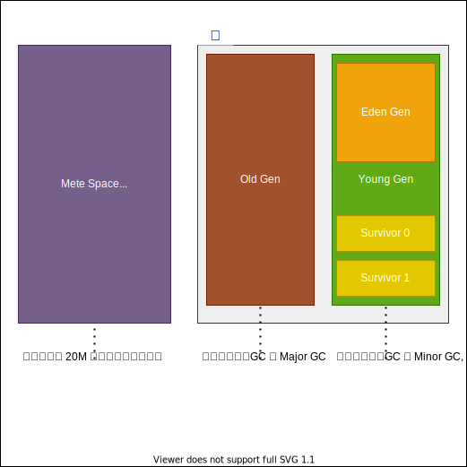

💠

- 1. [GC](#gc)
    - 1.1. [GC类型](#gc类型)
    - 1.2. [GC术语](#gc术语)
        - 1.2.1. [STW](#stw)
        - 1.2.2. [安全点](#安全点)
        - 1.2.3. [内存分代](#内存分代)
        - 1.2.4. [引用类型](#引用类型)
    - 1.3. [判断存活算法](#判断存活算法)
        - 1.3.1. [引用计数算法](#引用计数算法)
        - 1.3.2. [可达性分析算法](#可达性分析算法)
    - 1.4. [GC算法](#gc算法)
        - 1.4.1. [标记清除算法](#标记清除算法)
        - 1.4.2. [复制算法](#复制算法)
        - 1.4.3. [标记整理算法](#标记整理算法)
    - 1.5. [GC Callback](#gc-callback)
- 2. [GC参数](#gc参数)
- 3. [GC日志](#gc日志)
    - 3.1. [Unified GC Logging](#unified-gc-logging)
- 4. [垃圾收集器](#垃圾收集器)
    - 4.1. [默认垃圾收集器](#默认垃圾收集器)
    - 4.2. [Serial](#serial)
    - 4.3. [ParNew](#parnew)
    - 4.4. [Parallel Scavenge](#parallel-scavenge)
    - 4.5. [Serial Old](#serial-old)
    - 4.6. [Parallel Old](#parallel-old)
    - 4.7. [CMS](#cms)
    - 4.8. [G1](#g1)
    - 4.9. [ZGC](#zgc)
    - 4.10. [ShenandoahGC](#shenandoahgc)
    - 4.11. [Epsilon](#epsilon)
- 5. [最佳实践](#最佳实践)

💠 2026-03-05 20:29:01
****************************************
# GC
> Java Garbage Collection

GC 的目的是识别出不再使用的内存，并将其变为可用内存。现代垃圾收集器通常分为几个阶段，根据不同的分代使用不同的垃圾收集器来完成回收过程

- [你能不能谈谈，java GC是在什么时候，对什么东西，做了什么事情？” ](http://itindex.net/detail/54188-java-gc-%E4%B8%9C%E8%A5%BF) `什么时候, 对什么东西, 做了什么`
> 什么时候
- 程序员不能具体控制时间，系统在不可预测的时间调用System.gc()函数的时候；可以通过调参数，用NewRatio 控制newObject和oldObject的比例，用MaxTenuringThreshold  控制 进入oldObject的次数，使得oldObject 存储空间延迟达到full gc,延迟gc时间   
> 对什么东西
- 超出了作用域或引用计数为空的对象；从gc root开始搜索找不到的对象，而且经过一次标记、清理，仍然没有复活的对象。
> 做了什么
- 删除不使用的对象，回收内存空间；运行默认的finalize,当然程序员想立刻调用就用dipose调用以释放资源如文件句柄，JVM用from survivor、to survivor对它进行标记清理，对象序列化后也可以使它复活。

************************
列表： CMS(JDK14中被移除)，G1，Parallel，Serial，Epsilon，Shenandoah，ZGC
> [Github: OpenJDK 12 GC 算法源码](https://github.com/openjdk/jdk/tree/jdk-12+33/src/hotspot/share/gc)  
************************


> [看过无数Java GC文章，这5个问题你也未必知道！](https://mp.weixin.qq.com/s?__biz=MjM5OTMyNzQzMg==&mid=2257485503&idx=1&sn=87ac6a068e3c54d96c74bade2bac293b&chksm=a447fd189330740e52944d148ec838ac307ff7f05248b0a2223724b2fc6c335bc46d8d31da16&mpshare=1&scene=1&srcid=&sharer_sharetime=1584270847465&sharer_shareid=246c4b52c1cb45eaa580c985c95107f3#rd)  

## GC类型
> [RednaxelaFX](https://www.zhihu.com/question/41922036/answer/93079526)


| 列名      | 含义                       | 收集范围                             | 触发时机                                  | **STW 时长**（典型）                             | **成本/影响**                  | 快速调优口诀                                              |
| ------- | ------------------------ | -------------------------------- | ------------------------------------- | ------------------------------------------ | -------------------------- | --------------------------------------------------- |
| **YGC** | Young GC（Minor GC）       | **新生代**（Eden + Survivor）         | Eden 满                                | **< 10 ms**（G1）<br>**20~100 ms**（Parallel） | **最低**；**频率高**但**停顿极短**    | **别让 Eden 过大**→**YGC 间隔 2~3 s 最舒服**                 |
| **FGC** | Full GC                  | **整个堆**（Young + Old + Metaspace） | Old 满 / System.gc() / Meta 满          | **> 200 ms**<br>**可达几秒**（堆越大越长）            | **最高**；**停顿最长**→**直接卡死业务** | **目标：线上 FGC = 0**<br>**调大 Old / 换 G1 / 降晋升率**       |
| **CGC** | Concurrent GC（G1/Z 并发阶段） | **部分 Old**（G1 Mixed）**或全部**（Z）   | **G1**：Old 占比 > 45%\*\*<br>**Z**：后台定时 | **≈ 0 ms**（并发）<br>**仅初始标记 < 10 ms**        | **中等**；**不阻塞业务**但**占 CPU** | **CPU 够用就让它跑**<br>**CPU 紧张时调大 `-XX:ConcGCThreads`** |


- *Young GC*：当young gen 中的 eden gen 分配满的时候触发。注意young GC中有部分存活对象会晋升到old gen，所以young GC后old gen的占用量通常会有所升高。
- *Full GC*：当准备要触发一次young GC时，如果发现统计数据说之前young GC的平均晋升大小比目前old gen剩余的空间大，则不会触发young GC而是转为触发full GC
    - 因为HotSpot VM的GC里，除了CMS的concurrent collection之外，其它能收集old gen的GC都会同时收集整个GC堆，包括young gen，所以不需要事先触发一次单独的young GC
    - `perm gen` / `MetaSpace` 内存空间不足时，也会触发一次 Full GC；
    - System.gc()、heap dump、jcmd pid GC.run 等指定触发GC时，默认触发 Full GC。
    - [What causes a Full GC to run?](https://stackoverflow.com/questions/42226785/what-causes-a-full-gc-to-run)
- *Concurrent GC*:
    - G1和Z 并发GC： CPU 够就让它工作

************************

> 以下为八股文区分，通常用于分类，实践上无意义，重点仅关注 Full GC 
- `Full GC`：收集整个堆 **会引发STW**，包括young gen、old gen、perm gen（如果存在的话），metaspace等所有部分内存的模式。
    - gc日志中会有明确的 `[Full GC]` 字样
- `Partial GC`：收集部分堆
    - `Young GC`：只收集young gen的GC
    - `Old GC`：只收集old gen的GC。只有CMS的concurrent collection是这个模式
    - `Mixed GC`：收集整个young gen以及部分old gen的GC。只有G1有这个模式
- `新生代GC Minor GC`
    - 也称 Young GC，**会引发STW**。发生在新生代的垃圾收集动作, 因为大多数对象都是存活时间很短, 所以 Minor GC 非常频繁, 一般回收速度也比较快.   
    - 扫描过后将 Eden 和 现在使用的 Survivor 两个区中的存活对象 全搬去空闲的 Survivor.   
    - 如果 存活的对象内存大小大于 Survivor 区大小, 则需要`分配担保机制`提前将对象转移到老年代中
- `老年代GC Major GC`
    - 发生在老年代的GC不会单独触发, 出现了 Major GC, 往往会伴随至少一次 Minor GC. “Major” 只是 Full GC 的一个子阶段，并不存在“只收集 Old 而不收 Young”的独立 Major GC；
    - [Major GC和Full GC的区别是什么？触发条件呢？](https://www.zhihu.com/question/41922036/answer/93079526)

************************

## GC术语

- `串行（Serial）` 只有单个 GC 线程在运行。与上面的并行阶段一样，规范中也没有说明 GC 线程是否可以与当前运行的应用程序线程重叠。
- `并行（Parallel）` 运行中的 JVM 包含应用程序线程和 GC 线程。在并行阶段，会运行多个 GC 线程，也就是说任务被拆分给它们去完成。
    - 至于 GC 线程是否可以与正在运行的应用程序线程重叠，这个在规范中并没有特别说明。
- `并发（Concurrent）` GC 线程和应用程序线程并发执行。
- `增量（Incremental）` 在增量阶段，它可以运行一段时间，并基于某些条件提前终止，例如时间预算或执行更高优先级的 GC 阶段。

- `吞吐量 = 运行用户代码时间 / (用户代码时间 + 垃圾收集时间)`
- 并行和并发 : 并行：充分利用多核CPU来缩短STW的时间, 并发：部分其他收集器需要停顿的逻辑也和用户进程并发执行

### STW 
> [参考: JVM中的STW和CMS](https://blog.csdn.net/zkkzpp258/article/details/80080764)  

Java中Stop-The-World机制简称STW，是在执行垃圾收集算法时，Java应用程序的其他所有线程都被挂起（除了垃圾收集帮助器之外）。   
Java中一种全局暂停现象，全局停顿，所有Java代码停止，native代码可以执行，但不能与JVM交互。这些现象多半是由于GC引起。

除了GC，JVM下还有其他原因会触发停顿现象。[JVM Pauses - It's More Than GC ](https://www.reddit.com/r/java/comments/gsp4p4/jvm_pauses_its_more_than_gc/)

### 安全点

JVM里有一种特殊的线程`VM Threads`，专门用来执行一些特殊的VM Operation，比如分派GC，thread dump等，这些任务，都需要整个Heap，以及所有线程的状态是静止的，一致的才能进行。  
所以JVM引入了安全点`Safe Point`的概念，在需要进行VM Operation时，通知所有的线程进入一个静止的安全点。

除了GC，其他触发安全点的VM Operation包括：
```
    1. JIT相关，比如Code deoptimization, Flushing code cache ；
    2. Class redefinition (e.g. javaagent，AOP代码植入的产生的instrumentation) ；
    3. Biased lock revocation 取消偏向锁 ；
    4. Various debug operation (e.g. thread dump or deadlock check)；
```

- 通过监控安全点，看看JVM到底发生了什么？
    - 最简单的做法，在JVM启动参数的GC参数里追加: `-XX:+PrintGCApplicationStoppedTime` 它就会把全部的JVM停顿时间（不只是GC），打印在GC日志里。
- 如何打印出是哪种原因导致的停顿呢？
    - 再多加两个参数：`-XX:+PrintSafepointStatistics -XX: PrintSafepointStatisticsCount=1`
    - 此日志分两段，第一段是时间戳，VM Operation 的类型，以及线程概况
        ```
            total: 安全点里的总线程数 
            initially_running: 安全点时开始时正在运行状态的线程数 
            wait_to_block: 在VM Operation开始前需要等待其暂停的线程数
        ```
    - 第二行是到达安全点时的各个阶段以及执行操作所花的时间，其中最重要的是vmop
        ```
            spin: 等待线程响应
            safepoint号召的时间 
            block: 暂停所有线程所用的时间 
            sync: 等于 spin+block，这是从开始到进入安全点所耗的时间，可用于判断进入安全点耗时 
            cleanup: 清理所用时间 
            vmop: 真正执行VM Operation的时间
        ```

可见，那些很多但又很短的安全点，全都是RevokeBias，详见 偏向锁实现原理， 高并发的应用一般会干脆在启动参数里加一句`-XX:-UseBiasedLocking`取消掉它。
另外还看到有些类型是no vm operation， 文档上说是保证每秒都有一次进入安全点（如果这秒已经GC过就不用了），给一些需要在安全点里进行，又非紧急的操作使用，比如一些采样型的Profiler工具，可用`-DGuaranteedSafepointInterval`来调整，不过实际看它并不是每秒都会发生，时间不定。

在实战中，我们利用安全点日志，发现过有程序定时调用Thread Dump等等情况。不过因为安全点日志默认输出到stdout，因为性能及stdout日志的整洁性等原因，我们平时默认没有开启它。只有在需要时才打开。

再再增加下面三个参数，可以知道更多VM里发生的事情。可惜JVM不会因为设了这三个参数，就把安全点日志转移到vm.log里面来，而是白白打印了两次。

`-XX:+UnlockDiagnosticVMOptions -XX:+LogVMOutput -XX:LogFile=/dev/shm/vm.log`

************************

### 内存分代

> [Oracle Java8 Doc: Generation](https://docs.oracle.com/javase/8/docs/technotes/guides/vm/gctuning/generations.html#sthref16)



> [参考: JVM中新生代为什么要有两个Survivor（form,to）？](https://www.zhihu.com/question/44929481)  
> [参考: 为什么新生代内存需要有两个Survivor区](https://blog.csdn.net/antony9118/article/details/51425581)  

> [聊聊JVM的年轻代](http://ifeve.com/jvm-yong-generation/)  
> 我是一个普通的java对象，我出生在Eden区，在Eden区我还看到和我长的很像的小兄弟，我们在Eden区中玩了挺长时间。  
有一天Eden区中的人实在是太多了，我就被迫去了Survivor区的“From”区，自从去了Survivor区，我就开始漂了，  
有时候在Survivor的“From”区，有时候在Survivor的“To”区，居无定所。  
直到我18岁的时候，爸爸说我成人了，该去社会上闯闯了。于是我就去了年老代那边，年老代里，人很多，并且年龄都挺大的，我在这里也认识了很多人。  
在年老代里，我生活了20年(每次GC加一岁)，然后被回收。  

### 引用类型
Java 引用是 Java 虚拟机为了实现更加灵活的对象生命周期管理而设计的对象包装类，一共有四种引用类型，分别是强引用、软引用、弱引用和虚引用

> [How to Use Java SoftReferences to Build an Efficient Cache](https://blog.shiftleft.io/understanding-jvm-soft-references-for-great-good-and-building-a-cache-244a4f7bb85d)  

************************

## 判断存活算法
### 引用计数算法
> 给对象添加一个引用计数器, 每当有一个地方引用该对象就加一, 引用失效就减一; 计数器值为零的对象就是不可能被使用的对象

但是该算法无法解决 对象间循环引用的问题, 例如：A 引用 B, B 引用 A, 此时两个对象的计数大于0，但是这两个对象都没被其他对象引用。

可引入 Recycler算法 进行解决 --《垃圾回收算法手册》

`思路大致是 找出循环引用的环，尝试遍历（可能有多个环混合，这里是一个图结构）并打破环并移除环内对象的内部引用，如果计数仍大于0表明该环有被其他对象引用，需要恢复破坏的引用关系，否则全部清除`

### 可达性分析算法
当一个对象到 GC Roots 对象没有任何引用链相连时(或者说从 GC Roots 到该对象的路径不可达), 则证明该对象是可回收的

GC Roots 对象包含:
- 虚拟机栈(栈帧中的本地变量表)中引用的对象
- 方法区中类静态属性引用的对象
- 方法去中常量引用的对象
- 本地方法栈中 JNI (Native 方法) 引用的对象
- 所有线程对象
- 系统类加载器及自定义类加载器
- 锁对象

> [Guide to Garbage Collector Roots](https://www.baeldung.com/java-gc-roots)`重点：每个JVM实现及GC实现没有强制的规范，只能通过MAT等工具分析，以上仅为常见的Root类型对象`

************************

## GC算法
### 标记清除算法
> Mark-Sweep 首先标记出所有需要回收的对象, 在标记完成后统一回收

 回收过程主要分为两个阶段，第一阶段为追踪（Tracing）阶段，即从 GC Root 开始遍历对象图，并标记（Mark）所遇到的每个对象，第二阶段为清除（Sweep）阶段，即回收器检查堆中每一个对象，并将所有未被标记的对象进行回收，整个过程不会发生对象移动。整个算法在不同的实现中会使用三色抽象（Tricolour Abstraction）、位图标记（BitMap）等技术来提高算法的效率，存活对象较多时较高效。

`缺点`
1. 效率问题: 标记和清除两个过程的效率不高
1. 空间问题: 容易引起内存碎片化问题, 碎片太多可能导致后期需要分配较大对象时找不到足够大的连续内存
    - 并因此触发一次垃圾收集动作

### 复制算法
> Copying 将内存按容量划分为等大的两块, 每次只使用其中的一块, 当这块的内存用到需要回收了, 就将需要存活的对象复制到另一块上去, 将该块全部清理掉  
> 转而只使用另一个块 这样就不会有内存碎片化问题, 但是可使用的内存只有原来的一半

将空间分为两个大小相同的 From 和 To 两个半区，同一时间只会使用其中一个，每次进行回收时将一个半区的存活对象通过复制的方式转移到另一个半区。有递归（Robert R. Fenichel 和 Jerome C. Yochelson提出）和迭代（Cheney 提出）算法，以及解决了前两者递归栈、缓存行等问题的近似优先搜索算法。复制算法可以通过碰撞指针的方式进行快速地分配内存，但是也存在着空间利用率不高的缺点，另外就是存活对象比较大时复制的成本比较高。

适用于新生代, 因为新生代对象大部分是存活时间短的

标记-复制算法可以分为三个阶段：

标记阶段，即从GC Roots集合开始，标记活跃对象；
转移阶段，即把活跃对象复制到新的内存地址上；
重定位阶段，因为转移导致对象的地址发生了变化，在重定位阶段，所有指向对象旧地址的指针都要调整到对象新的地址上。

### 标记整理算法
> Mark-Compact 标记过程和标记清除算法是一致的, 但是后续是让存活的对象往一端移动, 清理掉端边界以外的内存.

这个算法的主要目的就是解决在非移动式回收器中都会存在的碎片化问题，也分为两个阶段，第一阶段与 Mark-Sweep 类似，第二阶段则会对存活对象按照整理顺序（Compaction Order）进行整理。主要实现有双指针（Two-Finger）回收算法、滑动回收（Lisp2）算法和引线整理（Threaded Compaction）算法等。

适用于老年代

************************

## GC Callback
> [Letting the Garbage Collector Do Callbacks](https://dzone.com/articles/letting-garbage-collector-do-c)  
> [Garbage Collection JMX Notifications](http://www.fasterj.com/articles/gcnotifs.shtml)

************************
# GC参数

- `-verbose:gc`
- `-XX:+PrintGCDetails`
- `-XX:+PrintGCDateStamps`
- `-XX:MaxTenuringThreshold=15` 年轻代对象晋升年龄阈值 默认值15


************************

# GC日志
- `-XX:+UseGCLogFileRotation `
- `-XX:NumberOfGCLogFiles=< number of log files > `
- `-XX:GCLogFileSize=< file size >[ unit ]`
- `-Xloggc:/app/logs/gc_%t_%p.log` 指定GC日志 并 设置文件格式 **注意目录要已存在**
    - %t 日期时间
    - %p 进程id

1. 默认第一列是**JVM启动的相对秒数**，配置 `-XX:+PrintGCDateStamps` 就会显示真实时间 可读性更好
1. 日志滚动策略 `-XX:+UseGCLogFileRotation -XX:NumberOfGCLogFiles=14 -XX:GCLogFileSize=100M` **但是实际上不实用**
    - 并非按Logback等框架的思路滚动。重启后会重新从0计数覆盖掉最旧的gc日志 [Try to Avoid -XX:+UseGCLogFileRotation](https://dzone.com/articles/try-to-avoid-xxusegclogfilerotation)


示例： ` -XX:+PrintGC -XX:+PrintGCDetails -XX:+PrintGCDateStamps -Xloggc:/opt/gc_%t_%p.log`

## Unified GC Logging

> [JEP 271: Unified GC Logging](https://openjdk.org/jeps/271)`从JDK9开始`  

参数格式： `selector:output:decorators:output-options`


Selector（选择器）由 Tag（标签） 和 Level（级别） 组成。 `java -Xlog:help` 查看可用的Tag

| 标签 (Tag) | 推荐级别 Level | 场景 |
|:---|:---|:---|
| gc* |	Info |	必选。分析内存压力和 GC 停顿。
| safepoint| 	Info |	必选。找出除了 GC 以外，还有谁让系统卡住了。
| jit+compilation|	Debug|	进阶。排查代码运行几小时后突然响应变慢。
| classhisto| 	Warning/Error|	慎选。仅在 OOM 边缘调试时开启，平时禁开。


| JDK 8 参数                 |  JDK9+ 等价参数                  |
| ------------------------ | ---------------------------------- |
| `-XX:+PrintGC`           | `-Xlog:gc`                         |
| `-XX:+PrintGCDetails`    | `-Xlog:gc*`                        |
| `-XX:+PrintGCDateStamps` | 内置在 `gc*` 中，或显式 `tags,time,uptime` |
| `-Xloggc:/path`          | `-Xlog:gc*:file=/path`             |

示例： 

`-Xlog:gc*,safepoint:file=/opt/gc_%t_pid%p.log:time,uptime,level,tags:filecount=10,filesize=20M`

`-Xlog:gc*,safepoint,metaspace=info:file=/opt/log/gc_%t_pid%p.log:time,uptime,level,tags:filecount=10,filesize=50M`


> [Github: GCViewer](https://github.com/chewiebug/GCViewer)  
> [GCView线条图解](https://blog.csdn.net/chy2z/article/details/88651810)  

************************

# 垃圾收集器
> JVM垃圾收集器发展历程 

- 第一阶段，Serial（串行）收集器
    - 在jdk1.3.1之前，java虚拟机仅仅能使用Serial收集器。 Serial收集器是一个单线程的收集器，但它的“单线程”的意义并不仅仅是说明它只会使用一个CPU或一条收集线程去完成垃圾收集工作，更重要的是在它进行垃圾收集时，必须暂停其他所有的工作线程，直到它收集结束。
- 第二阶段，Parallel（并行）收集器
    - Parallel收集器也称吞吐量收集器，相比Serial收集器，Parallel最主要的优势在于使用多线程去完成垃圾清理工作，这样可以充分利用多核的特性，大幅降低gc时间。
- 第三阶段，CMS（并发）收集器
    - CMS收集器在Minor GC时会暂停所有的应用线程，并以多线程的方式进行垃圾回收。在Full GC时不再暂停应用线程，而是使用若干个后台线程定期的对老年代空间进行扫描，及时回收其中不再使用的对象。
- 第四阶段，G1（并发）收集器
    - G1收集器（或者垃圾优先收集器）的设计初衷是为了尽量缩短处理超大堆（大于4GB）时产生的停顿。相对于CMS的优势而言是内存碎片的产生率大大降低。

现代化的GC实现，都分为增量和全量处理，通过各自的设计来实现增量式处理（随着应用运行，低或无STW的情况，做一部分一部分的回收），实在来不及处理的兜底策略才是全量，全量时的成本会很大阻塞很久。  

*******************

> JVM垃圾收集器种类

根据设计, 往往是新生代和老年代使用不同的垃圾收集器并组合使用, 因为各分代的对象分配和释放特性不同  

> 新生代  

| 类型 | 说明 |
|:----|:----|
| Serial (第一代)            | 单线程STW 复制算法 |
| PraNew (第二代)            | 多线程并行STW 复制算法|
| Parallel Scavenge (第三代) | 多线程并行STW 吞吐量优化，复制算法|
| G1 (第四代)                | 多线程并发，可以精确控制STW时间，整理算法 |

> 老年代

| 类型 | 说明 |
|:----|:----|
| Serial Old (第一代) | |
| Parallel Old (第二代) | |
| CMS (第三代) | |
| G1 (第四代) | |
| ZGC/ShenandoahGC | | 

> 收集器搭配时的限制
- CMS 不能和 Parallel Scavenge 一起用
- Parallel Old 只能和 Parallel Scavenge 一起用
- G1 ZGC ShenandoahGC 只能单独使用(独自处理新生代和老年代)

************************

## 默认垃圾收集器
JDK 7，默认是 Parallel Scavenge + Serial Old。
JDK 8 及 JDK 7u40 之后的版本，默认是 Parallel Scavenge + Parallel Old。
JDK 9 到 JDK 17，默认是 G1。

`-XX:+PrintCommandLineFlags` 查看默认参数 或者查看GC日志中代的名称 `-XX:+PrintGCDetails`
- 例如： `java -XX:+PrintCommandLineFlags -version`

************************

## Serial
> 单线程垃圾收集器 JDK1.3.1之前唯一选择, 仅用于新生代

单线程的收集器, 采用复制算法, client模式下默认收集器, 因为client的内存一般不会很大, 单线程反而效率更高, STW的时间也不会很长

************************

## ParNew
> Serial 收集器的多线程版本, 仅用于新生代

仅有该收集器和Serial收集器能和CMS收集器一起使用, 当使用CMS的时候默认新生代使用ParNew

> 注: 单核服务器时, 该收集器性能必然比Serial差, 因为线程调度开销

************************

## Parallel Scavenge
> 并行多线程收集器, 同样使用标记复制算法 着重点是可控制的吞吐量, 可以高效率利用CPU时间, 仅用于新生代

`-XX:+UseParallelGC`

- 控制最大垃圾收集停顿时间 `-XX:MaxGCPauseMillis` (大于0的整数 单位millis)
    - 该值并不是越小越好, GC停顿时间缩短是牺牲吞吐量和新生代空间来换取的 
    - 新生代空间越小则垃圾收集器回收时间则更短, 但是也更频繁, 停顿时间降下来了,但是吞吐量就下降了
- 直接设置吞吐量大小 `-XX:GCTimeRatio` 值范围：(0,100)
    - 收集器将尽可能保证内存回收的时间不超过设置值, 值为垃圾收集时间占总时间的比率, 相当于吞吐量的倒数
    - 如果设置为 49 则允许的最大GC时间占总时间的 1/(1+49)
- GC自适应策略 `-XX:+UseAdaptiveSizePolicy`
    - 该参数启用后, 就无需手动设置新生代的大小(-Xmn)和Eden和Survivor的比例(-XX:SurvivorRatio) 晋升老年代对象大小(-XX:PretenureSizeThreshold) , 虚拟机将动态调整这些参数

************************

## Serial Old
> Serial收集器的老年代版本, 单线程收集器 

主要用于 client 模式下 , server 模式下的话， 1.5之前的版本与Parallel Scavenge搭配使用, 或者作为CMS的备选方案

************************

## Parallel Old
> 是Parallel Scavenge 收集器的老年代版本

`-XX:+UseParallelOldGC`

************************

## CMS
> Concurrent Mark Sweep 着重点是尽可能缩短垃圾收集时用户线程的停顿时间 [Oracle Doc](https://docs.oracle.com/javase/8/docs/technotes/guides/vm/gctuning/cms.html)

`-XX:+UseConcMarkSweepGC`

工作流程：
1. `初始标记` CMS initial mark  **STW**
1. 并发标记 CMS concurrent mark
1. `最终标记` CMS final remark  **STW**
1. 并发清除 CMS concurrent sweep

> 例如：
```log
4936.782: [GC (CMS Initial Mark) [1 CMS-initial-mark: 747140K(1494272K)] 752384K(1800960K), 0.0043788 secs] [Times: user=0.01 sys=0.00, real=0.00 secs] 
4936.787: [CMS-concurrent-mark-start]
4936.942: [CMS-concurrent-mark: 0.156/0.156 secs] [Times: user=0.23 sys=0.01, real=0.16 secs] 
4936.942: [CMS-concurrent-preclean-start]
4936.948: [CMS-concurrent-preclean: 0.005/0.005 secs] [Times: user=0.01 sys=0.00, real=0.00 secs] 
4936.948: [CMS-concurrent-abortable-preclean-start]
4938.832: [GC (Allocation Failure) 2020-11-23T17:06:01.905+0800: 4938.832: [ParNew: 277821K->4257K(306688K), 0.0088608 secs] 1024961K->751463K(1800960K), 0.0089994 secs] [Times: user=
4939.249: [CMS-concurrent-abortable-preclean: 0.774/2.301 secs] [Times: user=1.32 sys=0.09, real=2.31 secs] 
4939.250: [GC (CMS Final Remark) [YG occupancy: 142153 K (306688 K)]2020-11-23T17:06:02.323+0800: 4939.250: [Rescan (parallel) , 0.0225236 secs]2020-11-23T17:06:02.346+0800: 4939.273:
4939.382: [CMS-concurrent-sweep-start]
4939.627: [CMS-concurrent-sweep: 0.235/0.245 secs] [Times: user=0.43 sys=0.03, real=0.24 secs] 
4939.627: [CMS-concurrent-reset-start]
4939.631: [CMS-concurrent-reset: 0.004/0.004 secs] [Times: user=0.00 sys=0.00, real=0.01 secs]
```

优点: 并发低停顿  
缺点:  
1. 因为会和用户进程抢占CPU资源, 会导致应用程序变慢, 造成总吞吐量的下降. 默认启动的线程数为 (CPU数量+3)/4
1. 无法处理浮动垃圾, 可能出现 Concurrent Mode Failure 从而引起新一次FullGC
    - 并发清理阶段用户线程还在运行，这段时间就可能产生新的垃圾，新的垃圾在此次GC无法清除，只能等到下次清理
1. 由于使用的是标记清除算法, 容易导致大量空间碎片, 这样的后果是分配大内存对象会很麻烦, 往往出现老年代总空间还有大量剩余, 但是没有足够大的连续空间
    - 为了解决该问题, 提供了参数 `-XX:+UseCMSCompactAtFullCollection` 默认开启, 用于在FullGC时进行内存碎片的合并, 该过程无法并发还是要 STW
    - 还有一个参数 `-XX:CMSFullGCsBeforeCompaction` 默认为0, 设置多少次不压缩的FullGC后进行一次压缩的FullGC(内存合并的FullGC)

CMS 垃圾收集器的另一个挑战是如何处理老年代中的空间碎片，也就是当老年代中对象间的空间碎片太小，以至于无法容纳从年轻代晋升上来的对象，因为在CMS 的并发收集循环中并不执行压缩，哪怕是增量或局部压缩。
一旦无法找到可用空间，就会使CMS 回过来使用**Serial Old**，触发一次full收集，导致一个漫长的暂停。伴随CMS 碎片的另一个很不幸的挑战就是上述问题完全无法预测。同样都是老年代碎片，某些应用可能没有经历过一次 full GC，而有些可能时不时就要经历一次。  

其中 初始标记 和 重新标记 仍然需要 STW, 两个并发的过程是和用户线程并发执行的对吞吐量有一定影响  
且由于是并发执行的, 那么并发的两个阶段用户进程是需要执行的, 就需要给这些线程预留足够的内存空间, 默认触发GC的阈值是 老年代使用了68%后(1.5) 1.6是92%   
可通过 `-XXCMSInitiatingOccupancyFraction` 进行设置. 如果CMS执行期间发现剩余内存不足以让程序正常运行, 就会临时启用 **Serial Old**  
所以该参数不可设置过高, 否则容易导致频繁采用 **Serial Old**, 大大延长 STW 时间  

> [参考: JVM 源码解读之 CMS GC 触发条件 ](https://club.perfma.com/article/190389)  
> [参考: JVM 源码解读之 CMS 何时会进行 Full GC](https://club.perfma.com/article/244846)  

CMS进入 full GC 的情况是并发收集模式跟不上应用分配内存的速度了，或者是碎片化开始变严重了。  
主要体现是GC日志里可以看到 concurrent mode failure 字样，然后就开始可以看到 `[Full GC ... ]` 的日志了  
这样就带来一个问题，如果CMS并发GC发生了，此时是无法利用 `-XX:+HeapDumpBeforeFullGC` 参数生成dump文件，因为不是发生 FullGC  

************************

## G1
> Garbage First 面向服务端应用的垃圾收集器, JDK7发布, JDK9作为默认GC [Oracle Doc](https://docs.oracle.com/javase/8/docs/technotes/guides/vm/gctuning/g1_gc.html#garbage_first_garbage_collection)

`-XX:+UseG1GC`

设计目的： 避免FullGC
- 分代收集
    - 虽然G1可以独立管理整个堆, 但同样具有分代的概念, 物理内存切分为等大小的Region块
    - Region上的标签（会随时变化）： Eden Region， Survivor Region， Old Region， Humongous Region（>= Region ½ 的大对象，物理连续 1 或多个 Region）， Free/Unused Region（空白，等待下次分配）
    - 没有固定 Young/Old 分代边界 —— 年轻代大小 = 当前 Eden + Survivor Region 数 × RegionSize，可动态伸缩。
- 空间整合
    - 从整体上看是基于标记整理算法, 局部(两个Region之间)上基于标记复制算法, 相比于CMS不容易产生内存碎片
- 可预测的停顿
    - G1除了追求低停顿, 还能建立可预测的停顿时间模型, 能让使用者明确指定在一个长度为M毫秒的时间片段内, 消耗在垃圾收集上的时间不得超过N毫秒
    - 几乎是RTSJ的特征
- [JEP 346: 内存自动返还](https://openjdk.org/jeps/346)`JDK12发布`
    - G1在12之前只有在full GC或者concurrent cycle（并发处理周期）的时候才会归还内存，由于这两个场景都是G1极力避免的，因此在大多数场景下可能不会及时归还committed Java heap memory给操作系统。除非有外部强制触发Full GC。
    - 在使用云平台的容器环境中，这种不利之处特别明显。例如一个JVM最大堆3G，当前使用到了2G，实际FullGC回收后只有500M 但是一直没达到FullGC条件，所以一直占用着1G多的内存
- [JEP 307: Parallel Full GC for G1](https://openjdk.org/jeps/307) JDK1.8时FullGC是单线程的， JDK10开始支持并行

> 字符串常量池去重 特性(8u20引入)  [UseStringDeduplication - 优缺点](https://gceasy.ycrash.cn/gc-recommendations/stringdeduplication-solution.jsp)
- `-XX:+UseStringDeduplication` 适用于大量相似字符串的场景降低内存占用，但会增加GC负担，默认不开启
    - 查看字符串去重统计信息（调试用） `-XX:+PrintStringDeduplicationStatistics` `-XX:+PrintStringTableStatistics`
    - 达到该年龄(经过GC次数)的String对象被认为是去重的候选对象 `-XX:StringDeDuplicationAgeThreshold`
- 该策略不会清除重复字符串对象本身。其只会替换底层 `char[]` 达到复用内存的目的 [Gitee 测试代码](https://gitee.com/gin9/JavaBase/blob/master/class/src/main/java/jvm/gc/g1/StringDeduplication.java)

> [参考: Java Hotspot G1 GC的一些关键技术](https://tech.meituan.com/2016/09/23/g1.html)  
> [Welcome 20% less memory usage for G1 remembered sets](https://tschatzl.github.io/2021/02/26/early-prune.html)  

G1提供了两种GC模式，Young GC和Mixed GC，两种都是完全**Stop The World**的
- Young GC：选定所有年轻代里的Region。通过控制年轻代的 Region 个数，即年轻代内存大小，来控制young GC的时间开销。 
- Mixed GC：选定所有年轻代里的Region，外加根据 global concurrent marking 统计得出收集收益高的若干老年代Region。在用户指定的开销目标范围内尽可能选择收益高的老年代Region。

由上面的描述可知，Mixed GC不是full GC，它只能回收部分老年代的Region，如果mixed GC实在无法跟上程序分配内存的速度，导致老年代填满无法继续进行Mixed GC，就会使用serial old GC（full GC）来收集整个GC heap。  
所以我们可以知道，G1是不提供full GC的。  

上文中，多次提到了global concurrent marking，它的执行过程类似CMS，但是不同的是，在G1 GC中，它主要是为Mixed GC提供标记服务的，并不是一次GC过程的一个必须环节。  
global concurrent marking 的执行过程分为四个步骤：  
- **初始标记**（initial mark，`STW`）: 它标记了从GC Root开始直接可达的对象。
- **并发标记**（Concurrent Marking）: 这个阶段从GC Root开始对heap中的对象标记，标记线程与应用程序线程并行执行，并且收集各个Region的存活对象信息。 
- **最终标记**（Remark，`STW`）: 标记那些在并发标记阶段发生变化的对象，将被回收。
- **清除垃圾**（Cleanup）: 清除空Region（没有存活对象的），加入到free list。

第一阶段initial mark是共用了Young GC的暂停，这是因为他们可以复用root scan操作，所以可以说global concurrent marking是伴随Young GC而发生的。  
第四阶段Cleanup只是回收了没有存活对象的Region，所以它并不需要STW。  

Young GC发生的时机大家都知道，那什么时候发生Mixed GC呢？其实是由一些参数控制着的，另外也控制着哪些老年代Region会被选入CSet。 
- `G1HeapWastePercent`： 在global concurrent marking结束之后，我们可以知道old gen regions中有多少空间要被回收，在每次YGC之后和再次发生Mixed GC之前，会检查垃圾占比是否达到此参数，只有达到了，下次才会发生Mixed GC。 
- `G1MixedGCLiveThresholdPercent`： old generation region中的存活对象的占比，只有在此参数之下，才会被选入CSet。 
- `G1MixedGCCountTarget`： 一次global concurrent marking之后，最多执行Mixed GC的次数。 
- `G1OldCSetRegionThresholdPercent`： 一次Mixed GC中能被选入CSet的最多old generation region数量。

> G1 相关的重要参数

| 参数 | 描述 |
|:----|:----|
| `-XX:MaxGCPauseMillis=200`  |  单位ms，设置最大停顿时间值。默认值为 200 毫秒。|
| `-XX:G1HeapRegionSize=n`  |  	单位字节，设置 G1 区域大小。值必须为 2 的 N 次幂 且 设置值范围是 1MB 至 32MB（JDK17之前，JDK18开始最大支持512M）。默认值：  JVM 在启动时按堆初始大小 ÷ 2048 计算得出，向下取整到 1 MB 的倍数： ≤ 2 GB 堆 → 1 MB 4 GB → 2 MB 8 GB → 4 MB|
| `-XX:GCTimeRatio=12`  |  	    设置应用于 GC 的总目标时间与处理客户事务的总时间。|
| `-XX:ParallelGCThreads=n`  |  	设置 Stop-the-world 工作线程的数量。|
| `-XX:ConcGCThreads=n`  |  	    设置并行标记线程的数量。将 n 值设为并行垃圾回收线程（ParallelGCThreads）数的大约 1/4。|
| `-XX:InitiatingHeapOccupancyPercent=45`  |  	当堆内存使用率超过此百分比时会触发 GC 标记周期。默认值为 45%。|
| `-XX:G1NewSizePercent=5`  |  	设置用作 Young 代空间大小的最低堆内存百分比。默认值为 Java 堆内存的 5%。|
| `-XX:G1MaxNewSizePercent=60`  | 设置用作 Young 代空间大小的最高堆内存百分比。默认值为 Java 堆内存的 60%。|
| `-XX:G1OldCSetRegionThresholdPercent=10`  |  	设置混合垃圾回收周期中要收集的 Old 区域数量上限。默认为 Java 堆内存的 10%。|
| `-XX:G1ReservePercent=10`  |  	设置需保留的内存百分比。默认为 10%。G1 垃圾回收器会始终尝试保留 10% 的堆内存空间空闲。|
| `-XX:G1PeriodicGCInterval` | *JDK12+* 设置周期GC的周期（ms） 默认值为0， 0表示禁用该功能 |
| `-XX:G1PeriodicGCSystemLoadThreshold` | *JDK12+* 设置阈值 当系统负载高于该阈值就触发FullGC或并行GC 0表示禁用该触发策略|


**GCTimeRatio**： 确定目标 GC 时间的实际公式为 [1 / (1 + GCTimeRatio)]。默认值 12 表示目标 GC 时间为 [1 / (1 + 12)]，即 7.69%。
这意味着 JVM 可将 7.69％ 的时间用于 GC 活动，其余 92.3％ 用于处理客户活动。

**ParallelGCThreads**： 如果逻辑处理器的数量M小于或等于 8 个，则将 n 值设置为M。如果M为5，则将 n 设为 5.如果M为 8 个以上，请将该值设置为大约 5/8 * M。
这种设置在大多数情况下都有效，除了较大规模的 SPARC 系统——其中 n 值可以大约是 `5/16 * M`。

MaxGCPauseMillis：G1将根据先前收集的信息以及检测到的垃圾对象量预估可以执行回收的垃圾区域，尽量保证GC时间不超过设置的值。

**ParallelGCThreads**： 使用默认值就可以了。但是在JRE版本1.8.0_131之前，JVM无法感知Docker的CPU限制，会使用宿主机的逻辑核数计算默认值。  
这通常会远超过容器的核数, 过多的GC线程数抢占了业务线程的CPU时间，加上线程切换的开销，较大的降低了吞吐量。因此JRE 1.8.0_131之前的版本，未明确指定ParallelGCThreads会有较大的风险。

**ConcGCThreads**： 一般称为并发标记线程数，为了减少GC的STW的时间，CMS和G1都有并发标记的过程，此时业务线程仍在工作，只是并发标记是CPU密集型任务，业务的吞吐量会下降，RT会变长。
ConcGCThreads的默认值不同GC策略略有不同，CMS下是(ParallelGCThreads + 3) / 4 向下取整，G1下是ParallelGCThreads / 4 四舍五入。一般来说采用默认值就可以了，但是还是由于在JRE版本1.8.0_131之前，JVM无法感知Docker的资源限制的问题，ConcGCThreads的默认值会比较大（20左右），对业务会有影响。

**G1PeriodicGCSystemLoadThreshold**： 系统会调用 getloadavg()，默认一分钟内系统返回的平均负载值低于 G1PeriodicGCSystemLoadThreshold指定的阈值，则触发full GC或者concurrent GC( 如果开启 G1PeriodicGCInvokesConcurrent )

> 周期GC
- 自上次垃圾回收完成以来已超过 G1PeriodicGCInterval ( milliseconds )， 并且此时没有正在进行的垃圾回收任务。如果 G1PeriodicGCInterval 值为零表示禁用快速回收内存的定期垃圾收集。
- 或者达到 G1PeriodicGCSystemLoadThreshold 阈值
如果不满足上述条件中的任何一个，则取消当期的定期垃圾回收。等一个 G1PeriodicGCInterval 时间周期后，将重新考虑是否执行定期垃圾回收。

> GC cause

真正需要调优的只有 3 个, 其余 cause 基本属于“正常节奏”，知道含义即可，不必专门“避免”。
    - Allocation Failure（包括 Evacuation Failure）→ 会演变成 Full GC；
    - Humongous Allocation → 频繁申请大对象容易踩 Full GC 红线；
    - G1 Evacuation Pause 时间超长 → 说明 Region 大小或停顿目标设得不合理。


| # | Cause 关键字                                 | 触发场景                                         | 严重程度   | 优化思路                                                                                   |
| - | ----------------------------------------- | -------------------------------------------- | ------ | -------------------------------------------------------------------------------------- |
| 1 | `G1 Evacuation Pause`                     | Young/Mixed GC 的正常 STW 复制阶段                  | ○ 例行   | 只关注暂停时间是否突破 `-XX:MaxGCPauseMillis`；超长就调大 Region 或降低 IHOP。                              |
| 2 | `Allocation Failure (Evacuation Failure)` | 复制阶段找不到空闲 Region，被迫晋升或直接 Full GC             | ★★★ 极高 | ① 调大 `-XX:G1ReservePercent`（默认 10→20）留更多“逃生空间”；② 调大 Region 减少碎片；③ 降低 IHOP 提前 Mixed GC。 |
| 3 | `Humongous Allocation`                    | 对象 ≥ Region×50% 直接进老年代，连续 Region 不够就 Full GC | ★★☆ 高  | ① 把 Region 调到 16/32 MB 减少“跨区大对象”；② 业务侧拆大数组/缓存块；③ 保证 ② 失败时有足够连续老年代。                     |
| 4 | `G1 Compaction Pause`                     | 并发周期结束后做“部分压缩”                               | ○ 例行   | 正常 Mixed GC 的一部分，只要暂停不长就无需处理。                                                          |
| 5 | `G1 Preventive Collection`                | 预测“再不动手就要 Full GC”提前 Mixed GC                | ○ 例行   | 说明 G1 自我保护生效，是好事，不必抑制。                                                                 |
| 6 | `System.gc()`                             | 代码里显式调了 `System.gc()`                        | ☆ 低    | 加 `-XX:+DisableExplicitGC` 直接禁掉；或换成 `G1 Full GC` 看是否必要。                                |
| 7 | `Full GC (Allocation Failure)`            | 晋升失败 & 连续空间申请失败，退化成 Serial Old 单线程 Full GC   | ★★★ 极高 | 同上 #2；出现一次就值得加监控告警，连续出现必须调参或扩容。                                                        |
| 8 | `Full GC (System.gc())`                   | 同上，只是触发点是 `System.gc()`                      | ★★★ 极高 | 同上 #6。                                                                                 |

把上面“红叉”三类 cause 压下去，G1 就能长期保持在 Young GC + Mixed GC 的节奏里，Full GC 基本销声匿迹

```ini
-XX:G1HeapRegionSize=16m          # 减少 Humongous 碎片
-XX:G1ReservePercent=20           # 给 Evacuation 留逃生舱
-XX:InitiatingHeapOccupancyPercent=30  # 更早 Mixed GC，别让老年代堆满
-XX:MaxGCPauseMillis=150          # 控制单次停顿上限，避免业务超时
```


************************

## ZGC
> [wiki: ZGC](https://wiki.openjdk.java.net/display/zgc/Main) | [JEP 377 ZGC](https://openjdk.org/jeps/377) | [ZGC Release note](https://www.oracle.com/technetwork/java/javase/11-relnote-issues-5012449.html#JDK-8197831)

- `-XX:+UseZGC` JDK11引入，JDK15正式使用，因此JDK11-14需要追加参数`-XX:+UnlockExperimentalVMOptions`

> [参考: Oracle 即将发布的全新 Java 垃圾收集器 ZGC](https://www.infoq.cn/article/oracle-release-java-gc-zgc)
> [参考: 美团：新一代垃圾回收器ZGC的探索与实践](https://tech.meituan.com/2020/08/06/new-zgc-practice-in-meituan.html)  

- [JDK21 ZGC 支持内存分代](https://openjdk.org/jeps/439)
- [JDK13 ZGC 支持内存返还](https://openjdk.org/jeps/351)

************************

## ShenandoahGC
> JDK12引入  [wiki: ShenandoahGC](https://wiki.openjdk.java.net/display/shenandoah/Main)

`-XX:+UnlockExperimentalVMOptions  -XX:+UseShenandoahGC`

> [参考: JDK12 ShenandoahGC小试牛刀](https://juejin.im/post/5c934a5d5188252dad05d82a)  
> [Has anyone given Shenandoah GC a try yet? How was your experience? : r/feedthebeast](https://www.reddit.com/r/feedthebeast/comments/euw3k2/has_anyone_given_shenandoah_gc_a_try_yet_how_was/)  

> [JDK25支持分代 JEP 521: Generational Shenandoah](https://openjdk.org/jeps/521)   

************************

## Epsilon
> JDK11 [A No-Op Garbage Collector](https://openjdk.org/jeps/318)

`-XX:+UseEpsilonGC -XX:+UnlockExperimentalVMOptions` 直至22尚未GA

空实现，不做垃圾回收的GC，一旦内存不够分配了JVM就直接停掉，通常用于测试调优GC方案的对照组

************************

# 最佳实践
[Choosing a GC Algorithm in Java](https://www.baeldung.com/java-choosing-gc-algorithm)  
[Tuning Garbage Collection with Oracle JDK](https://docs.oracle.com/cd/E55119_01/doc.71/e55122/cnf_jvmgc.htm#WSEAD414)  

