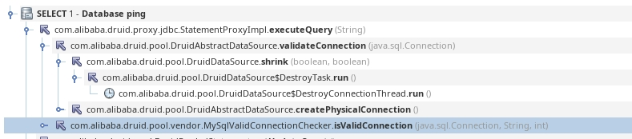
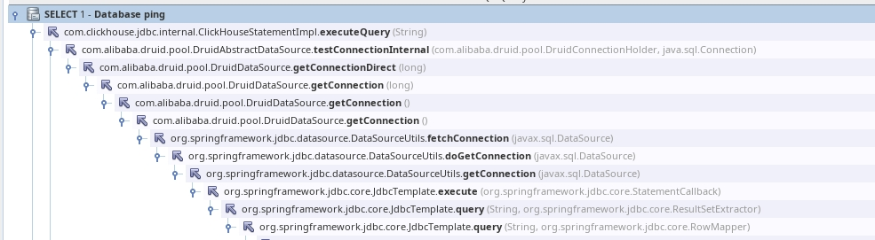
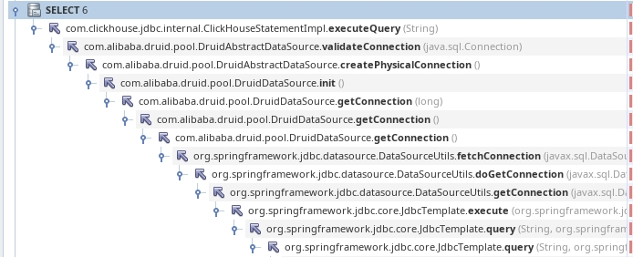

💠

- 1. [数据库模块](#数据库模块)
    - 1.1. [多数据源配置](#多数据源配置)
    - 1.2. [连接池](#连接池)
        - 1.2.1. [c3p0](#c3p0)
        - 1.2.2. [druid](#druid)
        - 1.2.3. [HikariCP](#hikaricp)
    - 1.3. [Relational Database](#relational-database)
        - 1.3.1. [JPA](#jpa)
            - 1.3.1.1. [Configuration](#configuration)
            - 1.3.1.2. [Jpa数据分页](#jpa数据分页)
            - 1.3.1.3. [原生SQL](#原生sql)
            - 1.3.1.4. [Mysql](#mysql)
            - 1.3.1.5. [映射关系](#映射关系)
                - 1.3.1.5.1. [一对一](#一对一)
                - 1.3.1.5.2. [一对多](#一对多)
                - 1.3.1.5.3. [多对多](#多对多)
        - 1.3.2. [Mybatis](#mybatis)
    - 1.4. [Non Relational database](#non-relational-database)
        - 1.4.1. [Redis](#redis)
            - 1.4.1.1. [消息订阅和发布](#消息订阅和发布)

💠 2024-09-12 16:01:31
****************************************
# 数据库模块
> [Spring Data](https://spring.io/projects/spring-data)

## 多数据源配置
> 为什么要有多数据源? 
- 业务发展和划分拆解导致业务库被拆分（例如用户库，订单库），或者异构数据源支撑（订单库MySQL，订单快照库ES）

> [Spring Boot多数据源配置与使用](https://www.jianshu.com/p/34730e595a8c)

## 连接池
### c3p0
> [Github](https://github.com/swaldman/c3p0)
- [参考博客: springboot 使用c3p0数据库连接池](http://www.cnblogs.com/520playboy/p/7526252.html)

### druid
- [druid连接池的配置](http://makaidong.com/L_Sail/1/40930_11573921.html)

> [druid连接池引起的线程blocked](https://segmentfault.com/a/1190000041500544)`驱动改名引起的连锁反应`  

常见配置项
- com.alibaba.druid.pool.DruidDataSource#configFromPropety 环境变量 可配置项

```yml
      # 初始连接数
      initialSize: 6
      # 最小连接池数量
      minIdle: 6
      # 最大连接池数量
      maxActive: 200
      # 配置获取连接等待超时的时间
      maxWait: 60000
      # 驱逐连接：配置间隔多久才进行一次检测，检测需要关闭的空闲连接，单位是毫秒
      timeBetweenEvictionRunsMillis: 60000
      # 驱逐连接：配置一个连接在池中最小生存的时间，单位是毫秒
      minEvictableIdleTimeMillis: 200000
      # 驱逐连接：配置一个连接在池中最大生存的时间，单位是毫秒
      maxEvictableIdleTimeMillis: 280000
      # 心跳保活
      keepAlive: true
      # 心跳保活间隔，keepAlive开启才生效
      keepAliveBetweenTimeMillis: 40000
      # 配置检测连接是否有效 创建连接和心跳保活时执行
      validationQuery: SELECT 1
      # 建议配置为true，不影响性能，并且保证安全性。申请连接的时候检测，如果空闲时间大于 timeBetweenEvictionRunsMillis ，执行validationQuery检测连接是否有效
      testWhileIdle: true
      # 申请连接时执行validationQuery检测连接是否有效 性能影响明显
      testOnBorrow: false
      # 归还连接时执行validationQuery检测连接是否有效 性能影响明显
      testOnReturn: false
```

> validationQuery执行场景

周期检查 keepAlive  
 

获取连接时 闲置很久的连接触发检查  


创建连接时的检查  



************************

> [Druid连接检查机制](https://blog.csdn.net/qq_37993902/article/details/124777056)
- `com.alibaba.druid.pool.DruidDataSource#createAndStartDestroyThread` 定时调度或单线程方式 周期性 检查连接
    - `com.alibaba.druid.pool.DruidDataSource#shrink(boolean, boolean)` keepAlive保活，补充新连接，关闭连接（异常，空闲超时）
    - `com.alibaba.druid.pool.ValidConnectionChecker` 检查连接可用，注意MySQL PG都有协议层的ping方式，更省资源（类似ws协议中的Ping报文），其他数据库一般是配置校验SQL为 `select 1`


### HikariCP
> [HikariCP](https://github.com/brettwooldridge/HikariCP)

*******************
## Relational Database
### JPA
> 连接池:1.x 默认是tomcat-jdbc连接池 2.x 是 HikariPool

> [参考: spring boot2 整合（二）JPA](https://www.jianshu.com/p/3b31270a44b1)
#### Configuration
> [Official Doc](https://docs.spring.io/spring-boot/docs/2.0.6.RELEASE/reference/htmlsingle/#howto-configure-jpa-properties)
**`ddl-auto`**
- JPA 默认是该配置 `spring.jpa.hibernate.ddl-auto`
- 但是如上配置没有生效的话就要用 这个 `spring.jpa.properties.hibernate.hbm2ddl.auto` 
    1. none 什么都不做
    1. create-only 
    1. create 先删除, 然后建立新的表
    1. create-drop 先删除, 然后建立新的表, 然后在SessionFactory实例关闭后再删除
    1. update 创建和修改
    1. validate 校验是否一致, 不一致就报错,启动失败

- [Blog: 原生SQL的写法](http://blog.csdn.net/Amy_Queen/article/details/72454099)

- [ ] 怎么映射视图到实体上?

#### Jpa数据分页
> [参考博客](https://www.tianmaying.com/tutorial/spring-jpa-page-sort)

- 分页 page 从0开始 size是个数 sort可以不需要（如果本来就是id排序就没必要了） 
    - 原理就是 预编译SQL然后查询总数，然后再执行 必须有两条SQL执行
- 查询的结果不包含实体的id属性

#### 原生SQL
- 涉及到数据的修改,就要加上前两个前缀,查询就直接写Query注解即可
```java
    @Modifying
    @Transactional
    @Query(value = "update a set b=?1", nativeQuery = true)
```

*************************
#### Mysql
- 1.引入依赖
```groovy
	compile('org.springframework.boot:spring-boot-starter-data-jpa')
	compile('org.springframework.boot:spring-boot-starter-jdbc')
	runtime('mysql:mysql-connector-java')
```
- 2.继承接口，打好实体类的注解 @Entity 

- 3.*切记 属性名不能使用下划线（数据库风格）不然写声明方法就会报错，jpa只是看下划线前半部分，会说找不到属性*
    - jpa在创建表时会把驼峰命名改成数据库风格的形式

- 4.jpa是声明特定方法的接口，让jpa来实现并自动注入，如果是没有的方法，就可以使用@Query注解
    - 默认使用的是HQL（HQL是基于类的所以使用的是类的名字不是表的名字），可以设置下使用原生SQL

#### 映射关系
##### 一对一
> 据说这是性能最好的方式, 但是有一点让人不舒服, A的id是名存实亡的, 数据库都没有这个字段, 实际上就是B的id, 但是对象又一定要保留这个id, 不然约束通不过  
> 也就是说, 创建的时候要设置A的id的值, 但是后面却用不到这个值

```java
@Entity
@Data
public class A {
  @Id
  private String id;
  private String name;
  @OneToOne(fetch = FetchType.LAZY)
  @MapsId
  private B b;
}

@Data
@Entity
public class B implements Serializable {
  @Id
  private String id;
  private String name;
}
```
##### 一对多
- 一方的配置是当前类的id，多方则按基本ER的规则来，注解中配置的是外键的名字, 所以当前类中的属性,外键名是不能重复的
```java
    // 一方
public class TestOne{
    @Id
    private String testOneId;
    @OneToMany
    @JoinColumn(name = "testOneId")//这个名字可以重复，最终会有一个随机码生成
    private Set<TestMany> testManySet;
}
    // 多方
public class TestMany {    
    @Id
    private String testManyId;
    @ManyToOne
    @JoinColumn(name = "testOneId")
    private TestOne testOneId;
}
```
- [ ] 问题: 当两个表互相引用了, 需要修改表结构 ,怎么删除重建两张表结构, 简单的命令会陷入死锁

*************

##### 多对多


### Mybatis
> [Mybatis](/Java/Ecosystem/Mybatis.md)

****************
## Non Relational database
### Redis
> [Spring Data Redis](https://spring.io/projects/spring-data-redis)

_配置连接信息_
```conf
    # REDIS (RedisProperties)
    # Redis数据库索引（默认为0）
    spring.redis.database=0
    # Redis服务器地址
    spring.redis.host=127.0.0.1
    # Redis服务器连接端口
    spring.redis.port=6379
    # Redis服务器连接密码（默认为空）
    spring.redis.password=
    # 连接池最大连接数（使用负值表示没有限制）
    spring.redis.pool.max-active=8
    # 连接池最大阻塞等待时间（使用负值表示没有限制）
    spring.redis.pool.max-wait=-1
    # 连接池中的最大空闲连接
    spring.redis.pool.max-idle=8
    # 连接池中的最小空闲连接
    spring.redis.pool.min-idle=0
    # 连接超时时间（毫秒）0不超时
    spring.redis.timeout=0
```

`在一个配置类中复制如下代码即可使用 StringRedisTemplate RedisTemplate 的实例`
```java
    @Bean
    public RedisTemplate<Object,Object> redisTemplate(RedisConnectionFactory factory) {
        RedisTemplate<Object,Object> template = new RedisTemplate<>();
        Jackson2JsonRedisSerializer jackson2JsonRedisSerializer = new Jackson2JsonRedisSerializer<>(Object.class);
        template.setConnectionFactory(factory);
        ObjectMapper om = new ObjectMapper();
        om.setVisibility(PropertyAccessor.ALL, JsonAutoDetect.Visibility.ANY);
        om.enableDefaultTyping(ObjectMapper.DefaultTyping.NON_FINAL);
        jackson2JsonRedisSerializer.setObjectMapper(om);
        // 值序列化采用 jackson2JsonRedisSerializer
        template.setValueSerializer(jackson2JsonRedisSerializer);
        // 键序列化采用 StringRedisSerializer
        template.setKeySerializer(new StringRedisSerializer());
        template.afterPropertiesSet();
        return template;
    }
    @Bean
    StringRedisTemplate template(RedisConnectionFactory connectionFactory) {
        return new StringRedisTemplate(connectionFactory);
    }
``` 
`两个对象的简单使用`
```java
    stringRedisTemplate.opsForValue().set("aaa", "hello");
    String result = stringRedisTemplate.opsForValue().get("aaa");
    //获取所有
    Set<String> keysList =  stringRedisTemplate.keys("*");
    for(String temp :keysList){
        log.info(temp);
    }
```
- 以上配置的template都是只是建立在最简单的键值对上，String-String，所以对象使用的是json来存储
- 但是使用的时候如同使用MySQL一样，是ORM框架自动处理数据的转换

#### 消息订阅和发布
[参考: Spring Boot使用Redis进行消息的发布订阅](https://www.tianmaying.com/tutorial/springboot-redis-message)


