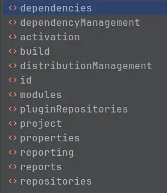

💠

- 1. [Maven](#maven)
    - 1.1. [安装](#安装)
    - 1.2. [Maven常用命令](#maven常用命令)
        - 1.2.1. [跳过测试阶段](#跳过测试阶段)
        - 1.2.2. [编译提速](#编译提速)
    - 1.3. [Profiles](#profiles)
    - 1.4. [配置](#配置)
        - 1.4.1. [settings.xml](#settingsxml)
        - 1.4.2. [pom.xml](#pomxml)
- 2. [构建](#构建)
    - 2.1. [Plugins](#plugins)
    - 2.2. [Extensions](#extensions)
    - 2.3. [构建多模块的项目 build](#构建多模块的项目-build)
    - 2.4. [打包部署 package](#打包部署-package)
        - 2.4.1. [打包瘦Jar](#打包瘦jar)
        - 2.4.2. [打包发布源码](#打包发布源码)
        - 2.4.3. [assembly](#assembly)
        - 2.4.4. [shade](#shade)
- 3. [依赖管理](#依赖管理)
    - 3.1. [依赖类型](#依赖类型)
    - 3.2. [依赖的范围](#依赖的范围)
    - 3.3. [依赖的传递](#依赖的传递)
    - 3.4. [处理项目间依赖方法](#处理项目间依赖方法)
    - 3.5. [依赖冲突](#依赖冲突)
        - 3.5.1. [排除依赖](#排除依赖)
    - 3.6. [依赖本地jar](#依赖本地jar)
- 4. [常用插件](#常用插件)
    - 4.1. [Lombok](#lombok)
    - 4.2. [Protobuf](#protobuf)
    - 4.3. [Maven Enforcer Plugin](#maven-enforcer-plugin)
    - 4.4. [Maven Deploy plugin](#maven-deploy-plugin)
    - 4.5. [Exec Maven Plugin](#exec-maven-plugin)
- 5. [构建工具对比](#构建工具对比)
    - 5.1. [Maven和Ant的区别](#maven和ant的区别)
    - 5.2. [Maven的优势](#maven的优势)
- 6. [发布构件到中央仓库](#发布构件到中央仓库)
    - 6.1. [发布到 Github Package](#发布到-github-package)
- 7. [配置私服](#配置私服)
    - 7.1. [nexus](#nexus)
    - 7.2. [公开Git仓库](#公开git仓库)
        - 7.2.1. [创建仓库](#创建仓库)
        - 7.2.2. [引用仓库中的构件](#引用仓库中的构件)
            - 7.2.2.1. [Gradle](#gradle)
            - 7.2.2.2. [Maven](#maven)

💠 2026-01-14 21:59:10
****************************************
# Maven
> [官网](https://maven.apache.org/) | [官网手册](https://maven.apache.org/guides/) | [http://takari.io/ 在线练习网](http://takari.io/)
> [关于Maven的完整博客](http://tengj.top/2018/01/01/maven/)  

## 安装
- 下载zip包解压，将bin目录配置至PATH（最好是配置MAVEN_HOME然后引用）
- sdkman 安装

## Maven常用命令
> `mvn [插件]:[目标] [参数]`  
> `mvn [阶段]`

* mvn archetype:generate ：创建 Maven 项目
    * -DgroupId=组织名/公司网址的反写+项目名
    * -DartifactId=项目名-模块名
    * -Dversion=版本号
    * -Dpackage=代码所在的包

> 插件
- `compile` ：编译源代码
- `test-compile` ：编译测试代码
- `test` ： 运行应用程序中的单元测试
- `site` ： 生成项目相关信息的网站
- `clean` ：清除目标目录中的生成结果
- `package` ： 依据项目生成 jar 文件
- `install` ：在本地 Repository 中安装 jar
- `deploy`：将jar包发布到远程仓库

> 参数
- 使用id为ChatServer的Profile `-PChatServer` 
- `-X` Debug模式
- `-e` 完整错误栈
- `-T 1C` 占满CPU核心数

************************

- 打包指定模块 `mvn package -pl a,b,c -am`
    - -am 同时打包指定模块所依赖的上游模块
    - -amd 同时打包 使用了 指定模块 的下游模块

> 将单独的jar安装到本地仓库

```
mvn install:install-file 
    -Dfile=D:\mvn\spring-context-support-3.1.0.RELEASE.jar \
    -DgroupId=org.springframework  \
    -DartifactId=spring-context-support \
    -Dversion=3.1.0.RELEASE \
    -Dpackaging=jar
```

### 跳过测试阶段

- `-Dmaven.test.skip=true` 不执行测试用例，也不编译测试用例类。
- `-DskipTests=true` 不执行测试用例，但编译测试用例类生成相应的class文件至target/test-classes下
- `-Dmaven.javadoc.skip=true` 跳过文档生成
- 指定模块配置跳过测试
```xml
    <plugin>
        <groupId>org.apache.maven.plugins</groupId>
        <artifactId>maven-surefire-plugin</artifactId>
        <configuration>
            <skip>true</skip>
        </configuration>
    </plugin>
```

### 编译提速
把 `mvn clean compile` 从 1.5 min 压到 30 s 以内，先做“三步十秒改”，再考虑“增量与缓存”。按收益从高到低排：

------------------------------------------------
1. 并行 + 跳过测试（立竿见影）  
   命令里直接加：
   ```bash
   mvn clean compile -T 1C -Dmaven.test.skip=true
   ```
   - `-T 1C` 让 Maven 用满 CPU 核心并行构建，实测 4 核笔记本可砍 40-60% 时间 ；  
   - `-Dmaven.test.skip=true` 跳过 test-compile + surefire，省 10-30 s 。

------------------------------------------------
2. 关闭增量编译 & 强制多线程编译（防“假增量”拖慢）  
   ```bash
   mvn clean compile -T 1C -Dmaven.test.skip=true \
     -Dmaven.compiler.useIncrementalCompilation=false \
     -Dmaven.compile.fork=true
   ```
   增量编译在模块多、跨模块改常量时反而会全量重编，关闭后全程多线程编译，大型多模块项目可从 4 min → 1 min 。

------------------------------------------------
3. 本地仓库 & 网络提速  
   - 公司/外网仓库慢 → 在 `settings.xml` 里加国内镜像（阿里云、清华），依赖下载阶段不再拖 30-40 s ；  
   - 重复快照更新 → 去掉 `-U` 参数，或加 `--offline` 强制离线模式（只要本地仓库已有依赖）。

------------------------------------------------
4. JVM 启动提速（再抠 5-10 s）  
   给 Maven 本身加快速 JIT 参数：
   ```bash
   export MAVEN_OPTS="-XX:+TieredCompilation -XX:TieredStopAtLevel=1 -Xms1g -Xmx2g"
   ```
   只让 HotSpot 做初级编译，启动更快；堆 1-2 G 避免频繁 GC 。

------------------------------------------------
5. 只编译改动模块（终极杀招）  
   开发调试时根本没必要全量 clean：
   ```bash
   mvn compile -pl 你改的模块名 -am -T 1C
   ```
   `-pl` 指定模块，`-am` 自动把其依赖一并编译，其余模块跳过，10 个子模块的项目可再降 50-70% 时间 。

------------------------------------------------
一条“开发日常最快命令”模板  
```bash
export MAVEN_OPTS="-XX:+TieredCompilation -XX:TieredStopAtLevel=1 -Xms1g -Xmx2g"
mvn compile -T 1C -Dmaven.test.skip=true \
  -Dmaven.compiler.useIncrementalCompilation=false \
  -Dmaven.compile.fork=true -pl 当前模块 -am
```
实测 20 模块项目从 1.5 min → 25 s 。  
（若 CI 需要全量打包，再把 `compile` 换成 `package`，参数照用即可。）


## Profiles
> [Official Doc](http://maven.apache.org/guides/introduction/introduction-to-profiles.html)
> [参考: Guide to Maven Profiles](https://www.baeldung.com/maven-profiles)  

`简单配置`
```xml
    <profiles>
        <profile>
            <id>development</id>
            <activation>
                <activeByDefault>true</activeByDefault>
            </activation>
            <properties></properties>
        </profile>
        <profile>
            <id>production</id>
            <properties></properties>
        </profile>
    </profiles>
```

- 指定 profile `mvn clean package -P development`
- 禁用profile `mvn compile -P '!profileId'` 多个时 `-P '!p1,!p2'`
- mvn help:active-profiles 可以用于查看profile都是从哪里加载和激活的

注意 profile 内可配置的标签有 依赖，插件，配置项 等内容，因此可以用于区分环境设置：  



> [Maven 如何为不同的环境打包](https://www.zybuluo.com/haokuixi/note/25985) `开发、测试和生产`

*****************
## 配置
> [插件地址](http://maven.apache.org/plugins/index.html)

### settings.xml 
> 注意 `settings.xml` 后者覆盖前者 加载顺序是: 
>> `maven目录/conf/setting.xml`  
>> `用户目录下/.m2/setting.xml` 

*配置镜像源*

> 在 用户目录下 .m2/setttings.xml 中 找到 mirrors 标签 进行添加`mirror节点`即可

```xml
<mirror> 
    <id>alimaven</id> 
    <name>aliyun maven</name> 
    <url>http://maven.aliyun.com/nexus/content/groups/public/</url> 
    <mirrorOf>central</mirrorOf> 
</mirror> 
```
 
*配置本地仓库目录*

`localRepository节点` 

### pom.xml
> [版本说明](http://www.blogjava.net/RomulusW/archive/2008/05/04/197985.html)

```xml
      <project xmlns="http://maven.apache.org/POM/4.0.0" xmlns:xsi="http://www.w3.org/2001/XMLSchema-instance"
  xsi:schemaLocation="http://maven.apache.org/POM/4.0.0 http://maven.apache.org/xsd/maven-4.0.0.xsd">
     <modelVersion>4.0.0</modelVersion>
     <groupId>反写的公司域名+项目名</groupId>
     <artifactId>项目名+模块名</artifactId>
     <!--
         第一个 0 是大版本号
         第二个 0 是分支版本号
         第三个 0 是小版本号
         snapshot 快照
         alpha 内部测试
         beta 公测
         RC 发行候选版本
         Release/GA 正式发布
     -->
     <version>0.0.1-SNAPSHOT</version>
     <!--jar war zip pom-->
     <packaging>jar</packaging>
     <!--项目描述名-->
     <name>test</name>
     <!--项目地址-->
     <url>http://maven.apache.org</url>
     <!--项目描述-->
     <description></description>
     <developers></developers>
     <licenses></licenses>
     <orgnazation></orgnazation>

    <!-- 配置属性 -->
    <properties>
		<project.build.sourceEncoding>UTF-8</project.build.sourceEncoding>
        <!-- 统一定义版本 -->
        <springframework.version>1.5.6</springframework.version>
	</properties>
     <!--依赖-->
     <dependencies>
       <dependency>
         <groupId>junit</groupId>
         <artifactId>junit</artifactId>
         <version>3.8.1</version>
         <!--
            test 表明这个构件只在test目录下可以被引用
            compile 默认的
            provided 只在编译中引用
            runtime 编译和运行都有效
         -->
         <scope>test</scope>
         <!--设置依赖是否可选，默认是false-->
         <optional></optional>
         <!--排除依赖传递列表-->
         <exclusions></exclusions>
       </dependency>
     </dependencies>
     <dependencyManagement>
     </dependencyManagement>
     <build>
      <plugins>
         <!-- 构件三要素 -->
      </plugins>
     </build>
     <!--继承-->
     <parent></parent>
     <modules>
         <module></module>
     </modules>
```

*配置代码编译版本*

```xml
    <plugin>
        <artifactId>maven-compiler-plugin</artifactId>
        <version>3.1</version>
        <configuration>
            <source>1.8</source>
            <target>1.8</target>
            <encoding>UTF-8</encoding>
        </configuration>
    </plugin>
```

************************

# 构建
通常配置在 build 标签内

- 需要注意 不同插件的配置在父子项目间是`覆盖共存关系`，例如父项目配置了跳过单元测试，子项目如果没配置则也是跳过

## Plugins

- 禁用父项目定义的插件
```xml
    <plugin>
      <groupId>org.apache.maven.plugins</groupId>
      <artifactId>maven-compiler-plugin</artifactId>
      <!-- 版本、坐标必须和父里的一致 -->
      <executions>
        <execution>
          <id>default-compile</id>
          <!-- 关键：把 phase 设为 none -->
          <phase>none</phase>
        </execution>
      </executions>

      <!-- 或者是配置skip，但是不一定每个插件都有 -->
      <configuration>
        <skip>true</skip>
      </configuration>
    </plugin>
```

## Extensions
> [Guide to using Extensions – Maven](https://maven.apache.org/guides/mini/guide-using-extensions.html)  


## 构建多模块的项目 build
`父项目pom文件`
``` xml
    <groupId>com.github.kuangcp</groupId>
    <artifactId>Modules</artifactId>
    <version>1.0-SNAPSHOT</version>
    <packaging>pom</packaging>
    <modules>
        <module>repository</module>
        <module>service</module>
        <module>website</module>
    </modules>
    <properties>
        <project.build.sourceEncoding>UTF-8</project.build.sourceEncoding>
        <java.version>1.8</java.version>
    </properties>
```

`子项目pom文件`
```xml
    <artifactId>website</artifactId>
    <version>1.0-SNAPSHOT</version>
    <packaging>jar</packaging>
    <parent>
        <groupId>com.github.kuangcp</groupId>
        <artifactId>Modules</artifactId>
        <version>1.0-SNAPSHOT</version>
    </parent>
```

## 打包部署 package
> 获取项目版本 ： `mvn help:evaluate -Dexpression=project.version -q -DforceStdout`  

> [Maven实战（九）——打包的技巧](http://www.infoq.com/cn/news/2011/06/xxb-maven-9-package)
> [Maven打包成可执行jar](https://blog.csdn.net/u013177446/article/details/53944424)
> [参考: 使用MAVEN打包可执行的jar包](https://www.jianshu.com/p/afb79650b606)

> war和jar一样使用
- Springboot项目能够做到, 其实就是 Main 方法, 然后配置了一个Servlet的加载类就可以当war用了
    - [通过Maven构建打包Spring boot，并将config配置文件提取到jar文件外](http://lib.csdn.net/article/java/65574)

> [一个项目生成若干不同内容的Jar](https://stackoverflow.com/questions/2424015/maven-best-practice-for-generating-multiple-jars-with-different-filtered-classes)

> [maven打包jar依赖到外部 - 易水风萧](https://yishuifengxiao.com/2021/01/24/maven%E6%89%93%E5%8C%85jar%E4%BE%9D%E8%B5%96%E5%88%B0%E5%A4%96%E9%83%A8/)  

### 打包瘦Jar
以 conf/ +  lib/ + xxx.jar 形式交付产物。

```xml

<plugin>
    <groupId>org.apache.maven.plugins</groupId>
    <artifactId>maven-jar-plugin</artifactId>
    <configuration>

        <archive>
            <!-- 生成MANIFEST.MF的设置 -->
            <manifest>
                <!-- 为依赖包添加路径, 这些路径会写在MANIFEST文件的Class-Path下 -->
                <addClasspath>true</addClasspath>
                <classpathPrefix>lib/</classpathPrefix>
                <!-- jar启动入口类 -->
                <mainClass>com.xxxx.Application</mainClass>
                <useUniqueVersions>false</useUniqueVersions>
            </manifest>
            <manifestEntries>
                <!-- 在Class-Path下添加配置文件的路径 -->
                <Class-Path>conf/</Class-Path>
            </manifestEntries>
        </archive>
        <!--                    <outputDirectory>${app.outputdir}/${app.dir}</outputDirectory>-->
        <outputDirectory>./app/</outputDirectory>
        <includes>
            <!-- 打jar包时，只打包class文件 -->
            <include>**/*.class</include>
            <include>aviator/**</include>
            <include>META-INF/spring/*.*</include>
            <include>META-INF/SPI/*.*</include>
        </includes>
    </configuration>
</plugin>

<plugin>
    <groupId>org.apache.maven.plugins</groupId>
    <artifactId>maven-dependency-plugin</artifactId>
    <version>3.6.0</version>
    <executions>
        <execution>
            <id>copy-dependencies</id>
            <phase>package</phase>
            <goals>
                <goal>copy-dependencies</goal>
            </goals>
            <configuration>
                <skip>false</skip>
                <!-- 拷贝项目依赖包到lib/目录下 -->
                <outputDirectory>./lib</outputDirectory>
            </configuration>
        </execution>
    </executions>
</plugin>

```

### 打包发布源码
> [deploy with source](https://stackoverflow.com/questions/4725668/how-to-deploy-snapshot-with-sources-and-javadoc)

```xml
<plugin>
    <artifactId>maven-source-plugin</artifactId>
    <executions>
        <execution>
            <id>attach-sources</id>
            <phase>verify</phase>
            <goals>
                <goal>jar-no-fork</goal>
            </goals>
        </execution>
    </executions>
</plugin>
```

**不依赖Jar的项目**
> [Demo项目](https://gitee.com/gin9/codes/ri4x8cut3awgh0e271lfb54) 

### assembly
> [Maven Doc](http://maven.apache.org/plugins/maven-assembly-plugin/index.html)  
> [Maven 引入 JDK 自带 tools.jar 注意事项](https://www.sunyongfei.cn/archives/305/)  

> 打包fatjar

```xml
    <plugin>
        <artifactId>maven-assembly-plugin</artifactId>
        <version>3.0.0</version>
        <configuration>
            <archive>
                <manifest>
                    <mainClass>com.xxx.Main</mainClass>
                </manifest>
            </archive>
            <descriptorRefs>
                <descriptorRef>jar-with-dependencies</descriptorRef>
            </descriptorRefs>
        </configuration>
        <executions>
            <execution>
                <id>make-assembly</id>
                <phase>package</phase>
                <goals>
                    <goal>single</goal>
                </goals>
            </execution>
        </executions>
    </plugin>
```


### shade

> 打包fatjar

```xml
    <plugin>
        <groupId>org.apache.maven.plugins</groupId>
        <artifactId>maven-shade-plugin</artifactId>
        <version>3.2.1</version>
        <executions>
            <execution>
                <phase>package</phase>
                <goals>
                    <goal>shade</goal>
                </goals>
                <configuration>
                    <transformers>
                        <transformer implementation="org.apache.maven.plugins.shade.resource.ManifestResourceTransformer">
                            <mainClass>com.xxx.Main</mainClass>
                        </transformer>
                    </transformers>
                </configuration>
            </execution>
        </executions>
    </plugin>
```

******************
# 依赖管理
## 依赖类型
默认是jar类型。扩展了 pom（引入复合项目时使用 例如 groovy-all） war maven-plugin test-jar 等。

## 依赖的范围
> 依赖范围就是用来控制依赖和三种classpath(编译classpath，测试classpath、运行classpath)的关系

- `compile`:编译依赖范围。如果没有指定，就会默认使用该依赖范围。使用此依赖范围的Maven依赖，对于编译、测试、运行三种classpath都有效。
    - 典型的例子是spring-core,在编译、测试和运行的时候都需要使用该依赖。
- `test`: 测试依赖范围。使用次依赖范围的Maven依赖，只对于测试classpath有效
    - 在编译主代码或者运行项目的使用时将无法使用此依赖。典型的例子是Jnuit,它只有在编译测试代码及运行测试的时候才需要。
- `provided`:已提供依赖范围。使用此依赖范围的Maven依赖，对于编译和测试classpath有效，但在运行时候无效。
    - 典型的例子是servlet-api,编译和测试项目的时候需要该依赖，但在运行项目的时候，由于容器以及提供，就不需要Maven重复地引入一遍。
- `runtime`:运行时依赖范围。使用此依赖范围的Maven依赖，对于测试和运行classpath有效，但在编译主代码时无效。
    - 典型的例子是JDBC驱动实现，项目主代码的编译只需要JDK提供的JDBC接口，只有在执行测试或者运行项目的时候才需要实现上述接口的具体JDBC驱动。

| 依赖范围 Scope | 对于编译classpath | 对于测试classpath | 对于运行classpath | Demo | 
|:----:|:----:|:----:|:----:|:----:|
| compile | Y | Y | Y | spring-boot-starter-web |
| test |  | Y |  | Junit |
| provided | Y | Y |  | servlet-api |
| runtime |  | Y | Y | JDBC的实现Jar |
| system | Y | Y |  | Maven仓库之外的类库文件 |

## 依赖的传递
- 比如一个account-email项目为例
    - account-email有一个compile范围的spring-code依赖，
    - spring-core有一个compile范围的commons-logging依赖，
- 那么commons-logging就会成为account-email的compile的范围依赖，commons-logging是account-email的一个传递性依赖

特殊标签 optional 不会发生依赖传递
```xml
    <dependency>
        <groupId>org.springframework.boot</groupId>
        <artifactId>spring-boot-devtools</artifactId>
        <optional>true</optional>
    </dependency>
```

## 处理项目间依赖方法
```
项目A依赖B
A项目 pom.xml中配置依赖 （构件三要素）
B项目 先clean package
      然后build 的 install
A 项目 compile
```

## 依赖冲突
- 依赖路径短优先
   - 1 A->B->C->X(jar文件)
   - 2 A->C->X(jar文件)
   - 会选择 2 中的X的jar版本
- 先声明的优先

### 排除依赖
`对应的<dependency>标签中添加`
```xml
    <exclusions>
        <exclusion>
            <groupId>org.springframework.boot</groupId>
            <artifactId>spring-boot-starter-logging</artifactId>
        </exclusion>
    </exclusions>
```

## 依赖本地jar
```xml
    <dependency>
        <groupId>xxx</groupId>
        <artifactId>name</artifactId>
        <version>1.0.0</version>
        <scope>system</scope>
        <systemPath>${project.basedir}/lib/xxx-name-1.0.0.jar</systemPath>
    </dependency>
```

*************************

# 常用插件

## Lombok
> [详细](/Java/Tool/Lombok.md)

## Protobuf
> [maven 插件 ](https://www.xolstice.org/protobuf-maven-plugin/) `本质还是要使用系统安装的protoc, 然后插件实现了自动编译文件`

- [protoc-jar](https://github.com/os72/protoc-jar-maven-plugin)`自动识别平台, 使用对应的编译器编译得到java文件, 但是目前还有一些bug`

## Maven Enforcer Plugin
> [Official Site](http://maven.apache.org/enforcer/maven-enforcer-plugin/)  

[Maven Enforcer Plugin - Baeldung](https://www.baeldung.com/maven-enforcer-plugin)

## Maven Deploy plugin
> [maven-deploy-plugin](https://maven.apache.org/plugins/maven-deploy-plugin/deploy-mojo.html)

## Exec Maven Plugin
> [Introduction – Exec Maven Plugin](https://www.mojohaus.org/exec-maven-plugin/)  

- 执行test包下指定类 `mvn exec:java -Dexec.mainClass="com.a.b.StreamOptimizedHighlightBenchmark" -Dexec.classpathScope=test`

****************************

# 构建工具对比
> [码农翻身:小李的Build之路(上)](https://mp.weixin.qq.com/s?__biz=MzAxOTc0NzExNg==&mid=2665513207&idx=1&sn=cbfad70e656fc50c4fff18678a282b95&scene=21#wechat_redirect) | [码农翻身:小李的Build之路(下)](https://mp.weixin.qq.com/s?__biz=MzAxOTc0NzExNg==&mid=2665513212&idx=1&sn=280647b0c6cd265f85590f64d3216bee&scene=21#wechat_redirect) `这个小故事讲述了ant到maven的演化`

## Maven和Ant的区别

1. ant脚本是可以直接运行在maven中的。maven和ant最大的差别就是在于maven的编译以及所有的脚本都有一个基础，就是POM（project object model）。这个模型定义了项目的方方面面，然后各式各样的脚本在这个模型上工作，而ant完全是自己定义，显然maven更胜一筹。

2. maven对所依赖的包有明确的定义，如使用那个包，版本是多少，一目了然。而ant则通常是简单的inclde 所有的jar。导致的最终结果就是，你根本无法确定JBoss中的lib下的common－logging 是哪个版本的，唯一的方法就是打开 META－INF 目录下MANIFEST.MF。

3. maven是基于中央仓库的编译，即把编译所需要的资源放在一个中央仓库里，如jar，tld，pom，等。当编译的时候，maven会自动在仓库中找到相应的包，如果本地仓库没有，则从设定好的远程仓库中下载到本地。这一切都是自动的，而ant需要自己定义了。这个好处导致的结果就是，用maven编译的项目在发布的时候只需要发布源码，小得很，而反之，ant的发布则要把所有的包一起发布，显然maven又胜了一筹。

4. maven有大量的重用脚本可以利用，如生成网站，生成javadoc，sourcecode reference，等。而ant都需要自己去写。

5. maven目前不足的地方就是没有象ant那样成熟的GUI界面，不过mavengui正在努力中。目前使用maven最好的方法还是命令行，又快又方便

## Maven的优势

- 协同开发的基本规范，为大家提供方便的协作的模式，能增加代码的复用，提高生产率。
- 提供方便，规范化的打包方法，是公司完成自动构建系统的核心部分，能帮助提高敏捷开发的效率(敏捷开发提倡尽早集成)。
- 减少冗余，减少出错的可能。
- 中心资源库管理，能减低源码库的大小，中心资源库可以统一定期备份。
- 目录结构规范，让开发者从一个maven项目过度到另一maven项目很容易。
- 大量的开源项目使用了maven。

********************

# 发布构件到中央仓库
`mvn clean javadoc:jar source:jar deploy -U -DskipTests=true` 带文档和源码跳过测试发布，注意javadoc:jar对javadoc有严格要求，文档不符合规范会发布失败，可按需使用该插件。

配置对应模块不执行deploy

```xml
<properties><maven.deploy.skip>true</maven.deploy.skip></properties>
```

> [将项目发布到 maven 中央仓库踩过的坑](http://blog.csdn.net/h3243212/article/details/72374363)

> [发布Maven构件到中央仓库](https://www.xncoding.com/2018/01/27/tool/maven-central.html)  
> [android-library-publish-to-jcenter](https://github.com/panpf/android-library-publish-to-jcenter)

## 发布到 Github Package
> 1. 申请token（clasic） 具有package的读写权限
> 2. settings.xml 配置 Github 源
```xml
    <profile>
      <id>github</id>
      <repositories>
        <repository>
          <id>central</id>
          <url>https://repo1.maven.org/maven2</url>
        </repository>
        <repository>
          <id>github</id>
          <url>https://maven.pkg.github.com/</url>
          <snapshots>
            <enabled>true</enabled>
          </snapshots>
        </repository>
      </repositories>
    </profile>
```
```xml
    <!-- 按仓库发布项目 -->
    <distributionManagement>
        <repository>
            <id>github</id>
            <name>GitHub OWNER Apache Maven Packages</name>
            <url>https://maven.pkg.github.com/{username}/{repo}</url>
        </repository>
    </distributionManagement>
```

*********************

# 配置私服
> 不用去跑审核流程, 私有, 快速, 便捷

## nexus
> 需要运行软件, 一般公司内部局域网使用, 如果自己有服务器也能开放给公众使用 [参考: maven私服搭建及gradle上传](https://www.jianshu.com/p/b1fe26d5b8c8)

1. 设置 RELEASE 不可重复 deploy 管理后台 Repositories -> Releases -> ANALYZE -> Configuration -> Deployment Policy 设置为 Disable Redeploy

```xml
    <distributionManagement>
        <repository>
            <id>nexus-releases</id>
            <url>http://192.168.0.221:8081/nexus/content/repositories/releases</url>
        </repository>
        <snapshotRepository>
            <id>nexus-snapshots</id>
            <url>http://192.168.0.221:8081/nexus/content/repositories/snapshots</url>
        </snapshotRepository>
    </distributionManagement>
```

************************

## 公开Git仓库
> 利用公开仓库来搭建私服 | [参考:  使用git仓库搭建maven私服 ](https://my.oschina.net/polly/blog/1649362)

### 创建仓库
> 当然了在各个托管平台都可以的, 只不过码云是国内的, 毕竟要快 github gitlab bitbucket 就....

1. 创建好一个空的公开仓库
2. 使用统一的groupId, 这样就会放到默认目录 `~/.m2/repository/` 下 只要在groupId对应的目录下 git init
3. 只需在项目中执行install, 然后在此目录进行提交即可

### 引用仓库中的构件
#### Gradle
build.gradle 中添加
```groovy
repositories {
    maven{
        url "https://gitee.com/你的用户名/创建的仓库/raw/master"
    }
}
```
#### Maven
pom.xml中添加
```xml
    <repositories>
    <repository>
        <id>mvnrepo</id>
        <name>mvn repository</name>
        <url>https://gitee.com/用户名/仓库/raw/master</url>
    </repository>
    </repositories>
```
