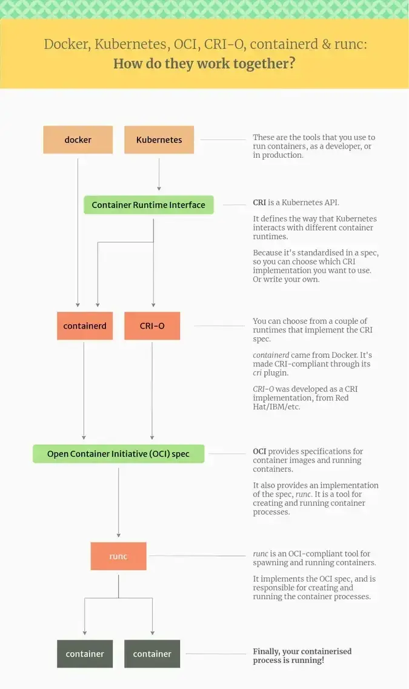
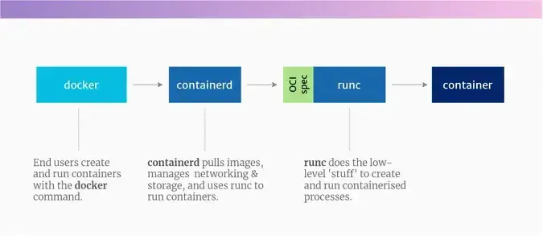

# 容器化时代
Docker创造性出世，利用cgroup namespace隔离提出了容器的概念，后续才发展出了丰富的体系。

## 规范
> [The differences between Docker, containerd, CRI-O and runc | by Vineet Kumar | Medium](https://vineetcic.medium.com/the-differences-between-docker-containerd-cri-o-and-runc-a93ae4c9fdac)  

K8S后来者居上，建立CNCF [Cloud Native Computing Foundation](https://www.cncf.io/) 制定了一系列规范

> Linux基金会建立的 OCI：[Open Container Initiative - Open Container Initiative](https://opencontainers.org/)  

OCI 分为镜像和容器 [OCI Runtime Specification](https://github.com/opencontainers/runtime-spec) [OCI Image Format](https://github.com/opencontainers/image-spec)  
OCI标准的实现有 Docker Podman 
