**目录 start**

1. [Nginx设计与实现](#nginx设计与实现)

**目录 end**|_2021-02-03 17:28_|
****************************************
# Nginx设计与实现
- 《深入理解Nginx：模块开发与架构解析（第2版）》
- 《Nginx高性能Web服务器详解》

> [参考: Nginx从听说到学会](https://www.jianshu.com/p/630e2e1ca57f)  

> 参考 图 1 

Nginx 采用多进程设计(避免锁)，使用master进程管理若干worker进程
- master 进程管理(生命周期管理)多个worker进程，用于升级nginx，更新nginx配置等行为
- worker 进程则处理真正的请求，且 worker 进程间会通过通信协调完成负载均衡

***

> Nginx是事件驱动型的
- 支持的常见事件驱动模型
    - select
    - poll
    - epoll
    - rtsig

***

> 参考 图3

对于传统Web服务器而言，采用的所谓事件驱动往往局限在TCP连接建立、关闭事件上，一个连接建立以后，在其关闭之前的所有操作都不再是事件驱动，这时会退化成按序执行每个操作的批处理模式，这样每个请求在连接建立后都将始终占用着系统资源，直到连接关闭才会释放资源。

