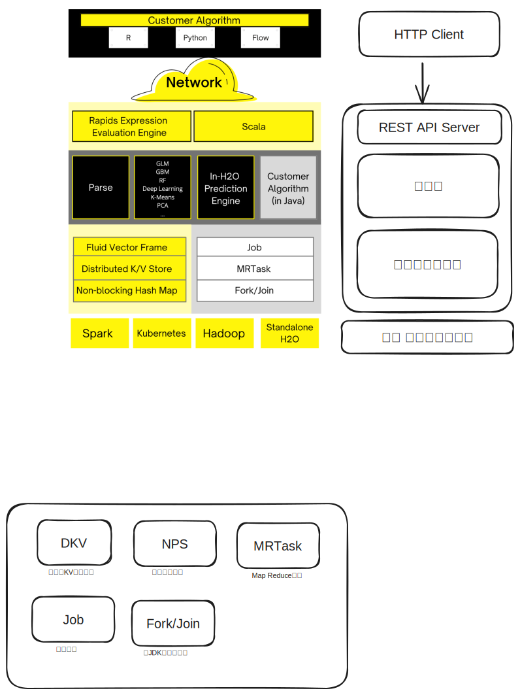
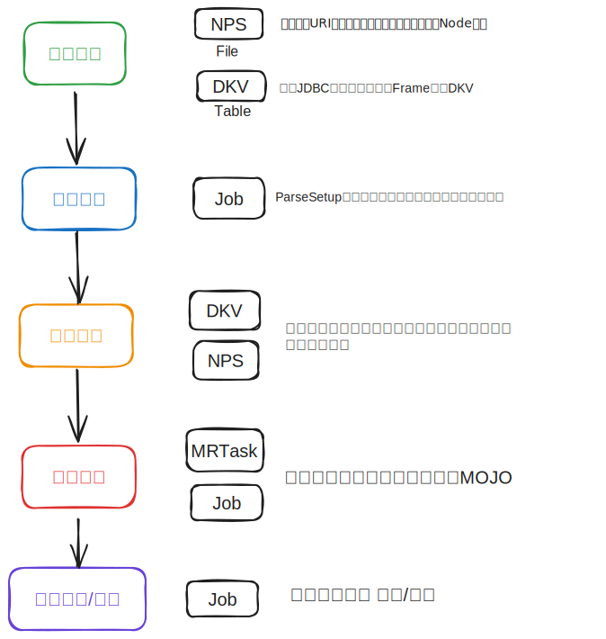

💠

- 1. [机器学习平台](#机器学习平台)
- 2. [商业平台](#商业平台)
    - 2.1. [Azure](#azure)
    - 2.2. [BML](#bml)
- 3. [开源](#开源)
    - 3.1. [Anaconda](#anaconda)
    - 3.2. [Posit](#posit)
    - 3.3. [H2O](#h2o)
        - 3.3.1. [部署](#部署)
        - 3.3.2. [H2O Flow](#h2o-flow)
        - 3.3.3. [H2O-Python](#h2o-python)

💠 2024-08-13 11:47:10
****************************************
# 机器学习平台
> 将机器学习工程化组织的平台

# 商业平台
## Azure
[Azure 机器学习文档](https://learn.microsoft.com/zh-cn/azure/machine-learning/?view=azureml-api-2)

[无需代码经验的机器学习入门第一天 - 训练AutoML 分类模型](https://developer.baidu.com/article/detail.html?id=293344)

## BML
[BML 百度全功能AI开发平台](https://cloud.baidu.com/product/bml)

************************

# 开源
## Anaconda
[Anaconda](https://www.anaconda.com/)

## Posit
[posit](https://posit.co/)

## H2O
> [H2O-3](https://h2o.ai/platform/ai-cloud/make/h2o/)`开源 分布式内存机器学习平台` 类似于 Jupyter Notebook 的数据开发平台
- [Github](https://github.com/h2oai/h2o-3) | [Youtube H2Oai](https://www.youtube.com/@H2Oai)
- 历史还有H2O-2版本， 14年开始做起 [两个项目Star History 对比](https://star-history.com/#h2oai/h2o-3&h2oai/h2o-2&Date)



建模支持的算法
```
    Aggregator
    ANOVA for Generalized Linear Model
    Cox Proportional Hazards
    Deep Learning
    Distributed Random Forest
    Extended Isolation Forest
    Gradient Boosting Machine
    Generalized Linear Modeling
    Generalized Low Rank Modeling
    Information Diagram
    Isolation Forest
    K-means
    Model Selection
    Naive Bayes
    Principal Components Analysis
    RuleFit
    Stacked Ensemble
    TargetEncoder
    Uplift Distributed Random Forest
    Word2Vec
    XGBoost
```

### 部署

- 下载压缩包解压运行h2o.jar之后，可打开一个默认无认证体系的 H2O Flow. 
- 加载数据库驱动 `java -cp h2o.jar:mysql-connector-java-8.0.25.jar -Dsys.ai.h2o.sql.jdbc.driver.mysql=com.mysql.cj.jdbc.Driver water.H2OApp`
- 启动集群 `-flatfile flatfile -name testEnv`
    -  如果是同主机搭建需要不同的进程指定端口，例如 `-port 54323` 内部paxos端口则是参数值+1 54324
    ```
    192.168.1.5:54321
    192.168.1.6:54321
    192.168.1.7:54321
    ```

### H2O Flow
[H2O Flow Tutorial](https://docs.h2o.ai/h2o/latest-stable/h2o-docs/flow.html) [mirror](http://h2o-release.s3.amazonaws.com/h2o/rel-3.44.0/3/docs-website/h2o-docs/flow.html)`H2O Flow GUI操作方式完成全流程`

- [MOJO](https://docs.h2o.ai/h2o/latest-stable/h2o-docs/mojo-quickstart.html)`模型的抽象表示` 导出为GenModel即jar包可部署到应用中。

> 跑GLM的流程
- [GLM Tutorial](https://github.com/h2oai/h2o-3/blob/master/h2o-docs/src/product/tutorials/glm/glm.md)


> [H2o使用分布式随机森林建模分类](https://blog.csdn.net/gpwner/article/details/74058850)

************************

1. [数据处理](https://docs.h2o.ai/h2o/latest-stable/h2o-docs/data-munging.html#data-manipulation)
1. [模型评分](https://h2o-release.s3.amazonaws.com/h2o/rel-yates/1/docs-website/h2o-docs/performance-and-prediction.html)
1. [模型部署](https://docs.h2o.ai/h2o/latest-stable/h2o-docs/productionizing.html)
    - [使用Amazon SageMaker训练H2O模型并对其服务化](https://aws.amazon.com/cn/blogs/china/training-and-serving-h2o-models/)

### H2O-Python

************************

> 同组织项目
- [H2O Wave](https://h2o.ai/platform/ai-cloud/make/h2o-wave/) `开源` 基于动态数据实时渲染仪表板WEBAPI服务 Python实现
- [H2O Driverless AI](https://h2o.ai/platform/ai-cloud/make/h2o-driverless-ai/) `商业化` 将ML工程简化，在交互上构建清晰的工作流程
