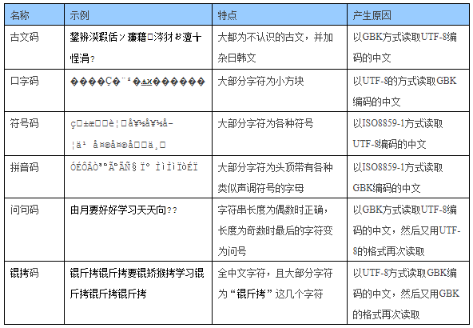

💠

- 1. [字符编码](#字符编码)
    - 1.1. [ASCII](#ascii)
    - 1.2. [ANSI](#ansi)
    - 1.3. [Unicode](#unicode)
        - 1.3.1. [UTF](#utf)
            - 1.3.1.1. [关于 BOM](#关于-bom)
            - 1.3.1.2. [UTF-8](#utf-8)
            - 1.3.1.3. [UTF-16](#utf-16)
            - 1.3.1.4. [UTF-32](#utf-32)
- 2. [汉字编码发展史](#汉字编码发展史)
- 3. [Java中的编码](#java中的编码)
- 4. [乱码](#乱码)

💠 2024-09-09 17:25:40
****************************************
# 字符编码
> [字符编码笔记：ASCII，Unicode 和 UTF-8](http://www.ruanyifeng.com/blog/2007/10/ascii_unicode_and_utf-8.html) | [阮一峰的文章有哪些常见性错误](https://www.v2ex.com/t/343634)

> [参考: Ansi,UTF8,Unicode,ASCII编码的区别](https://blog.csdn.net/xiongxiao/article/details/3741731)
> [参考: 字符编码的前世今生](https://tgideas.qq.com/webplat/info/news_version3/804/808/811/m579/201307/218730.shtml)

- 字符内码(charcter code)指的是用来代表字符的内码.读者在输入和存储文档时都要使用内码,内码分为
    - 单字节内码 -- Single-Byte character sets (SBCS), 也就是第一个字节 0-127 
    - 双字节内码 -- Double-Byte character sets (DBCS), 也就是第二个字节 128-255

字符集编码发展史：ASCII，IOS-8859家族， GB2312和GBK等双字节家族， Unicode字符， UTF 编码家族

************************

## ASCII
> ASCII (American Standard Code for Information Interchange)  美国信息交换标准代码 属于单字节内码 并等同于国际标准ISO/IEC 646

> [Wiki: ASCII](https://en.wikipedia.org/wiki/ASCII)  

1. 0-31 以及 127 是控制字符或通信专用字符 （其余为可显示字符）
1. 32～126(共95个)是字符(32是空格）
    - 其中48～57为0到9十个阿拉伯数字
    - 65～90为26个大写英文字母
    - 97～122号为26个小写英文字母
    - 其余为一些标点符号、运算符号等。

> 注意
>- 在标准ASCII中，其最高位(b7)用作奇偶校验位。 Linux上 `man ascii` 就可以查看完整表
>- 经过扩充后 ascii 可大于127 `ASCII扩展字符`

1. ascii 160 不间断空格 non-breaking space

************************

## ANSI
> ANSI/ISO8859-1-1987 或称 Latin 1  

这个编码就是 ascii 的扩展, 但是只是扩展了一个字节, 然后各个国家的编码又不一致(不同的代码页), 导致了十分混乱
至于简体中文编码GB2312，实际上它是 ANSI 的一个代码页 936

************************

## Unicode
> [wikipedia](https://en.wikipedia.org/wiki/Unicode) | [unicode.org](http://www.unicode.org/) | [unicode table](https://unicode-table.com/cn/)  

Unicode 是一个囊括了世界上所有字符的字符集，其中每一个字符都对应有唯一的编码值, 但是并不是一个已实现的编码方案, 不能直接使用  
基于此套编码值的**编码实现方案**有 UTF-8 UTF-16 UTF-32 ...  目前最新版本 Unicode11 已经包括 137,439 个字符

> 问题: 直接看, 看不到的字符, 可能带来一些坑

|  |  |
|:----|:----|
| 零宽间隔  zero-width space          | `U+200B` |
| NO-BREAK SPACE                     | `U+C2A0` |
| 零宽不折行空格                       | `U+FEFF` html: `&#65279;` |
| 零宽度连字符 (zero-width joiner)     |  \u200D|
| 零宽度断字符 (zero-width non-joiner) | \u200C |
| 左至右符 (left-to-right mark)       | \u200E |
| 右至左符 (right-to-left mark)       | \u200F |

************************

### UTF
> UTF: UCS Transformation Format, UCS: Unicode Character Set

它是将Unicode编码规则和计算机的实际编码对应起来的一个规则。现在流行的UTF有2种：UTF-8和UTF-16.

#### 关于 BOM 
- [wiki: bom](https://en.wikipedia.org/wiki/Byte_order_mark)
- [知乎: 「带 BOM 的 UTF-8」和「无 BOM 的 UTF-8」有什么区别？](https://www.zhihu.com/question/20167122)`微软的习惯`

1. 找出含BOM的文件  `grep -r $'\xEF\xBB\xBF'`
1. 通过 vim 进行转换, 去除 `:set nobomb` 加上 BOM `:set bomb`

思考： 对于有格式的文件来说，无BOM会更省事，但是无格式的文本处理，有BOM会更省事。
- 例如Java的class文件，已经有魔数 CAFEBABE， 不需要BOM来标记字符集编码，因为是二进制的。 以及Linux世界的代码和脚本默认是UTF-8，也不需要BOM
- 但是无格式的文本文件要判断文件的字符编码就会很麻烦了,某文本如果是有中文和英文，直到读取到中文的字节串才能直到整体编码是什么，意味着读完整个文件才能判断出编码，这一点是有风险的。
    - [CharsetDetector](https://tika.apache.org/0.8/api/org/apache/tika/parser/txt/CharsetDetector.html#detect())`如detect方法的注释所述`
    Return the charset that best matches the supplied input data. Note though, that because the detection only looks at the start of the input data, there is a possibility that the returned charset will fail to handle the full set of input data. 

#### UTF-8
> UTF-8 是一种Unicode的实现方式, 是一种`变长编码方案`(1-6 字节), 在表示中文时是采用 `三字节 四字节` 的方式, 已成为WEB领域事实标准编码  
>> 占3个字节的：基本等同于GBK，含21000多个汉字
>> 占4个字节的：中日韩超大字符集里面的汉字，有5万多个

注意： 依据 2003年的标准 UTF8 仅使用 1-4 字节长度

**依据首字节的最高位表示**
- 1 字节 0xxxxxxx 
- 2 字节 110xxxxx 10xxxxxx 
- 3 字节 1110xxxx 10xxxxxx 10xxxxxx 
- 4 字节 11110xxx 10xxxxxx 10xxxxxx 10xxxxxx 
- 5 字节 111110xx 10xxxxxx 10xxxxxx 10xxxxxx 10xxxxxx 
- 6 字节 1111110x 10xxxxxx 10xxxxxx 10xxxxxx 10xxxxxx 10xxxxxx 

> [参考: UTF-8编码规则（转） ](http://www.cnblogs.com/chenwenbiao/archive/2011/08/11/2134503.html)

#### UTF-16
- [CESU-8](https://en.wikipedia.org/wiki/CESU-8)

#### UTF-32
> 每个字符4字节

************************

# 汉字编码发展史
最早是制定的 `GB2312-80` 兼容 `ASCII` 采用的是双字节编码方式, 其中一共编码了6763个常用简体汉字, Big5，是台湾使用的编码标准，编码了台湾使用的繁体汉字，大概有8千多个。
`HKSCS` 是中国香港使用的编码标准，字体也是繁体，但跟 `Big5` 有所不同。  
后来，由于各方面的原因，国际上又制定了针对中文的统一字符集 `GBK` 和 `GB18030` ，其中GBK已经在Windows、Linux等多种操作系统中被实现。  
GBK兼容GB2312，并增加了大量不常用汉字，还加入了几乎所有的Big5中的繁体汉字。但是GBK中的繁体汉字和Big5中的几乎不兼容。  

**GB2312 GBK GB18030 都属于`双字节`字符集 (DBCS)**

> [字体编辑用中日韩汉字Unicode编码表](http://www.chi2ko.com/tool/CJK.htm)  
> [参考: Unicode中文和特殊字符的编码范围](http://www.cnblogs.com/sosoft/p/3456631.html)  
> [参考: 中文标点符号具体unicode码](https://blog.csdn.net/yuan892173701/article/details/8731490)
> [汉字 Unicode 编码范围](https://www.qqxiuzi.cn/zh/hanzi-unicode-bianma.php)

| 类别 | 字数 | Unicode 范围 |
|:----|:----|:----|
| 基本汉字 	     | 20902字 | 4E00-9FA5
| 基本汉字补充    | 74字    | 9FA6-9FEF
| 扩展A 	    | 6582字  | 3400-4DB5
| 扩展B 	    | 42711字 | 20000-2A6D6
| 扩展C 	    | 4149字  | 2A700-2B734
| 扩展D 	    | 222字   | 2B740-2B81D
| 扩展E 	    | 5762字  | 2B820-2CEA1
| 扩展F 	    | 7473字  | 2CEB0-2EBE0
| 康熙部首 	     | 214字  | 2F00-2FD5
| 部首扩展 	     | 115字  | 2E80-2EF3
| 兼容汉字       | 477字  | F900-FAD9
| 兼容扩展 	     | 542字  | 2F800-2FA1D
| PUA(GBK)部件  | 81字   | E815-E86F
| 部件扩展       | 452字  |	E400-E5E8
| PUA增补 	    | 207字  |	E600-E6CF
| 汉字笔画 	     | 36字   | 31C0-31E3
| 汉字结构 	     | 12字   | 2FF0-2FFB
| 汉语注音 	     | 43字   | 3105-312F
| 注音扩展 	     | 22字   | 31A0-31BA
| 〇 	        | 1字    |  3007

************************

# Java中的编码
> [字符、编码和Java中的编码](https://www.jianshu.com/p/1b00ca07b003)  
> [Guide to Character Encoding](https://www.baeldung.com/java-char-encoding)  

> [Java : How to determine the correct charset encoding of a stream](https://stackoverflow.com/questions/499010/java-how-to-determine-the-correct-charset-encoding-of-a-stream)
- [juniversalchardet](https://github.com/albfernandez/juniversalchardet) 通过字节流识别文件的字符集编码
    - UniversalDetector.detectCharset 原理是读取4K字节长度的二进制流，识别编码方案，还会尝试解析BOM头。
- GuessEncoding
- ICU4j
- cn.hutool.core.io.CharsetDetector 字节流识别文件的字符集编码
    - 原理为读取512字节长度后，穷举字符集来解码

************************

# 乱码
> 顾名思义则是用了错误的编码方案去对二进制流解码

