💠

- 1. [编译原理](#编译原理)
    - 1.1. [编译技术](#编译技术)
        - 1.1.1. [JIT](#jit)
        - 1.1.2. [AOT](#aot)
- 2. [词法分析](#词法分析)
- 3. [语法分析](#语法分析)
    - 3.1. [AST](#ast)
- 4. [工具](#工具)
    - 4.1. [Antlr](#antlr)

💠 2023-10-22 02:47
****************************************
# 编译原理

最简单： 词法分析 -> 语法分析 -> 语义分析 -> 代码生成

| 前端 | 中端 | 后端 |
|:---|:---|:---|
| 词法分析 -> 语法分析 -> 语义分析 | -> 平台无关优化 -> 平台相关优化 | -> 寄存器分配 -> 代码生成 |

## 编译技术
### JIT
> Just in time 

在运行时才将源码编译成机器码

### AOT
> Ahead of time 

预先将所源码编译成机器码

************************

# 词法分析

************************

# 语法分析

## AST
> Abstract Syntax Tree 

用处: 错误提示、自动补全、重构、语法检查, 代码混淆, 静态代码分析, 自动生成测试代码 ...

> [参考: 从现在起-彻底学会 js ast](https://segmentfault.com/a/1190000017992387)
> [参考: Java代码分析器(一): JDT入门](https://segmentfault.com/a/1190000000609246)

- [Github: java parser](https://github.com/javaparser/javaparser)`Java生成AST`

# 工具
## Antlr
> [Antlr](https://www.antlr.org/) `ANother Tool for Language Recognition`

> 基于ANTLR的语法制导翻译（内嵌在语法里的语义动作（semantic action），或者是ANTLRv4的回调），还可以实现AST生成、语义检查等功能。
这样借助ANTLR就可以基本覆盖整个编译器前端的需求了。
>- [ANTLR涉及编译原理中的哪些部分？ - RednaxelaFX的回答 - 知乎](https://www.zhihu.com/question/21580602/answer/93736714)

