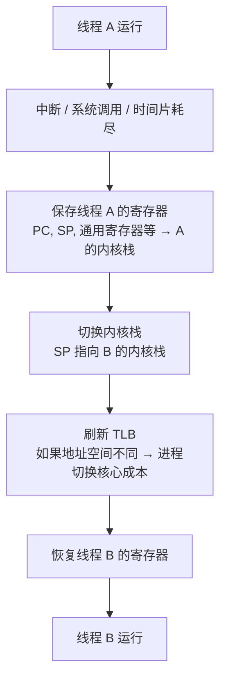
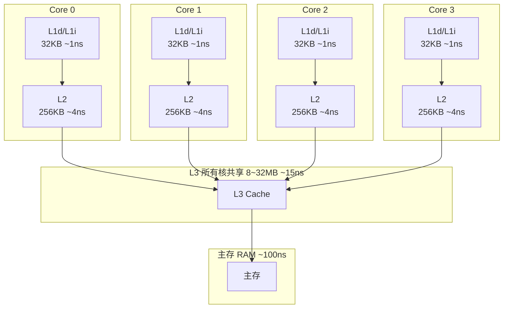
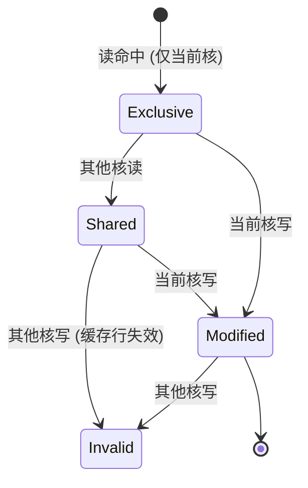
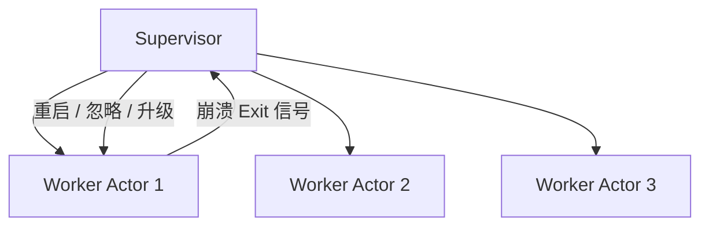
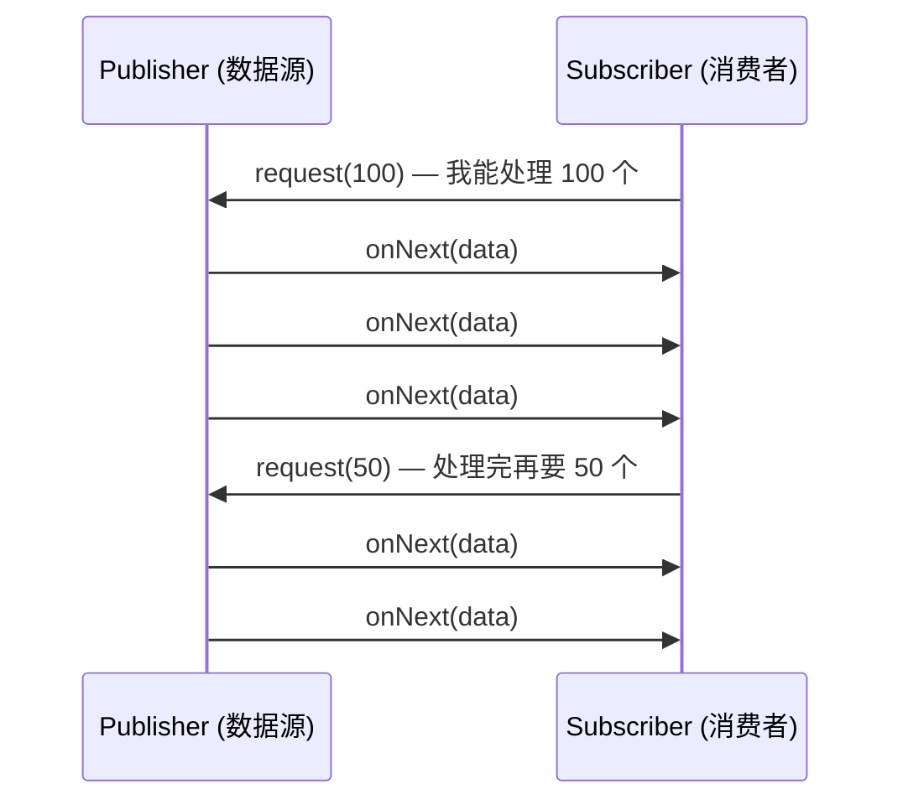
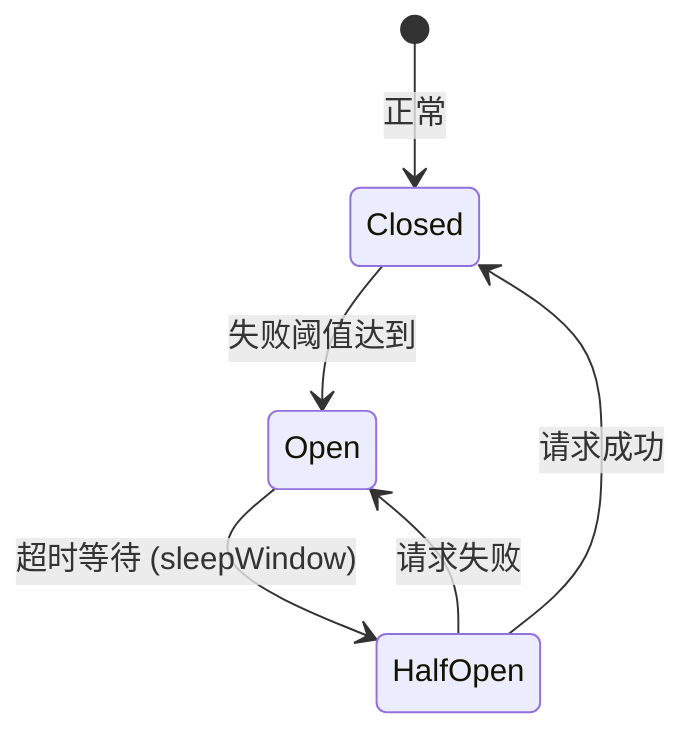
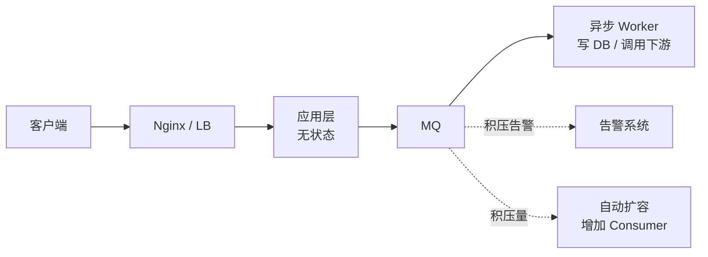

💠

- 1. [并发核心概念与理论](#并发核心概念与理论)
    - 1.1. [同步 vs 异步](#同步-vs-异步)
    - 1.2. [并发 vs 并行](#并发-vs-并行)
    - 1.3. [操作系统调度基石](#操作系统调度基石)
        - 1.3.1. [进程与线程](#进程与线程)
        - 1.3.2. [上下文切换](#上下文切换)
    - 1.4. [数据一致性与内存模型](#数据一致性与内存模型)
        - 1.4.1. [CPU 缓存一致性 (MESI) 与伪共享](#cpu-缓存一致性-mesi-与伪共享)
        - 1.4.2. [原子性、可见性、有序性](#原子性可见性有序性)
        - 1.4.3. [指令重排与内存屏障](#指令重排与内存屏障)
    - 1.5. [协程](#协程)
        - 1.5.1. [有栈 vs 无栈](#有栈-vs-无栈)
        - 1.5.2. [协程异常处理](#协程异常处理)
    - 1.6. [并发控制：锁、无锁与通信模型](#并发控制锁无锁与通信模型)
        - 1.6.1. [悲观锁与互斥同步](#悲观锁与互斥同步)
            - 1.6.1.1. [互斥锁 (Mutex)、读写锁 (RWMutex)、自旋锁 (SpinLock)](#互斥锁-mutex读写锁-rwmutex自旋锁-spinlock)
            - 1.6.1.2. [锁升级与锁优化](#锁升级与锁优化)
            - 1.6.1.3. [死锁的四个必要条件与检测/预防](#死锁的四个必要条件与检测预防)
        - 1.6.2. [乐观锁与无锁并发](#乐观锁与无锁并发)
            - 1.6.2.1. [CAS (Compare And Swap) 原理与 ABA 问题](#cas-compare-and-swap-原理与-aba-问题)
            - 1.6.2.2. [原子变量与分段锁](#原子变量与分段锁)
        - 1.6.3. [CSP 理论与通道通信 (Channel)](#csp-理论与通道通信-channel)
        - 1.6.4. [Actor 模型](#actor-模型)
- 2. [并发实践与架构演进](#并发实践与架构演进)
    - 2.1. [经典并发指标的突破](#经典并发指标的突破)
        - 2.1.1. [C10K C100K 问题](#c10k-c100k-问题)
        - 2.1.2. [C1000K 下的内核调优](#c1000k-下的内核调优)
    - 2.2. [现代高并发的真正瓶颈：有状态中间件](#现代高并发的真正瓶颈有状态中间件)
        - 2.2.1. [关系型数据库](#关系型数据库)
        - 2.2.2. [分布式状态中心过载](#分布式状态中心过载)
    - 2.3. [高并发系统御三家：限流、熔断、削峰](#高并发系统御三家限流熔断削峰)
        - 2.3.1. [背压机制 (Backpressure)](#背压机制-backpressure)
        - 2.3.2. [利用消息队列 (MQ) 进行缓冲隔离](#利用消息队列-mq-进行缓冲隔离)

💠 2026-07-15 16:55:28
****************************************
# 并发核心概念与理论
> 并发编程的理论基础 无关语言 

> [高并发的哲学原理](https://github.com/johnlui/PPHC)

## 同步 vs 异步

> 同步与异步关注的是**调用方式**（调用方是否需要等待结果），阻塞与非阻塞关注的是**调用中线程的状态**（线程在等待时是否被挂起）。

| 维度 | 同步 (Synchronous) | 异步 (Asynchronous) |
|------|--------------------|---------------------|
| 调用方等待 | 发起调用后，必须等待结果返回 | 发起调用后，立即返回，结果通过回调/轮询获取 |
| 线程状态 | 调用线程被阻塞或忙等 | 调用线程可执行其他任务 |
| 典型形式 | 普通函数调用、BIO | Future/Promise、回调、async/await |
| 复杂度 | 简单直观，但效率低 | 编程模型复杂，但资源利用率高 |

```
// 同步：调用者等待结果
result = readSocket()       // 线程卡在这里直到数据到达
process(result)

// 异步：调用者不等待，通过回调获取结果
readSocketAsync(callback)   // 立即返回，线程继续做其他事
// ... 其他工作 ...
// 数据到达时 callback(result) 被调用
```

> [码农翻身:那些烦人的同步和互斥问题](https://mp.weixin.qq.com/s?__biz=MzAxOTc0NzExNg==&mid=2665513371&idx=1&sn=c875f64af83306bffca8dd748f1462ff&chksm=80d679d8b7a1f0ce98a0e3a12409805757cd2e958586c54049121f961cf5b2d236530cd019c7&scene=21#wechat_redirect)

> 这种对`共享变量，共享内存，共享资源`进行访问的程序片段叫做`临界区`，代码在进入临界区之前一定要做好同步或者互斥的操作。  
- 例如在 Java JDK 中，已经对线程的同步做了封装了，对于生产者-消费者问题，可以直接使用 `BlockingQueue`
   - 非常简单，完全不用你去考虑这些 wait, signal, full, empty

> [JAVA 拾遗--Future 模式与 Promise 模式-腾讯云开发者社区-腾讯云](https://cloud.tencent.com/developer/article/1110576)  

## 并发 vs 并行

> "并发是逻辑上的同时发生，并行是物理上的同时发生。" — Rob Pike

| 维度 | 并发 (Concurrency) | 并行 (Parallelism) |
|------|--------------------|--------------------|
| 定义 | 多个任务在**同一时间段**内交替执行 | 多个任务在**同一时刻**同时执行 |
| 核心 | **任务调度**与结构设计 | **硬件执行**与资源利用 |
| 依赖 | 单核 CPU 即可实现 | 必须多核 / 多 CPU |
| 关注点 | 如何处理多个任务（正确性、同步） | 如何加速计算（吞吐量、延迟） |
| 典型例子 | 一个 CPU 交替运行浏览器 + IDE | 8 核 CPU 同时编译 8 个文件 |

```mermaid
gantt
    title 并发 vs 并行
    dateFormat  HH:mm
    axisFormat  %H:%M

    section 并发(单核交替)
    A           :a1, 00:00, 2m
    B           :a2, after a1, 2m
    A           :a3, after a2, 2m
    C           :a4, after a3, 2m
    B           :a5, after a4, 2m

    section 并行(多核同时)
    A           :b1, 00:00, 10m
    B           :b2, 00:00, 10m
```



> 并发属于问题域 (Problem Domain)，并行属于求解域 (Solution Domain)。  
> 并发的核心是**正确性**（如何安全地访问共享资源），并行的核心是**性能**（如何利用多核加速计算）。  
> 并发解决的是有状态的高性能，并行适用于无状态的计算密集场景。

## 操作系统调度基石

### 进程与线程

> 进程是资源分配的最小单位，线程是 CPU 调度的最小单位。

| 维度 | 进程 (Process) | 线程 (Thread) |
|------|----------------|---------------|
| 资源开销 | 独立地址空间（页表、文件描述符表等） | 共享进程地址空间（仅有独立的栈和寄存器） |
| 创建成本 | fork() 复制页表 → 开销大（毫秒级） | pthread_create() 分配栈 → 快（微秒级） |
| 上下文切换 | 切换页表 → TLB 刷新 → 开销大 | 仅切换寄存器 + SP → 开销小 |
| 通信方式 | IPC（管道/共享内存/Socket） | 直接读写共享变量 |
| 隔离性 | 进程间完全隔离，一个崩溃不影响其他 | 线程间共享地址空间，一个段错误全线崩溃 |
| 典型数目 | 一台机器几百个进程 | 一个进程数千~数万线程 |

```
// 进程创建 (Linux)
pid = fork()              // 复制整个进程地址空间（写时复制优化）
if pid == 0:
    exec("my_program")    // 替换为新的程序

// 线程创建 (Linux)
pthread_create(&tid, NULL, func, arg)  // 仅分配一个新的栈 + 线程上下文
```

**写时复制 (Copy-on-Write)：** fork() 时并不真正复制内存页，而是父子进程共享同一份物理页，标记为只读。当任意一方写入时才触发缺页中断复制页面。这使得 fork() 的成本大幅降低，但依然远高于创建线程。

### 上下文切换

> 上下文切换是操作系统的核心开销之一。每次切换，CPU 停止执行当前线程，保存其状态，加载另一个线程的状态。

**完整切换路径（线程 A → 线程 B）：**



**切换开销在哪里：**

| 开销来源 | 量级 | 说明 |
|----------|------|------|
| **寄存器保存/恢复** | ~100ns | 纯 CPU 指令成本，固定可预测 |
| **TLB 刷新** | ~1μs | 进程切换时页表切换 → TLB 全部失效 → 后续访存全部 miss |
| **缓存污染 (Cache Miss)** | ~10μs | 切换后新线程的数据不在 L1/L2 缓存中，热身成本 |
| **内核态入口/退出** | ~100ns | 用户态 ↔ 内核态的权限切换成本 |

```
线程切换 ≈ 1~10μs          ← 纯调度成本
               ↓
线程切换导致缓存缺失 ≈ 0.5~2ms  ← 实际的隐性成本（后续指令全部 cache miss）
               ↓
**真正的开销 ≈ 10~100μs 级别**
```

**核心原则：**
- **线程不是免费的**：1 个线程切换开销看似微小，但 10000 个线程互相争抢 CPU，切换开销会吃掉 30%+ 的 CPU 时间。
- **线程数 ≤ CPU 核数 × 2** 时，上下文切换成本可以接受；超过后每翻一倍，切换开销非线性增长。
- **协程**正是为解决此问题而生——协程切换完全在用户态，不需要陷入内核，只需要保存少量寄存器，成本约 **10~100ns**，是线程切换的千分之一。

## 数据一致性与内存模型

> 内存模型（Memory Model）定义了在多线程环境下，一个线程对共享变量的写入何时对另一个线程可见。Java 有 JMM，Go 有 Go Memory Model，C++ 有 std::memory_order。

### CPU 缓存一致性 (MESI) 与伪共享

**缓存层次结构：**



> 核心问题：Core 0 改了变量 x，Core 1 读到的 x 必须是新值 —— 这就引出了**缓存一致性协议**。

**MESI 协议**（缓存行的四种状态）：

| 状态 | 含义 | 说明 |
|------|------|------|
| **M** (Modified) | 修改 | 该缓存行被当前核修改，与主存不一致，其他核不可读 |
| **E** (Exclusive) | 独占 | 仅当前核持有，与主存一致 |
| **S** (Shared) | 共享 | 多个核持有该缓存行，均与主存一致 |
| **I** (Invalid) | 失效 | 该缓存行已过时，不可用 |

**MESI 状态转换（核心操作）：**



**伪共享 (False Sharing)：** 当两个线程操作的是**不同变量但位于同一缓存行**时，Core 0 修改变量 A → 缓存行变 M → Core 1 的相同缓存行变 I → 即使 Core 1 只操作变量 B，也必须重新加载。这导致本无竞争的变量因缓存行共享而频繁失效，造成性能大幅下降。

```
// ❌ 伪共享：x 和 y 大概率在同一缓存行 (64B)
int x, y;

Thread A: x++   // Core 0 修改 x，缓存行标记 M
Thread B: y++   // Core 1 修改 y → 发现缓存行已失效 → 重新加载 → 性能暴跌

// ✅ 缓存行填充：确保 x 和 y 在不同缓存行
int x;
char pad[60];   // 填充到 64B 对齐
int y;
```

Java 的 `@Contended` 注解和 Go 的 `CacheLinePad` 类型就是用来解决伪共享的。

### 原子性、可见性、有序性

> 并发编程的三座大山：原子性、可见性、有序性。理解了这三点，就理解了 90% 的并发问题。

| 特性 | 定义 | 违反的后果 | 保障机制 |
|------|------|-----------|----------|
| **原子性** | 一个或多个操作要么全部执行成功，要么全部不执行，不可中断 | 计数丢失、状态不一致 | 锁、CAS 指令、原子变量 |
| **可见性** | 一个线程对共享变量的修改，能被其他线程及时看到 | 读到过期的脏数据 | volatile、锁、内存屏障 |
| **有序性** | 程序执行的顺序按照代码的先后顺序执行 | 指令重排导致意外结果 | 内存屏障、happens-before 规则 |

```
// 原子性被破坏
count++   // 不是原子操作！实际是：load → add → store
          // 线程1 load (count=0)，线程2 load (count=0)
          // 线程1 add+store (count=1)，线程2 add+store (count=1)
          // 结果：count=1，丢失一次递增！

// 可见性被破坏
boolean running = true;

// Thread A                    // Thread B
while (running) {              running = false;
    // 死循环！                // 由于 CPU 缓存，A 可能永远看不到 B 的修改
}

// ✅ 用 volatile 修复
volatile boolean running = true;  // 保证可见性：写立即刷入主存，读从主存加载
```

**Happens-Before 规则：** JMM 定义的一套偏序关系，保证在满足某些条件时，A 操作的结果对 B 操作可见。

```
// Volatile 变量规则：对 volatile 变量的写 happens-before 后续对该变量的读
volatile int flag = 0;
int data = 0;

// Thread A                          // Thread B
data = 42;     // 1. 普通写            while (flag == 0) { }
flag = 1;      // 2. volatile 写       int r = data;  // 3. 一定能读到 42 ！
```

**Go 内存模型：** Go 的内存模型比 C++/Java 更简单，主要通过 `sync` 包（Mutex、Once）和 `channel` 来建立 happens-before 关系。Go 不依赖 `volatile`，推荐通过 channel 传递数据来保证可见性。

### 指令重排与内存屏障

> 为了提升性能，CPU 和编译器会对指令进行重排序（Reordering），只要重排后单线程执行结果不变。但在多线程下，这会造成严重问题。

**重排的三个层次：**

```
源代码:        a = 1;     b = 2;     c = a + b;

编译器重排:     b = 2;     a = 1;     c = a + b;   // 不改变单线程语义

CPU 乱序执行:  加载 b     加载 a     计算         // 按资源就绪顺序执行

内存重排 (Store Buffer):  a = 1 的写入可能先进入 Store Buffer
                          后续读先穿透执行，写再异步落内存
```

**一个经典的重排问题（单例双重检查锁 DCL）：**

```
// ❌ 没有 volatile 的单例可能返回未初始化完成的对象
instance = new Singleton();
// 实际可能被重排为：
// 1. 分配内存 (memory = allocate)
// 2. 将 memory 赋值给 instance  (此时 instance != null，但对象还没构造完！)
// 3. 调用构造函数初始化 (init(memory))
// 另一个线程在步骤 2-3 之间读到 instance，拿到一个未初始化的对象！

// ✅ 解决方案：instance 声明为 volatile，禁止重排
private static volatile Singleton instance;
```

**内存屏障 (Memory Barrier)：** 一种 CPU 指令，强制禁止特定类型的重排，并保证可见性。

| 屏障类型 | 作用 |
|----------|------|
| **LoadLoad** | 屏障前的所有读操作完成后，才能执行屏障后的读操作 |
| **StoreStore** | 屏障前的所有写操作完成后，才能执行屏障后的写操作 |
| **LoadStore** | 屏障前的所有读操作完成后，才能执行屏障后的写操作 |
| **StoreLoad** | 屏障前的所有写操作完成后，才能执行屏障后的读操作（最重，全屏障） |

```
// JMM 中 volatile 的底层实现：
// volatile 写 = 普通写 + StoreStore 屏障 + StoreLoad 屏障
// volatile 读 = LoadLoad 屏障 + LoadStore 屏障 + 普通读

// 保证: volatile 写之前的所有普通写都对后续的 volatile 读可见
```

**各语言中的内存屏障：**
- **Java**：`volatile`、`synchronized`、`Atomic*`、`Unsafe.putOrdered*`、`VarHandle` 的 `setOpaque`/`setRelease`/`setAcquire`
- **C++**：`std::atomic<T>` 配合 `memory_order_relaxed`/`acquire`/`release`/`acq_rel`/`seq_cst`
- **Go**：`sync/atomic` 的原子操作提供 `acquire`/`release` 语义，`sync.Mutex` 和 `channel` 提供完整 happens-before
- **Rust**：`Ordering::Relaxed` / `Acquire` / `Release` / `AcqRel` / `SeqCst`，类型系统保证安全访问

```
// C++ 内存顺序示例
std::atomic<int> x{0};
x.store(42, std::memory_order_release);  // 释放语义：之前的写入对 acquire 线程可见
int val = x.load(std::memory_order_acquire);  // 获取语义：看到 release 之前的所有写入
```

> 理解内存模型是掌握并发编程的"内功"。绝大多数业务开发不需要直接和内存屏障打交道（语言运行时已经封装好了），但在编写高性能无锁数据结构、底层框架或跨平台代码时，这是必修课。

## 协程
在计算机科学中，协程（Coroutine）最早由 Melvin Conway 于 1958 年提出。它的抽象定义是

    协程是一种计算机程序组件，它通过允许显式地挂起（Suspend）和恢复（Resume）执行，来实现非抢占式的多任务协作。


| 维度 | Go (Goroutine) | Java 21+ (Virtual Thread) | Rust (Async/Await) | Kotlin (Coroutines) | Python (Asyncio) | JavaScript / TS | C# (DotNet) | C++ 20+ | Erlang / Elixir |
|---|---|---|---|---|---|---|---|---|---|
| 协程类型 | 有栈协程 (Stackful) | 有栈协程 (Stackful) | 无栈协程 (Stackless) | 无栈协程 (Stackless) | 无栈协程 (Stackless)  | 无栈协程 (Stackless) | 无栈协程 (Stackless) | 无栈协程 (Stackless) | 有栈协程 / 进程 (Stackful) |
| 底层实现 | 运行时内核线程复用 | JVM 调度器托管 | 编译期状态机 (Enum) | 延续体传递 (CPS 变换) | 生成器 (Generator) 进化  | 状态机 (由 V8 等引擎转换) | 状态机 (由 CLR 编译器转换) | 编译器生成隐式激活记录 (coroutine_handle) | 虚拟机 BEAM 原生轻量级进程 (Actor 模型) |
| 调度器 | 内置 (GMP 模型) | 内置 (ForkJoinPool) | 需第三方库 (如 Tokio) | 需指定内置/自定义调度器 | 内置事件循环 (Event Loop)  | 浏览器/Node.js 单线程事件循环 | 内置线程池调度器 (TaskScheduler) | 完全没有内置调度器 (需手写或用第三方库) | 虚拟机自带的 M:N 强占式调度器 |
| 核心优势 | 并发极其简单，天然支持多核 | 老旧同步代码无痛升级 | 零内存开销，极致性能，无 GC | 结构化并发，语法极漂亮 | 语法简单，生态丰富  | 彻底避免多线程死锁，I/O 吞吐极高 | 语法极度优雅，结合了高性能与易用性 | 极致的零成本抽象，可由程序员魔改一切 | 恐怖的容错能力（任其崩溃）与天然分布式 |
| 主要劣势 | 栈动态扩容有微小开销 | 某些底层阻塞会锁死线程（Spin问题，JDK24+解决） | 函数染色，生命周期检查极其严格 | 仍依赖 JVM 平台，非完全零成本 | 受限于 GIL 锁，无法利用多核  | 无法利用多核 CPU（需开工作线程） | 存在极其微小的堆分配开销 | 极其底层，API 晦涩，学习曲线极陡 | 语法小众，不适合密集型数值计算 |

- [知乎:协程的讨论](https://www.zhihu.com/question/20511233)

[Go 实现](/Go/GoBase.md#协程-goroutine) | [Kotlin 实现](/Kotlin/KotlinBase.md#协程) | [Python 实现](/Python/PythonConcurrency.md#协程-asyncio) | [Java 实现](/Java/AdvancedLearning/JavaThread.md#协程)

协程运行在用户态。当遇到网络 I/O 阻塞时，协程会主动出让 CPU 核心给其他协程，而底层的 OS 线程（通常等同于 CPU 核心数）一直在满载工作，完全没有内核态调度的开销。

------------------------------
### 有栈 vs 无栈
要彻底理解它们的区别，我们要把目光投向 CPU 和内存。当一个协程被挂起（暂停执行）时，它必须把当前的现场（上下文）保存起来。“有栈”和“无栈”的区别，本质上就是“这个现场保存在哪里”的区别。

- 有栈派 (Go, Java 21, Erlang)：追求 “写代码爽、无脑并发、老代码直接升级”。它们在运行时里塞进了一个极其庞大、聪明的“老大哥（调度器/虚拟机）”来帮你打理一切。
- 无栈派 (Rust, C#, JS, Python, Kotlin, C++)：追求 “少占内存、高吞吐量、跨平台”。它们把压力交给了编译器，在编译时把你的代码拍扁成状态机。
    - 其中 JS/Python 受限于单线程或 GIL 锁，适合纯 I/O；
    - C# / Kotlin 加上了各种语法糖，写起来最舒服；
    - Rust / C++ 则剥离了一切垃圾回收和安全网，让你用最少的内存，去榨干硬件的最后一滴性能。

> 1. 有栈协程 (Stackful) —— “我有自己的小房子”

* 代表语言：Go, Java 21+
* 底层原理：当你创建一个有栈协程时，运行时会在内存中为它分配一段真正的、连续的调用栈空间（就像一个微型的线程栈）。
* 挂起时发生什么：当协程遇到阻塞（比如等待网络），调度器会直接把当前 CPU 的 SP（栈指针寄存器）和 PC（程序计数器）切走，保存到这个协程自己的栈空间里。
* 优点：无感知、极度自由。因为每个协程都有独立的栈，你可以在代码的任何地方、任何嵌套函数深处随时挂起，外层代码不需要做任何修改。
* 缺点：内存开销大。哪怕一个协程只用到了几个变量，它也必须占用几 KB 的栈空间。如果开百万个协程，光是这些栈内存就能把机器撑爆（虽然 Go 实现了栈动态扩容，但依然有开销）。

> 2. 无栈协程 (Stackless) —— “我只是随身带了个记事本”

* 代表语言：Rust, Python, (编译期的) Kotlin
* 底层原理：无栈协程没有自己独立的调用栈。它在执行时，依然借用当前所在的操作系统线程的栈。
* 挂起时发生什么：既然没有自己的栈，那挂起时现场的变量放哪呢？编译器在编译时，会把这个异步函数变成一个结构体（或者叫闭包/状态机对象）。这个结构体里精准地只包含了跨越挂起点时需要的变量。当协程挂起时，这个结构体被保存在堆（Heap）上（Rust 更极致，优先在当前线程栈上，只有 spawn 时才去堆上）。
* 优点：零成本、内存开销低到令人发指。它占用的内存刚好等于它需要的变量大小，可能只有几十个字节。
* 缺点：函数染色（Function Coloring）。因为没有独立的栈，它无法在普通的嵌套函数里挂起。如果一个函数要挂起，它自己必须变成 async/suspend，它的调用者也必须变成 async/suspend，一路向上传染。


在学术和编译器的视角下，表格写 Kotlin 是“无栈协程（Stackless）”是完全正确的。因为 Kotlin 编译后的字节码并没有自己独立的、由它完全控制的 C 语言级别的运行栈，它本质上是通过 CPS（Continuation-Passing Style，延续体传递） 把代码变成了状态机对象，这些对象是存在 Java 堆（Heap） 上的。

但是！在语义表现上，Kotlin 经常被称为“逻辑上的有栈协程”。 为什么？因为“有栈”和“无栈”在写代码时有一个最显著的直观区别：能不能在嵌套函数里直接挂起？

* 纯粹的无栈协程（如 Rust / Python）：如果你在函数 A 里调用了函数 B，而你希望在 B 里面挂起，那么 B 必须是 async 的，同时 A 在调用 B 时必须显式写 await。这就叫“函数染色”。
* 有栈协程（如 Go / Java）：你可以在任何深度的嵌套函数里直接调用阻塞/挂起操作，外层的调用者完全不需要做任何特殊声明。
* Kotlin 的神奇之处：Kotlin 实现了 “隐式挂起”。在 Kotlin 里，如果函数 A 调用了 suspend 函数 B，你不需要写 await！它看起来就像 Go 语言一样顺滑。
    - 因此，很多工程师从“开发体验”的角度，会把 Kotlin 归类为有栈协程，或者叫“伪有栈协程”。

> 💡 形象的比喻

* 有栈协程（Go）：每个协程都是一个独立的小全套公寓。里面有厨房（栈）、有床。切换协程就像是你从 A 公寓搬到 B 公寓，里面什么都有，你在里面干什么（嵌套调用）都很方便，但建公寓很贵（费内存）。
* 无栈协程（Rust）：所有人都在同一个大酒店（线程栈）里轮流办公。当你需要暂停去吃饭时，你不能把你的桌子留在房间里，你必须把你当前手头的工作写在一张便签纸（状态机结构体）上，揣在兜里腾出位子。等轮到你继续时，你坐在桌子前，拿出便签纸看一眼“哦，刚才写到第三行了”，然后继续写。这非常省空间，但你必须时刻带着这张便签纸（显式写 async/await）。

这也解释了为什么 Rust 的异步学起来最痛苦——因为借用检查器（Borrow Checker）会死死盯着你那张“便签纸”，确保你在离开桌子（挂起）期间，便签纸上记录的那些借用指针依然合法！  

在 Go 语言里，你可以在 Goroutine 里随意读写外部变量、传递各类指针，Go 运行时和 GC 会在后台默默帮你处理并发。但 Rust 没有运行时垃圾回收，它必须在编译期确保绝对的线程安全。
这个 Future cannot be sent between threads safely（通常伴随着 within ... the trait Send is not implemented）的报错，就很容易初学时经常出现

### 协程异常处理

1. “古典硬核派”（Go, Node.js, Rust原生）：
    * 态度：宁为玉碎，不瓦全。
    * 逻辑：并发状态太复杂，出了错我不知道内存有没有坏，为了安全，进程直接死，让外部的运维工具（如 K8s / Systemd）去重启我。
2. “包容放任派”（Java 21, Python, C#, 浏览器JS）：
    * 态度：你死你的，我活我的。
    * 逻辑：任务是相互独立的，你崩了不应该影响别人。但代价是程序员必须小心翼翼地去“捞”异常，否则系统里就会充满死掉的“僵尸任务”。
3. “现代工程派”（Kotlin, 开启结构化并发后的 Java）：
    * 态度：同生共死，有序撤退。
    * 逻辑：不让进程无脑死，也不让子任务窝囊死。用“结构化作用域”把大家捆成一根绳上的蚂蚱，一个地方塌方，全队立刻有序收工。


************************

## 并发控制：锁、无锁与通信模型

### 悲观锁与互斥同步

> 悲观锁的核心假设：冲突一定会发生。因此在访问共享资源之前，必须先获取锁，确保独占访问。

#### 互斥锁 (Mutex)、读写锁 (RWMutex)、自旋锁 (SpinLock)

| 锁类型 | 原理 | 适用场景 | 优缺点 |
|--------|------|----------|--------|
| **互斥锁 (Mutex)** | 同一时间只允许一个线程进入临界区，其他线程阻塞休眠 | 临界区操作时间长 | 线程阻塞时让出 CPU，但上下文切换开销大 |
| **读写锁 (RWMutex)** | 多读单写：读读不互斥，读写/写写互斥 | 读远多于写的场景 | 极高读并发，但写可能被读饿死 |
| **自旋锁 (SpinLock)** | 获取不到锁时忙等（循环检查），不切换线程 | 临界区极短（纳秒级） | 避免上下文切换，但浪费 CPU 空转 |

```go
// 互斥锁 (Go)
var mu sync.Mutex
mu.Lock()
// critical section
mu.Unlock()

// 读写锁 (Go)
var rw sync.RWMutex
rw.RLock()  // 读锁
// read only
rw.RUnlock()
rw.Lock()   // 写锁
// write
rw.Unlock()
```

**选型原则：**
- 临界区 > 1ms → Mutex（省 CPU）
- 临界区 < 1μs 且读多写少 → SpinLock（省线程切换）
- 读 : 写 ≈ 9 : 1 以上 → RWMutex

#### 锁升级与锁优化

> 以 JVM 的 `synchronized` 锁升级路径为例，展示现代运行时如何激进优化锁：

```
无锁 → 偏向锁 → 轻量级锁（CAS 自旋） → 重量级锁（OS 互斥量）
```

1. **偏向锁 (Biased Locking)**：同一个线程重复获取同一把锁时，在对象头标记偏向该线程，后续直接进入，连 CAS 都不需要。
2. **轻量级锁 (Lightweight Locking)**：当有另一个线程竞争时，偏向锁撤销，升级为轻量级锁。线程通过 CAS 自旋尝试获取锁，避免线程切换。
3. **重量级锁 (Heavyweight Locking)**：自旋超过阈值或自旋线程数过多，锁膨胀为 OS 内核互斥量，未获取到的线程进入挂起等待。

**其他的编译器/运行时锁优化：**

- **锁粗化 (Lock Coarsening)**：连续的加锁解锁（如循环内频繁 lock/unlock）合并为一次加锁解锁，减少开销。
- **锁消除 (Lock Elimination)**：逃逸分析发现锁对象仅在线程内部使用，根本没有竞争，直接去掉锁。
- **自适应自旋 (Adaptive Spinning)**：JVM 根据上次自旋成功与否动态调整自旋次数（成功则下次多自旋，失败则少自旋）。

#### 死锁的四个必要条件与检测/预防

死锁的四个必要条件（**必须全部满足才会死锁**）：

1. **资源互斥**：资源同时只允许一个线程独占访问。
2. **不可剥夺**：线程已持有的资源不能被其他线程强行抢走。
3. **持有并等待**：线程持有一个资源时，又在等待另一个被其他线程占用的资源，且不释放已有资源。
4. **环路等待**：存在线程集合 {T₁, T₂, ..., Tₙ}，T₁ 在等 T₂ 的资源，T₂ 在等 T₃ 的资源，...，Tₙ 在等 T₁ 的资源。

**检测手段：**
- **等待图 (Wait-for Graph)**：有向图，节点 = 线程，边 = T₁ → T₂ 表示 T₁ 在等 T₂ 持有的资源。存在环则死锁。
- 数据库系统使用 WFG 定期检测死锁并回滚事务。

**预防策略（破坏四个条件中的任意一个即可）：**
- 破坏"不可剥夺" → 超时放弃：`lock.tryLock(timeout)` 获取锁失败时主动释放已有资源。
- 破坏"持有并等待" → 一次性全部分配：要么全部拿到，要么全部不拿。
- 破坏"环路等待" → **锁排序**：所有线程按全局固定的顺序获取锁（如先获取锁 A 再获取锁 B），彻底消除环。
- 破坏"资源互斥" → 无锁数据结构（见下节）。

### 乐观锁与无锁并发

> 乐观锁的核心假设：冲突是罕见的。因此不先加锁，直接操作，仅在提交时检查是否冲突。

#### CAS (Compare And Swap) 原理与 ABA 问题

**原理：** CAS 是一条 CPU 原子指令（`CMPXCHG`），三个操作数：

```
CAS(memory, expected, newValue):
    if *memory == expected:
        *memory = newValue
        return true
    else:
        return false
```

```
// Go 中的 CAS
import "sync/atomic"

var value int64
atomic.CompareAndSwapInt64(&value, old, new)
```

**ABA 问题：** 变量从 A → B → A，CAS 检查时发现值仍是 A，误认为未被修改过。

```
// ABA 场景
线程1: 读取 value = A
线程2: 读取 value = A, 写入 B
线程2: 写入 A
线程1: CAS(A → C) 成功！但实际上 value 已经被改过
```

**解决方案：** 带版本号/时间戳的 CAS（AtomicStampedReference），版本号单调递增，A1 → B2 → A3，CAS 检查 (A,1) 不匹配。

```
// Java 中的带版本 CAS
AtomicStampedReference<Integer> ref = new AtomicStampedReference<>(100, 0);
ref.compareAndSet(100, 200, stamp, stamp + 1);
```

#### 原子变量与分段锁

**原子变量 (Atomic Variables)：** 基于 CAS 的无锁线程安全变量。

| 语言 | 实现 |
|------|------|
| Java | `AtomicInteger`, `AtomicLong`, `AtomicReference` |
| Go | `sync/atomic` 包 (`AddInt64`, `LoadInt64`...) |
| C++ | `std::atomic<T>` |
| Rust | `AtomicI64`, `AtomicBool`, `AtomicPtr` |

**LongAdder（Java）：** 高并发场景下 AtomicLong 的替代方案。AtomicLong 多线程同时 CAS 争抢一个变量会导致大量自旋失败。LongAdder 将计数拆成多个 Cell（一个 base + 一组数组），不同线程 hash 到不同 Cell 上各自累加，最终 sum() 时汇总。
```
// AtomicLong → 单点争抢，并发越高自旋越严重
// LongAdder → 分散到多个 Cell，类似分段思想
LongAdder counter = new LongAdder();
counter.increment();  // 内部线程 hash 到不同 Cell
counter.sum();        // base + cell[0..n]
```

**分段锁 (ConcurrentHashMap)：** 将整个数据分成多个 Segment（分段），每个 Segment 独立加锁。写操作只锁住对应的 Segment，其他 Segment 仍可并发读写。

```
// Java 7 ConcurrentHashMap 分段锁
Segment[] segments          // 默认 16 个 Segment
put(key, val) →             // hash 定位到某个 Segment
    segment.lock()          // 仅锁这一个分段
    segment[key] = val
    segment.unlock()

// Java 8+ 优化为 Node 数组 + CAS + synchronized（锁单个桶，粒度更细）
// 桶内链表超过 8 转为红黑树，防止 hash 碰撞攻击
```

### CSP 理论与通道通信 (Channel)

> **"Don't communicate by sharing memory; share memory by communicating."**
> — Rob Pike (Go 语言之父)

**CSP (Communicating Sequential Processes)：** 由 Tony Hoare 于 1978 年提出的并发模型理论。核心思想是通过**通道（Channel）**在并发实体之间传递消息，而不是通过共享内存 + 锁来同步。

**对比传统锁模型：**

| 维度 | 共享内存 + 锁 | CSP / Channel |
|------|---------------|---------------|
| 同步方式 | 通过锁保护临界区 | 通过 Channel 传递消息 |
| 数据流向 | 多个线程读写同一块内存 | 一个 goroutine 发，另一个收 |
| 心智负担 | 考虑竞争条件、死锁、锁顺序 | 只考虑消息的发送和接收 |
| 组合性 | 嵌套锁容易出问题 | Channel 可以通过 select/select 组合 |

```
// Go: 通过 Channel 通信
ch := make(chan int)

// 生产者
go func() {
    for i := 0; i < 10; i++ {
        ch <- i  // 发送
    }
    close(ch)
}()

// 消费者
for v := range ch {
    fmt.Println(v)
}
```

**Channel 的核心特性：**
- **无缓冲 (Unbuffered)**：同步通信，发送和接收必须同时准备好，否则阻塞。
- **有缓冲 (Buffered)**：异步通信，缓冲区满时发送阻塞，空时接收阻塞。
- **Select 多路复用**：同时监听多个 Channel，哪个就绪执行哪个（类似 Unix `select()`）。

```
select {
case msg := <-ch1:
    // 处理 ch1 消息
case ch2 <- data:
    // 向 ch2 发送
case <-time.After(time.Second):
    // 超时处理
default:
    // 没有任何 Channel 就绪
}
```

**适用场景：**
- 生产者 - 消费者模型
- Pipeline / 流水线模式
- 扇出 (Fan-out) / 扇入 (Fan-in)
- 超时控制 / 定时任务

### Actor 模型

> Actor 模型由 Carl Hewitt 于 1973 年提出，将"万物皆对象"的思想延伸到并发领域。

**核心原则：** 每个 Actor 是一个独立的计算单元，拥有自己的私有状态。Actor 之间通过**异步消息**通信，不共享任何状态。

**三个基本操作：**
1. **Create** — 创建子 Actor
2. **Send** — 向另一个 Actor 发送异步消息
3. **Become** — 改变自己的行为（状态）以处理下一条消息

```
Actor Counter:
    state: count = 0
    
    on receive(msg):
        match msg:
            case Increment: count += 1
            case Get(sender): send(sender, count)
```

**与 CSP 的关键区别：**

| 维度 | CSP (Channel) | Actor |
|------|---------------|-------|
| 通信媒介 | 通道（Channel）作为中间件 | 直接发送消息给 Actor |
| 耦合 | 发送方和接收方通过 Channel 解耦 | 发送方需要知道接收方的地址（PID） |
| 消息投递 | 基于 Channel 的同步/异步 | 完全异步，发完即忘 |
| 容错 | 由程序员自行处理 | 监管树（Supervisor Tree）自动恢复 |
| 典型实现 | Go Channel, Clojure core.async | Erlang/Elixir, Akka (JVM), Orleans (.NET) |

**Actor 模型的容错哲学 —— "任其崩溃" (Let It Crash)：**



Erlang/Elixir 的 Actor 实现中，每个 Actor 运行在独立的 BEAM 进程中（轻量级），拥有自己的 GC。一个 Actor 崩溃不会影响其他 Actor，Supervisor 树提供了层级化的容错机制。

**适用场景：**
- 电信系统（Erlang 最初的设计目标，99.999% 可用性）
- 分布式系统、游戏服务器
- 物联网设备管理
- 需要高容错性和热升级的系统
************************

# 并发实践与架构演进

## 经典并发指标的突破

### C10K C100K 问题

> C10K（1 万并发连接）是 1999 年 Dan Kegel 提出的经典问题，标志着互联网从"能否工作"转向"能否扛住"的分水岭。

**C10K 的核心矛盾：**

| 瓶颈 | 旧方案 (线程/进程每连接) | 突破方案 (事件驱动) |
|------|------------------------|--------------------|
| 文件描述符 | 进程/线程本身也消耗 fd | epoll 单线程管理百万 fd |
| 内存 | 每连接 8MB 栈（线程）→ 80GB | 每连接 4KB 堆 → 400MB |
| 上下文切换 | 万级线程调度 → CPU 耗尽 | 事件循环零切换 |
| I/O 模型 | BIO (blocking) 阻塞等待 | NIO (non-blocking) + 多路复用 |

**关键突破：**
1. **I/O 多路复用**：`select` (1024 限制) → `poll` (无上限但 O(n)) → `epoll`/`kqueue` (O(1)，就绪通知)。
2. **Reactor 模式**：单线程处理连接事件，非阻塞读写，避免线程爆炸。
3. **Nginx**：基于 epoll 的事件驱动架构，用 4MB 内存 + 1 个 worker 进程扛 1 万连接，替代 Apache 的进程每连接模型。

```
// Epoll 的核心 API
epoll_create(size)         // 创建 epoll 实例
epoll_ctl(epfd, op, fd, event) // 注册/修改/删除监听事件
epoll_wait(epfd, events, max, timeout) // 等待就绪事件

// 边缘触发 (ET) vs 水平触发 (LT)
// LT: 只要 fd 可读就不断通知（默认，不易漏事件）
// ET: 状态变化时通知一次，必须一次读完（性能更高，易漏事件）
```

**从 C10K 到 C100K：**
- 单机 Nginx + Node.js / Netty 即可达到 10 万连接
- 瓶颈从"能不能连上"转移到"单机吞吐上限"（带宽、CPU 中断）
- 引入了多进程/多 Reactor（主从 Reactor 模式）

### C1000K 下的内核调优

> 当单机连接数向百万级冲刺时，瓶颈从应用层下沉到**操作系统内核**和**硬件**。

**核心调优方向：**

```
# 1. 文件描述符上限
fs.file-max = 10000000          # 系统级
ulimit -n 1000000               # 进程级

# 2. 端口范围 (客户端连本机)
net.ipv4.ip_local_port_range = 1024 65535  # 默认够，但主动连接不够

# 3. TIME_WAIT 复用
net.ipv4.tcp_tw_reuse = 1       # 允许复用 TIME_WAIT 连接
net.ipv4.tcp_tw_recycle = 0     # 已废弃，NAT 环境下有 bug

# 4. 网络缓冲区
net.core.rmem_max = 16777216    # 读缓冲
net.core.wmem_max = 16777216    # 写缓冲

# 5. 软中断负载均衡 (RPS/RFS)
# 多队列网卡绑定不同 CPU，分摊中断处理
```

**Epoll 的百万连接瓶颈本身已经被突破（水平扩展 CPU 核数即可），真正的瓶颈在于：**

| 瓶颈层次 | 具体问题 | 解决方案 |
|----------|----------|----------|
| **软中断 (SoftIRQ)** | 网卡中断全部落在 CPU0 | RPS (Receive Packet Steering) 分发到多核 |
| **内存** | 百万连接 = 百万 socket 结构体 | 每连接 ~3KB → 百万连接 ~3GB 内存 |
| **惊群效应** | accept/epoll 多进程同时唤醒 | `SO_REUSEPORT` 多核独立监听 |
| **用户态/内核态拷贝** | 频繁系统调用 | 内核旁路 (DPDK / XDP) — 秒杀场景专用 |

> C1000K 已不是遥不可及的目标。2013 年，每秒 1 亿人同时在线的微信春晚抢红包，验证了分布式架构下"亿级并发"的可行性。本质上是**水平扩展**与**无状态化**的胜利。

## 现代高并发的真正瓶颈：有状态中间件

> 应用层通过无状态 + 水平扩展解耦后，瓶颈逐步向下穿透到**有状态中间层**。

### 关系型数据库

**MySQL 的连接数危机：**
- MySQL 默认最大连接数 151，即使调高到 1000+，每个连接消耗 2~4MB 内存
- 应用层 1000 个实例 × 每个实例 10 个连接 = 10000 个连接 → MySQL 直接 OOM

**保护策略：**


1. **连接池 (HikariCP / Druid)**：应用侧池化连接，避免每次请求新建/销毁连接。
2. **数据库中间件 (ProxySQL / MyCat / ShardingSphere)**：多路复用连接，1000 应用 → 代理层 200 连接 → MySQL。
3. **读写分离**：主库写，从库读，分摊读压力。
4. **缓存挡在数据库前面**：Redis / LocalCache 挡住 90%+ 读请求。
5. **异步化**：非核心写操作走 MQ，削峰填谷。

**PostgreSQL 的差异与考量：**

| 维度 | MySQL | PostgreSQL |
|------|-------|------------|
| 连接模型 | 线程 (thread-per-connection) | **进程** (process-per-connection) |
| 每连接开销 | ~2~4MB（线程栈 + 连接缓冲） | ~5~10MB（独立进程，含私有共享内存） |
| 实例最大连接数 | 1000~3000（可调） | **500** 左右即为高水位（再高进程 fork 成本暴涨） |
| 默认连接池 | MySQL 原生无内置池 | PgBouncer / Pgpool-II 几乎是标配 |

**PG 连接数限制更严格的原因：**  
PG 每个连接 fork 一个独立进程，共享内存 `shared_buffers` 被所有进程共享，但每个进程自己的上下文占用更多。连接数超过 500 后，进程调度 + 上下文切换成本显著高于 MySQL 线程模型。`postgresql.conf` 中的 `max_connections` 建议不超过 500，且需要同步调大 `kernel.shmmax` 等内核参数。

**PG 的专用连接池方案：**


- **Session Pooling**：连接在客户端断开后归还池（与普通连接池相同）。
- **Transaction Pooling**：**事务结束后立即归还连接**，回话级状态（如 `SET LOCAL` / 临时表）不能跨事务保留。这是 PG 高并发最推荐的模式——1000 应用连接复用 50 个后端连接。
- **Statement Pooling**：最激进，每个语句执行完后归还，仅用于无状态的 prep 语句。

**PG 的读写分离：**
- 使用 **Streaming Replication**（流复制）：主库写 WAL，备库实时回放。延迟通常在毫秒级。
- Pgpool-II 或内置的 `libpq` 连接字符串可配置 `target_session_attrs=read-write` 自动路由读写到主/备。
- **逻辑复制**（PG 10+）：发布/订阅模式，支持异构同步和版本升级。

**PG 高并发关键调优参数：**

```
# postgresql.conf
max_connections = 200              # 不要超过 500
shared_buffers = RAM * 25%         # 共享缓存，不宜过大（>8GB 需 huge pages）
work_mem = 4MB                     # 排序/哈希操作每连接限额
maintenance_work_mem = 64MB        # VACUUM/索引维护
effective_cache_size = RAM * 75%   # 帮助优化器估算

# 连接风暴保护
max_worker_processes = 8           # 并行查询worker
max_parallel_workers_per_gather = 2
```

### 分布式状态中心过载

> 微服务体系中，注册中心 (Nacos / Eureka / Zookeeper) 和调度中心 (XXL-Job / Elastic-Job) 成为新的单点瓶颈。

**Nacos 的高并发挑战：**
- 每个服务实例启动时注册 + 心跳续约 → 万级实例 = 每秒数万次写请求
- Nacos AP 模式下使用 Distro 协议，写扩散到所有节点
- 解决方案：**Nacos 2.0 gRPC 长连接**替代 1.x HTTP 短连接，减少连接数 100 倍

**XXL-Job 的调度压力：**
- 集中式调度器在 1 万+ 任务下成为瓶颈
- 调度失败 → 重试 → 雪崩
- 替代方案：引入分片逻辑，将调度压力分散到 Worker 端

**通用解决思路：**
- **缓存**：注册信息客户端侧缓存 + Watch 机制（减少读）
- **分片**：一致性 Hash 将状态分散到多个节点
- **异步**：状态变更先落 MQ，后端批量写入

## 高并发系统御三家：限流、熔断、削峰

> "流量是不可预测的，但系统容量是有限的。" —— 这就是限流、熔断、削峰存在的理由。

### 背压机制 (Backpressure)

> 背压（Backpressure）是**流控中的流控**，核心思想：当消费者处理不过来时，主动压慢生产者，而不是丢弃消息或让消费者崩溃。

**实现层次：**

| 层级 | 实现方式 | 代表技术 |
|------|----------|----------|
| 应用层 | 限流 | Sentinel / Hystrix / RateLimiter |
| 传输层 | TCP 滑动窗口 | TCP 的内建背压（接收窗口满 → 发送方停） |
| 流式框架 | 响应式背压 | Reactive Streams (Java), RSocket |

**响应式背压 (Reactive Streams)：**


```java
// Java 限流：Guava RateLimiter（令牌桶）
RateLimiter limiter = RateLimiter.create(100); // 每秒 100 个令牌
if (limiter.tryAcquire()) {
    processRequest();
} else {
    return HTTP 429 Too Many Requests;
}

// Go 限流：官方 x/time/rate
limiter := rate.NewLimiter(rate.Limit(100), 200) // 速率 100/s，桶容量 200
limiter.Wait(ctx)  // 阻塞等待
```

**限流算法对比：**

| 算法 | 原理 | 特点 |
|------|------|------|
| 令牌桶 | 固定速率放令牌，桶满丢弃 | 允许突发流量，平滑限流 |
| 漏桶 | 固定速率流出，超出丢弃 | 强制平滑，无突发能力 |
| 滑动窗口 | 时间窗口内计数，窗口滑动重置 | 精确控制，但窗内峰值可能超限 |
| 自适应限流 | 根据系统负载（CPU/RT）动态调整 | 阿里 Sentinel 的核心，不依赖人工配置 |

**熔断 (Circuit Breaker)：**

> 当调用下游失败率达到阈值，直接熔断（快速失败），不再发送请求 —— 避免下游被压垮 + 调用方阻塞。



### 利用消息队列 (MQ) 进行缓冲隔离

> MQ 是最有效的削峰工具：将突发的请求峰值压平，保护后端系统不被瞬间流量冲垮。


**MQ 在高并发系统中的关键作用：**

1. **削峰填谷**：瞬间洪峰 → MQ 缓冲 → 消费端匀速处理，保护数据库。
2. **解耦**：核心链路与非核心链路分离（如订单完成 → 发短信/积分，失败也不影响下单）。
3. **流量控制**：`consumer 限速`（如 RocketMQ 的 `pull` 模式按需拉取）。
4. **死信 + 重试**：消费失败的消息进入死信队列，异步补偿，不影响正常流量。



**选型对比：**

| MQ | 吞吐量 | 延迟 | 特性 |
|----|--------|------|------|
| Kafka | 百万/s | ms 级 | 日志/大数据/流处理，顺序写极快 |
| RocketMQ | 十万/s | ms 级 | 事务消息、延迟队列，金融场景 |
| RabbitMQ | 万/s | μs 级 | 灵活路由，中小规模首选 |

