💠

- 1. [方向需求](#方向需求)
    - 1.1. [书籍](#书籍)
    - 1.2. [Topic](#topic)
    - 1.3. [系统重构](#系统重构)
- 2. [业务需求](#业务需求)
    - 2.1. [账号安全认证体系](#账号安全认证体系)
    - 2.2. [消息推送](#消息推送)
    - 2.3. [延迟消息](#延迟消息)
    - 2.4. [千万级数据导入](#千万级数据导入)
    - 2.5. [千万级数据导出](#千万级数据导出)
    - 2.6. [商品秒杀](#商品秒杀)
- 3. [数据需求](#数据需求)
    - 3.1. [数据血缘方案](#数据血缘方案)
    - 3.2. [汉字-拼音 处理](#汉字-拼音-处理)
    - 3.3. [敏感词匹配](#敏感词匹配)
    - 3.4. [OCR](#ocr)

💠 2025-04-25 13:53:45
****************************************
# 方向需求
> 关于问题的解决方案

> [饿了么交易系统 5 年演化史 ](http://mp.weixin.qq.com/s?__biz=MzU4NzU0MDIzOQ==&mid=2247489228&idx=1&sn=9baeb5d2cfef853c80068ce8e830ccb2&chksm=fdeb24acca9cadba8ab2055243a97a13b561ee4b3ab0ffba1ab2c8fa7caeae2de0f13b80213e&mpshare=1&scene=1&srcid=&sharer_sharetime=1587047061042&sharer_shareid=246c4b52c1cb45eaa580c985c95107f3#rd)

## 书籍
淘宝技术这十年
亿级流量网站架构核心技术

## Topic
1. 完整设计一个支持数十亿规模的用户系统
1. 如何设计一个支持千万设备推送的消息系统
1. 简单实现一个消息中间件保证消息不重复不丢失
1. 如何设计供应链正逆向系统
1. 如何设计财务对账系统

## 系统重构
> [知乎社区核心业务 Golang 化实践](https://zhuanlan.zhihu.com/p/48039838)`Python所开发的模块使用Go重写`

场景:

思考点:

************************

# 业务需求
> [Admol/SystemDesign: 系统设计面试：内幕指南](https://github.com/Admol/SystemDesign)  

[Global Burden of Disease](https://ghdx.healthdata.org)

## 账号安全认证体系
> [被脱裤也不怕 - 反馈总结](https://blog.coderzh.com/2016/01/13/password-security-additional/)

## 消息推送
站内信： [站内信设计思路之己见（基于上百万用户）](http://www.cnblogs.com/x-xk/archive/2012/11/17/2770935.html)

## 延迟消息
> [ 手把手实现一条延时消息 ](https://www.cnblogs.com/crossoverJie/p/11605814.html)

## 千万级数据导入
场景: 将数据库外的千万或亿级Excel CSV txt等文件导入到数据库

思考点:
1. 导入时 用户并发,数据库资源控制
    - 操作的频率, 导入的效率
1. 应用层资源优化,JVM内存 CPU占用
    - 需要按实际导入端,考虑是经过JVM应用层处理,还是直接利用数据库的附属工具或机制
1. 落库的类型和特点: NoSQL 或 关系型数据库
    - 

方案:

> NoSQL
- MongoDB
- Elasticsearch

> 关系型数据库
1. MySQL
    - 
1. Clickhouse 
    - 
1. GreenPlum 
    - copy 方式, 不经过应用端去做 数据解析和写入

## 千万级数据导出
场景: 数据库内大表输出为 csv,Excel  

思考点: 
- 导出时 用户并发及数据库资源控制
    - 如何在应用层接入端去感知数据库的资源状态, 协同控制并发频率 (比如: 应用层接受到请求,参考数据库资源状态设置并发数和导出数据量的约束, 而不是设置抽象的限流策略)
- 字段多且大存储高
    - 如何平衡数据导出效率 和 应用JVM投入资源
- 使用独占长连接完整SQL查询数据库 和 共享连接查询分批SQL 的取舍 `简单理解为分页和不分页`
    - 独占连接: 完整SQL查询然后不关闭连接使用游标分批去数据库fetch数据, 最后汇总
    - 共享连接: SQL层加分页或者条件范围 查询小批结果集, 最后汇总

方案:
- Java应用层面可以使用JDBC长连接 游标方式查询数据分批读写

## 商品秒杀
[Seckill](https://github.com/hfbin/Seckill)

************************

# 数据需求
## 数据血缘方案
核心流程为 采集 解析 图计算 存储 展示

- 采集： 依据数据库的类型 采集到完备的DML DDL语句(create select, insert,update)， 例如MySQL可解析binlog Greenplum可解析审计日志 等等。
- 解析： ANTLR4将SQL解析为AST，遍历得到每层子查询，每句SQL的有向图
- 图计算： 将前文的若干有向图 合并为一个大图 得到复杂SQL 和 一批独立SQL 完整正确的图，从而得到完整的血缘关系(入度为0 源表，出度为0 目标表)
    - Gremlin Gephi 
- 存储： 图数据库存储以上解析出的全部的图，需考虑节点的唯一标识
- 展示： 图查询,需前端解决海量节点数时的性能问题
- 生命周期或快照： 从业务和存储上来看，此类数据会一直累积，最后图会成为垃圾堆，可监听删除类型的DDL，移除对应的节点和边。以及依据业务特点定期快照历史数据，重建图

> Greenplum/Hive 血缘解析落地方案： 采集SQL，ANTLR4解析为AST 调试规则文件，解析合并图，存入Atlas，查询Atlas

> [讲讲元数据](https://ganjiacheng.cn/article/2020/article_3_%E8%AE%B2%E8%AE%B2%E5%85%83%E6%95%B0%E6%8D%AE/)  

## 汉字-拼音 处理
汉字转换拼音，首字母模糊搜索等功能。

> [汉字转拼音项目pinyin-plus开源](http://www.kailing.pub/article/index/arcid/326.html)

## 敏感词匹配
DFA Bloom过滤器

## OCR
Optical Character Recognition

- 云厂商 例如阿里云，腾讯云等。
- [tesseract](https://github.com/tesseract-ocr/tesseract)
> [opendatalab/MinerU: A high-quality tool for convert PDF to Markdown and JSON.一站式开源高质量数据提取工具，将PDF转换成Markdown和JSON格式。](https://github.com/opendatalab/MinerU)  
