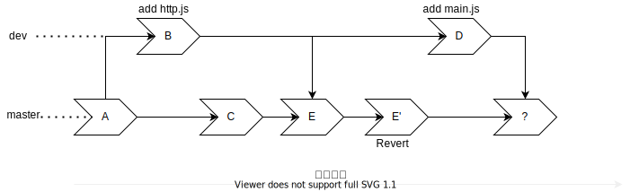

💠

- 1. [Git基础](#git基础)
- 2. [开源许可证](#开源许可证)
- 3. [基本命令](#基本命令)
    - 3.1. [config](#config)
    - 3.2. [clone](#clone)
        - 3.2.1. [Shallow Clone](#shallow-clone)
        - 3.2.2. [sparse checkout 稀疏检出](#sparse-checkout-稀疏检出)
    - 3.3. [add](#add)
    - 3.4. [rm](#rm)
    - 3.5. [status](#status)
    - 3.6. [commit](#commit)
    - 3.7. [restore](#restore)
    - 3.8. [revert](#revert)
    - 3.9. [show](#show)
    - 3.10. [log](#log)
        - 3.10.1. [对比两个分支的差异](#对比两个分支的差异)
        - 3.10.2. [查看文件的修改记录](#查看文件的修改记录)
        - 3.10.3. [查看目录或文件修改频次](#查看目录或文件修改频次)
    - 3.11. [blame](#blame)
    - 3.12. [diff](#diff)
        - 3.12.1. [diff 创建 patch](#diff-创建-patch)
    - 3.13. [apply](#apply)
    - 3.14. [format-patch](#format-patch)
    - 3.15. [am](#am)
    - 3.16. [tag](#tag)
    - 3.17. [notes](#notes)
    - 3.18. [reset](#reset)
        - 3.18.1. [回滚add操作](#回滚add操作)
        - 3.18.2. [回滚最近一次commit](#回滚最近一次commit)
        - 3.18.3. [回滚最近几次的commit并添加到一个新建的分支上去](#回滚最近几次的commit并添加到一个新建的分支上去)
        - 3.18.4. [回滚merge和pull操作](#回滚merge和pull操作)
        - 3.18.5. [在index已有修改的状态回滚merge或者pull](#在index已有修改的状态回滚merge或者pull)
        - 3.18.6. [被中断的工作流程](#被中断的工作流程)
    - 3.19. [gc](#gc)
    - 3.20. [clean](#clean)
- 4. [本地分支](#本地分支)
    - 4.1. [show-branch](#show-branch)
    - 4.2. [stash](#stash)
        - 4.2.1. [stash 创建 patch](#stash-创建-patch)
        - 4.2.2. [恢复被drop的stash](#恢复被drop的stash)
    - 4.3. [branch](#branch)
    - 4.4. [checkout](#checkout)
    - 4.5. [分支合并](#分支合并)
        - 4.5.1. [合并冲突](#合并冲突)
        - 4.5.2. [分支问题排查](#分支问题排查)
    - 4.6. [merge](#merge)
    - 4.7. [rebase](#rebase)
        - 4.7.1. [复杂操作](#复杂操作)
            - 4.7.1.1. [强制删除部分提交记录但是保留文件变更](#强制删除部分提交记录但是保留文件变更)
    - 4.8. [cherry-pick](#cherry-pick)
    - 4.9. [bisect](#bisect)
    - 4.10. [worktree](#worktree)
- 5. [远程操作](#远程操作)
    - 5.1. [remote](#remote)
    - 5.2. [push](#push)
    - 5.3. [fetch](#fetch)
    - 5.4. [pull](#pull)
- 6. [Submodule](#submodule)
- 7. [其他](#其他)
    - 7.1. [gitk](#gitk)
    - 7.2. [grep](#grep)
    - 7.3. [archive](#archive)
    - 7.4. [reflog](#reflog)
    - 7.5. [rev-parse](#rev-parse)
    - 7.6. [scalar](#scalar)
    - 7.7. [githooks](#githooks)
- 8. [配置文件](#配置文件)
    - 8.1. [gitignore](#gitignore)
    - 8.2. [gitattributes](#gitattributes)
- 9. [自定义插件](#自定义插件)

💠 2026-04-23 11:13:12
****************************************

# Git基础
> Git is a free and open source distributed version control system designed to handle everything from small to very large projects with speed and efficiency. -- [git-scm.com](https://git-scm.com/)

> [Official Doc: git](https://git-scm.com/docs) | [Github:git](https://github.com/git/git) | [Arch Wiki: Git](https://wiki.archlinux.org/index.php/Git) | [Gitee: about git](https://gitee.com/all-about-git) | [git-for-windows 安装包镜像源](https://npm.taobao.org/mirrors/git-for-windows/)

- index stage work 三个逻辑分区
  - index: 已经 commit 的内容, 不可更改历史commit
  - stage: 执行 add 命令, 将文件缓存到该区
  - work: 工作目录, 日常做修改的就是该分区

> [gitworkflows Documentation](https://git-scm.com/docs/gitworkflows)  

************************

- [Git LFS](https://git-lfs.github.com/) large file system

> 防止Git仓库存储爆炸
- 不提交源码无关文件： 编译后结果，二进制文件，日志
- 源码中单文件不要太大： 每次修改都会存储该文件的快照，文件大且修改频繁的话会快速占用空间

> [清理大文件](/Skills/Vcs/GitAction.md#清理仓库大文件)

# 开源许可证

> [License](/Skills/Document/License.md)

************************

# 基本命令

> [git-tips](https://github.com/521xueweihan/git-tips) `学习Git的仓库`  
> [git权威指南的组织](https://github.com/gotgit) `完整书籍,以及相关测试题`  

> [使用原理视角看 Git](https://coding.net/help/doc/practice/git-principle.html)  
> [如何高效地使用 Git](https://zhuanlan.zhihu.com/p/30561653)  

> [参考: 重看”Linus Torvalds on Git”视频](http://www.techug.com/post/review-of-linus-torvalds-on-git.html)  
> [GitHub Cheat Sheet](https://github.com/tiimgreen/github-cheat-sheet)  

> 使用 `git help 子命令`, 就能看到子命令对应的文档

## config

- 三种配置方式 作用范围越大, 生效优先级越低
  - `--system` 作用所有用户, 对应文件 `/etc/gitconfig`
  - `--global` 作用当前用户, 对应文件 `~/.gitconfig`
  - (缺省) `--local`作用当前项目, 对应文件 `./.git/gitconfig`
- `git config user.email ***`  和   `git config user.name ***` 这两个是必须的，
- `git config http.postBuffer 524288000` 设置缓存区大小为 500m
- `git config core.fileMode false` 忽略文件的mode变化，一般发生在文件放在挂载盘的时(默认755)
- `git config branch.master.description` **查看**master分支描述信息，命令后附带信息则是**设置**

打开 `~/.gitconfig`文件能够发现这是 ini 格式的配置文件

```ini
[user]
    email = kuangcp@aliyun.com
    name = kuangcp
[core]
    quotepath = false # 配置路径显示为中文
    autocrlf = false
    safecrlf = false
[credential]
    helper = store
```

************************

`diff`配置
> 可用： opendiff kdiff3 tkdiff xxdiff meld kompare gvimdiff diffuse diffmerge ecmerge p4merge araxis bc codecompare smerge vimdiff emerge
> [工具 详细](/Linux/Base/LinuxFile.md#比较文件内容)

> [delta](https://github.com/dandavison/delta) `diff和分页查看git差异` 但是搜索的历史有bug丢数据，配置后忘了这回事还找了半天的less配置问题。

git config --global --get diff.tool
git config --global diff.tool meld

************************

1. git config pull.rebase false  # merge (the default strategy)
2. git config pull.rebase true   # rebase
3. git config pull.ff only       # fast-forward only

************************

## clone

- `git clone URL 目录` 克隆下来后更名为指定目录
- `-b branch` 克隆远程仓库的指定分支  **从Git 1.7.10开始支持**
- `--single-branch` 只克隆当前分支
- `git clone --depth n URL` 只克隆最近n次提交的历史, 能大大减小拉取的大小

只克隆 指定标签或分支 且不包含内容 `git clone -b <tag_name> --single-branch --depth 1 <repo_url>` **大大缩减需下载的仓库大小**

### Shallow Clone

Shallow Clone： `git clone --depth n URL` 克隆的本地仓库

> 限制：

- 但是如果要新建一个分支, 并推送过去，会报错:`shallow update not allowed`
- 拉取远程分支到本地不能直接用 `git checkout -b branch origin/branch` 的方式，
  - 只能用 `git fetch origin branch:branch`
  - 并且跟踪远程也需手动执行 `git push -u origin branch`
  - 并且 git log 的输出不会显示 origin/branch 的指针信息，需要在对应分支上手动执行 `git remote set-branches origin branch` 再 `git fetch`

> 转为完整库的方案：

1. `git fetch --unshallow` 转换为完整仓库
2. 补全历史提交 `git remote set-branches origin '*'` 然后 `git pull` 就会拉取最新所有分支成为可正常checkout的仓库，但仍旧残缺
3. 篡改初始提交，丢弃残缺提交前的提交历史
   - 残缺库的第一个提交会有一个 `graft`的标记
   - START_COMMIT=$(git rev-list master|tail -n 1)
   - git checkout --orphan temp_branch
   - git commit -m "Initial commit"
   - git rebase --onto temp_branch $START_COMMIT master
   - 此时第一个提交hash变化了，graft也消失了，这个提交就成了正常的原始提交
   - 但是注意这个问题：假如master分支做了以上操作，其他同样是残缺提交作为第一个提交的分支（例如dev分支）会无法merge和rebase，push 即已作废，无法修复。 所以需要找一个有最完整提交的分支执行以上操作，然后作废其他同源分支。
   - 如果其他分支（feature/xxx-1.0）都是残缺提交节点后创建的，那就不受影响，因为 git merge-base 会检查到两个分支的祖先节点是一致的，能正常merge和push。
4. 简单粗暴：删除 .git 目录，从头开始

### sparse checkout 稀疏检出

> [参考: git sparse checkout (稀疏检出)](https://www.jianshu.com/p/680f2c6c84de)

1. git init name
2. cd name
3. git remote add origin URL
4. git config core.sparsecheckout true
5. echo "path1/" >> .git/info/sparse-checkout
6. echo "path2/" >> .git/info/sparse-checkout
7. git pull origin master

此时，只会从remote端pull下来符合 sparse-checkout 文件内规则(与 .gitignore 写法一致)的目录或文件，适合拉取大仓库中的局部目录和文件

************************

## add

- 添加文件或目录 `git add file dir ...`
- 添加当前文件夹以及子文件夹 `git add .`
- 交互式添加每个文件的每部分修改 `git add -p`

************************

## rm

- 删除文件 `git rm file1 file2 ...`
- 仅从git仓库中删除文件, 但是文件系统中保留文件 `git rm --cached 文件`
  - 如果仅仅是想从仓库中剔除, 那么执行完命令还要在 `.gitignore` 文件中注明, 不然又add回去了

************************

## status

> git status --help 查看详细介绍

- `-s --short` 简化输出
  - ?? 表示新添加未跟踪
  - A 新添加到暂存区
  - M 修改过的文件
  - MM 修改了但是没有暂存

************************

## commit

> [Official Doc](https://git-scm.com/docs/git-commit)

- `git commit -am "init" `: a git库已有文件的修改进行添加, m 注释
  - `git add * ` 如果有新建立文件就要add 再之后commit就不要a参数了 `git commit -m ""`
  - 如果只是修改文件没有新建 `git commit -am ""`
- `git commit ` 会自动进入VI编辑器
  - 第一行：用一行文字简述提交的更改内容
  - 第二行：空行
  - 第三行：记述更改的原因和详细内容
  - 使用下面方法关闭退出
- `--amend` 追加文件到上次commit
  - 如果上次提交漏了文件, 只需把漏的文件加入到 index区中, 然后执行 git commit --amend 即可
  - 注意: 如果没有将前一个提交推送到远程, 那么没有任何影响,
  - 如果已经推送上去了, 就相当于该次 --amend 操作是新开了个分支完成的修改, git log 里会出现一个分支的环
- `--no-edit` 沿用上次 commit msg
- `--allow-empty` 提交空提交

> [git-cliff](https://github.com/orhun/git-cliff)`从commit信息中提取 changelog`

************************

## restore

- 丢弃所有改动，将 Readme.md
  - 回滚到 master倒数第三个 commit `git restore -s master~2 Readme.md`
  - 回滚至指定提交 `git restore -s commitid filepath`
- 撤销所有Java文件修改 `git restore '*.java'` 注意支持 regex
- 撤销工作目录所有修改 `git restore :/`

************************

## revert

> [Doc](https://git-scm.com/docs/git-revert)

1. 取消所有暂存 `git revert .`
2. 回滚上一次提交 `git revert HEAD`
3. 撤销某次提交 `git revert commitId` 注意该操作可嵌套 即 撤销撤销某次提交
4. 回滚代码至指定提交 `git revert --no-commit 032ac94ad...HEAD`
   - `git commit -m "rolled back"`

> 场景: 一个特性分支不该合并到主开发分支, 但是已经合并了, 并且合并后又做了很多其他修改, 这时候怎么影响最小地撤销这次错误的合并?

1. 找到 merge 的 commitId，git show commitId 找到 Merge: 后两个commitId 分别记为 1 2
2. 如果保留1, 删除2节点提交的内容 则 `git revert commitId -m 1`

************************

## show

> 展示提交的详细信息 注意show和 diff 的输出仅仅相似 不可用于 patch

- 显示当前提交的差异 `git show HEAD`
  - HEAD替换成具体的 commit id就是显示指定提交的修改内容
  - 注意这里有个 `^` 语法 HEAD^ 就是HEAD的前一次，两个就是前两次，commit id 同理
  - 还有一个 `~` 语法 例如 ~2 ~3 就等价于 ^^ ^^^
    - 特别注意 `git show HEAD~2^2` 表示取第前两次提交的第二个父提交， 如果这是一个merge节点的话，否则会报错
    - `第一父提交`是合并时所在分支，`第二父提交`是所合并的分支
  - 可借助 git reflog 命令的输出找到对应的位置 例如 `HEAD{10}`
- 模糊搜索 `git show :/query`

************************

## log

> 更多说明 查看 `git help log` | [Official Doc](https://www.git-scm.com/docs/git-log)

- `-g` 包含 reflog 信息
- `-p` 显示所有提交的修改内容 `git log -p -2` 则仅显示最近两次提交的差异
- `--stat` 查看每一次提交的修改文件修改概述 （pull时看到的那些++--的内容）
    - 默认超过80会折叠成.. 可以手动指定宽度
- `---pretty=[online/short/full/fuller/format]` 使用预定义格式显示
    - format 可自定义格式和占位符 详情查看 -h
- 图形的样子显示分支图 `--graph`
- 显示每个分支最近的提交 `--simplify-by-decoration`
- 输出简短且唯一的 SHA-1 值 `--abbrev-commit`
    - 注意 SHA-1 20 byte长度 出现冲突的概率是 (n*(n-1)/2) / 2^160
- `git log --author='A' `输出所有A开头的作者日志
- `git log 文件名 文件名` 输出更改指定文件的所有commit 要文件在当前路径才可
- `git log --after='2016-03-23 9:20' --before='2017-05-10 12:00' ` 输出指定日期的日志
- `git log --format=format:'%h' --reverse | head -n 1` 获取第一个commit
- `git log --oneline -S "search keyword" --source --all` 全部提交范围内 搜索字符串

- `git shortlog` 按字母顺序输出每个人的日志
    - `--numbered` 按提交数排序
    - `-s` 只显示每个提交者以及提交数量

> **`彩色输出Log`**

```sh
    alias glogc="git log --graph --pretty=format:'%Cred%h%Creset %Cgreen%ad%Creset | %C(bold cyan)<%an>%Creset %C(yellow)%d%Creset %s ' --abbrev-commit --date=short" # 彩色输出
    alias gloga='git log --oneline --decorate --graph --all' # 简短彩色输出
    alias glo='git log --oneline --decorate' # 最简单
    alias glol='git log --graph --pretty='\''%Cred%h%Creset -%C(yellow)%d%Creset %s %Cgreen(%cr) %C(bold blue)<%an>%Creset'\'
    alias glola='git log --graph --pretty='\''%Cred%h%Creset -%C(yellow)%d%Creset %s %Cgreen(%cr) %C(bold blue)<%an>%Creset'\'' --all'
```

### 对比两个分支的差异
> [参考博客 git 对比两个分支差异](http://blog.csdn.net/u011240877/article/details/52586664)

> 分支间 commit 差异

查看**dev有，master没有**的那些提交
- `git log master..dev` 或 `git log dev ^master` (^表示非，等价于 --not)
- 且支持多个分支 `git log dev ^master ^fea/feature1` 表示：在dev有后两个分支没有的commit
- 还可对比远程分支和本地分支的差别 `git log origin/master..master`
- `hash..HEAD` 同分支内查看特定commit之间的提交记录

对比分支的差异： `git log dev...master` 即 非两个分支共有的commit
- 显示出每个提交是在哪个分支上 `git log --left-right dev...master`
- 注意输出： commit 后面的箭头，根据我们在 `–left-right dev…master` 的顺序，左箭头 < 表示是dev的提交，右箭头 > 表示是 master的。

对比两个tag差异 `git log -s "v1.1.0" "^v1.0.6"`

> 分支间 内容差异

`git diff dev master` 查看 从dev分支切换到master分支将会发生的所有修改内容
- 第一个分支可省略，缺省为当前分支

### 查看文件的修改记录

1. `git log fileName` 或者 `git log --pretty=oneline fileName` 更容易看到 sha-1 值
2. git show sha-1的值 就能看到该次提交的所有修改

### 查看目录或文件修改频次
> 查看所有提交修改过的文件

`git --no-pager log --format=format:'%h' --no-merges | awk '{system(" git --no-pager diff  --stat-name-width=300 --name-only "$1" "$1"~") }'`
-  追加 `| sed 's/\/.*//g' | sort | uniq -c | sort -hr` 得到模块分布
- `--stat-name-width=300` 规避路径过长被折叠成...
-  awk 中的 system() 调用命令
- `sed 's/\/.*//g'` 只保留第一级目录
- `--after='2022-01-01 0:00' --before='2023-01-01 0:00'` 追加时间过滤

************************
## blame
> 查看文件提交记录

`git blame file`

************************
## diff
- 默认是将 work 区 和 index 区 进行比较
    - `--cached` stage 区 和 index 区 进行比较, 等同于 `--staged`

```
    git diff [options] [<commit>] [--] [<path>...]
    git diff [options] --cached [<commit>] [--] [<path>...]
    git diff [options] <commit> <commit> [--] [<path>...]
    git diff [options] <blob> <blob>
    git diff [options] [--no-index] [--] <path> <path>
```

> [Github:diff-so-fancy](https://github.com/so-fancy/diff-so-fancy) `一个更方便查看diff的工具` 安装: `npm install -g diff-so-fancy`  

************************

> 查看当前分支和master的文件差异列表 `git diff master --stat=200 --compact-summary`， 在一个时间周期长，改动范围大的功能分支上可以在上线前快速确认下有没有漏SQL执行，漏配置项

[--stat 参数防止路径被折叠](https://git-scm.com/docs/git-diff-files/zh_HANS-CN#git-diff-files---statltgtltgtltgt)

### diff 创建 patch

- 创建分支之间的patch `git diff branch1 branch2 > first.patch`
- 创建分支之间具体文件的patch `git diff branch1 branch2 path/file1 path/file2 > first.patch`
  - 注意文件是命令行当前路径的相对路径
- 创建单文件的patch `git diff filePath > first.patch` 路径为Git项目根路径的相对路径

************************

## apply

> 将patch文件应用到 index区。  Apply a patch to files and/or to the index

- `git apply --ignore-space-change --ignore-whitespace first.patch`
- `patch -p1 < first.patch` git apply失败可以尝试这个方式

************************

## format-patch

> 将patch文件应用为commit。 Prepare patches for e-mail submission
> [参考: How To Create and Apply Git Patch Files](https://devconnected.com/how-to-create-and-apply-git-patch-files/)

> 创建 patch

- `git format-patch -1 commit-sha` 指定commit 创建 patch
  - 参数选项可以为 `-2` `-3`... 数字表示 commit id 之前的 几个 commit 也创建 patch
- `git format-patch master -o patches` 对那些 master分支 中有而当前分支没有的 commit 创建 patch 到 patches 目录
- `git format-patch master  --stdout > total.patch` 将所有patch文件合并为一个

> 使用 patch

使用[am](#am) 或者 [apply](#apply) 命令

************************

## am

> Apply a series of patches from a mailbox

- git am patches/1.patch
- 如果是单纯的搬运 commit 使用 format-patch 创建 patch 然后 使用 am 应用的方式 比 diff  然后 apply 更好， 因为会保留原有commit信息

************************

## tag

> [Official Doc](https://git-scm.com/docs/git-tag/2.10.2)

- 查看所有标签 `git tag`
  - `-l 'v1.0.*'` 列出v1.0.*
  - `git show tagname` 展示标签注释信息
- 新建一个标签并打上注释 `git tag -a v1.0.0 -m "初始版本"`
  - 由指定的commit打标签  `git tag -a v1.2.4 commit-id`
- 切换标签 `git checkout tagname` 和切换分支一样的，但是标签只是一个镜像，不能做提交
- 在某tag上新建一个分支 `git checkout -b branchname tagname`
- 删除本地标签 `git tag -d tagname`
- 删除远程的tag
  - `git push origin -d tag <tagname>`
  - 如果本地已经删除了标签, 就可以 `git push origin :refs/tags/<tagname>`

## notes

> [doc](https://git-scm.com/docs/git-notes)

************************

## reset

> git reset -h

```
用法：git reset [--mixed | --soft | --hard | --merge | --keep] [-q] [<提交>]
  或：git reset [-q] [<树或提交>] [--] <路径>...
  或：git reset --patch [<树或提交>] [--] [<路径>...]

    -q, --quiet           安静模式，只报告错误
    --mixed               重置 HEAD 和索引
    --soft                只重置 HEAD
    --hard                重置 HEAD、索引和工作区
    --merge               重置 HEAD、索引和工作区
    --keep                重置 HEAD 但保存本地变更
    --recurse-submodules[=<reset>]  control recursive updating of submodules
    -p, --patch           交互式挑选数据块
    -N, --intent-to-add   将删除的路径标记为稍后添加
```

> [参考: 使用reset回滚代码](https://www.v2ex.com/t/296286)

### 回滚add操作

- 当执行了 git add 命令, 将文件存入暂存区
- 可以使用 `git reset 文件` 将指定文件 或者 `git reset .` 当前目录(递归) 都取消暂存
- 文件内容没有改变, 这个用于选指定文件提交时

### 回滚最近一次commit

1. `git reset --soft HEAD^` 撤销最近那次 commit 行为
2. 修改代码的内容
3. `git commit -c ORIG_HEAD` 使用撤销的那次 commit 的注释进行提交

> 注意 reset 操作会将老的HEAD会备份到文件 .git/ORIG_HEAD 中，命令中就是引用了这个老的相关信息
> -c 参数是复用指定节点的提交信息

### 回滚最近几次的commit并添加到一个新建的分支上去

1. 新建分支 `git branch feature/new`
2. 删除master分支最近3次提交 `git reset --hard HEAD^3`
3. 切换到新分支上 `git checkout feature/new`

> 相当于是将master上这三次的修改都转移到了这个分支上, master 从来没有过这三次提交一样
> 如果没有在 执行 reset --hard 之前新建分支的话, 这三次提交就永远删除了

> 注意: 这个操作在多人的协作中, reset --hard 比较危险, 可能引起别人分支的混乱

### 回滚merge和pull操作

1. 执行了merge 或者 pull 操作后
2. `git reset --hard ORIG_HEAD` 注意: 该命令会将 index 和 stage 的修改清空

### 在index已有修改的状态回滚merge或者pull

1. `git pull`
2. `reset --merge ORIG_HEAD`

> 使用 --hard 会直接回滚,直接丢失当前未提交的所有更改

### 被中断的工作流程

> 在开发一个功能的时候, 突然有别的需求插进来了, 就可以通过 commit 一次, 然后回滚该次 commit 的方式
> 将工作状态暂存, 且不会产生垃圾提交

************************

## gc

`git gc -h`:

- `--aggressive` 默认使用较快速的方式检查文档库,并完成清理,当需要比较久的时间,偶尔使用即可
- `--prune[=<日期>]` 清除未引用的对
- `--auto` 启用自动垃圾回收模式
- `--force` 强制执行 gc 即使另外一个 gc 正在执行

************************

## clean

> Remove untracked files from the working tree `git clean --help`

`-n` 参数预览删除文件列表

************************

# 本地分支

> Git 的分支是轻量型的, 能够快速创建和销毁

- `@{-1}` 表示checkout的上一个分支 [Release V1.6.2](https://github.com/git/git/blob/master/Documentation/RelNotes/1.6.2.txt)
    - `git rev-parse --symbolic-full-name @{-1}` 展示上一个分支
    - `git merge @{-1}` 将上一个分支合并进来
    - `git branch --track mybranch @{-1}` 设置当前分支track上一个分支

************************

- 获取当前分支名 `git symbolic-ref --short -q HEAD`
- 拉取远程分支到本地并建立同名分支

  - 拉取元数据 `git fetch --all`
  - 建立和远程分支对应的本地分支 `git pull <远程主机名> <远程分支名>:<本地分支名>`

## show-branch

> 按颜色列出分支上的提交和图示

可以查看到每次提交所属的分支

************************

## stash

> [Official Doc](https://git-scm.com/docs/git-stash)

> 将当前修改缓存起来, 避免不必要的残缺提交 stash命令的缓存都是基于某个提交上的修改, 是一个栈的用法

> [参考: Git Stash的用法](http://www.cppblog.com/deercoder/archive/2011/11/13/160007.html) `底下的评论也很有价值, 值得思考`
> [参考: git-stash用法小结](https://www.cnblogs.com/tocy/p/git-stash-reference.html)

> git stash --help 查看完整的使用说明

`基本动作`

- push
  - save命令的进化版，该动作是缺省动作
- list
  - 输出大致为: `stash@{num}: On branchName : comment`
- save
  - save comment 已被废弃
- pop
  - 将最近的stash 应用到当前仓库上, 原有的 stash 就丢弃了，如果pop缓存时发生了冲突 则不会丢弃对应的缓存
- apply
  - 将指定的stash 应用到仓库上, 不丢弃原有的stash
- drop
  - 丢弃指定的stash, 如果想丢弃当前项目所有更改就可以将所有更改 save stash 然后 drop
- clear
  - 清除所有 stash
- branch
  - 从创建缓存处创建新分支出来并pop 默认栈顶缓存，相比于pop和apply，这种方式更贴近缓存被创建时的场景

> push动作 实用参数

1. `--keep-index` `-k` stash 将不缓存 已经被add进index区的内容
2. `--include-untracked` 或 `-u` stash 将缓存未被track的文件
3. `--patch` 交互式选择哪些内容需stash缓存哪些进入index区
4. 如果需要恢复 `stash@{0}: On feature-test: test`
   - 就在 feature-test 分支上建立新分支, 然后 apply stash@{0}
   - 不推荐用 pop, 当stash多了以后 人不一定都记得每个stash都改了啥, 可能会有冲突以及修改覆盖的问题
   - 最好用新分支装起来, 然后合并分支, 或者是 cherry-pick, 修改也不会丢失

> *注意* stash 是一个项目范围内的栈结构, 所以如果多个分支执行了stash, 那缓存都是共用的
> 要先确定好当前分支 stash 的 id (通过记录comment的方式会更好) 再 pop 或者 apply (不能无脑pop 血泪教训)

- 使用该别名能展示当前分支的stash `alias wip='git stash list | grep $(git branch --show-current)' `

### stash 创建 patch

- 查看stash栈某下标(提交)的差异 `git stash show -p stash@{0}`
  - 简化别名 `alias gsh.st='__gshst(){ index=$1; if test -z $index; then index=0; fi; git stash show -p stash@{$index} }; __gshst'`
- 创建 patch `gsh.st > dev.patch`

### 恢复被drop的stash

> [How to recover a dropped stash in Git?](https://stackoverflow.com/questions/89332/how-to-recover-a-dropped-stash-in-git)

可以恢复 stash drop 或者 clean 的内容。stash drop后会输出 `Dropped refs/stash@{0} (......)`， 括号内就是该次stash对应的commitId

- `git fsck --no-reflog | awk '/dangling commit/ {print $3}'`
  - 使用 gitk 显示 `gitk --all $(git fsck --no-reflog | awk '/dangling commit/ {print $3}')`
  - 或者在命令后接管道 ` | xargs git show`, 查找代码内容
- WIP 开头的就是 stash 对应的 commit , 找到对应的 sha1 id 建立新分支即可
  - 也就是说 stash 仍然是采用 分支 来实现的, 在某个分支stash 就相当于在该分支进行 commit

************************

## branch
> 查看所有参数 `git branch --help`

- 列出所有分支(包含本地和远程) `-a --all`
- 按条件显示分支 `--list 'feature*'`
- 列出远程分支 `-r --remote`
- 查看分支详细信息 `-vv` 本地分支和远程分支的关联状态
- 查看包含指定 commit(可以多个) 的分支 `--contains [<commit>]`
  - 对应的则是不包含 `--no-contains [<commit>]` commit 缺省为 HEAD(也就是最近的一次提交)
- 创建分支 `git branch name` 并设置当前分支的对应远程分支 `-t <remote>/<branch>`
- 重命名分支 `-m old new` 对于远程来说就是先要删除再新建分支
- 删除分支 `-d 分支`
  - 如果该分支没有被完全合并, 就会提醒使用 `-D` 强制删除. 等价于 `--delete --force`
- 设置当前分支跟踪的远程分支 `--set-upstream-to=<remote>/<branch> <branch>`
- 查看当前分支合并/未合并的其他分支 `--merged` `--no-merged`

************************

## checkout

> [Official Doc: git checkout](https://git-scm.com/docs/git-checkout)

1. 切换分支 `git checkout feature/a`
1. 切换至上一个分支 `git checkout -` 等价于 `git checkout @{-1}`
1. 切换分支并设置该分支的远程分支 `gh feature/a origin/feature/a`

> 撤销文件修改

- `git checkout .` 取出最近的一次提交, 覆盖掉 work 区下当前目录(递归)下所有已更改(包括删除操作), 且未进入 stage 的内容, 已经进入 stage 区的文件内容则不受影响
    - `git checkout 文件1 文件2...` 同上, 但是只操作指定的文件

- `git checkout [commit-hash] 文件1 文件2...` 根据指定的 commit 对应hash值, 作如上操作, 但是区别在于 从 index 直接覆盖掉 stage 区, 并丢弃 work 区
    - `git checkout [commit-hash] .`
    - **`如在项目根目录执行该命令, 会将当前项目的所有未提交修改全部丢失, 不可恢复!!!!`**, 所以应尽量使用 stash 命令，即使pop也能恢复

- `git checkout [commit-hash] 节点标识符或者标签 文件名 文件名 ...`
    - 取出指定节点状态的某文件，而且执行完命令后，取出的那个状态会成为head状态，
    - 需要执行  `git reset HEAD` 来清除这种状态

> 实验性命令： git switch branch

## 分支合并
> merge rebase squash 三种合并策略

- Merge 会创建合并节点形成环
- Rebase 是通过调整两个分支链上的提交，合并成一个链没有环
- Squash 不是具体命令，做法是将需要合并过去的那些提交撤销得到文件修改，基于这些修改再创建一个新提交。好处是分支图上只有主要合并提交，没有中间提交信息的干扰

[这才是真正的 Git——分支合并](https://zhuanlan.zhihu.com/p/192972614)



Git 在合并分支的时候使用的是 三向合并策略，即当前分支和目标分支的共同祖先commit节点， 和两个分支的当前commmit节点进行比较确定哪一方发生修改需要纳入，如果两方都修改就要提示冲突

根据 Git 的合并策略，在合并两个有分叉的分支（上图中的 D、E‘）时，Git 默认会选择 Recursive 策略。找到 D 和 E’的最短路径共同祖先节点 B，以 B 为 base，对 D，E‘做三向合并。

B 中有 http.js； D 中有 http.js 和 main.js； E’中什么都没有。  
根据三向合并，B、D 中都有 http.js 且没有变更，E‘删除了 http.js(revert会将所有内容操作取反)，所以合并结果就是没有 http.js，没有冲突，然后 http.js 最终被删除了。  
**问题出现了，怎么处理呢？** 其实也很简单，revert掉之前的revert，即 revert E' 节点得到 E''，再将 D 和 E''合并 完成dev合并到master。

### 合并冲突
> 最容易出丢代码问题的情况

Git目前的设计是当两个功能分支合并时，对代码的取舍（选当前分支的内容还是选合入分支的内容），或者编辑和删除，都不会记录在历史中  
不管是 git show commitId ， 还是 git log --stat 都是看不到这次合并的修改情况，只能通过 git log 查看 这个合并是从哪两个commitId 合并而来的  
然后拿合并id去分别diff两个原始合并id，查看差异，或者是基于两个原始合并id重新走一次合并操作得到正确的分支，废弃这次合并的分支。  

> 如何排查哪次提交导致的代码丢失？

利用独特关键字找到功能代码的原始提交 例如方法名或者变量名  `git log --oneline -S "methodName" --source --all`

例如两个人在一个分支上协作。甲在第4次合并时导致了乙方代码被删除，直到几天后发生了几十个提交才发现问题，这个时候如何快速在一堆提交中找到丢代码的那一次提交？  
目前思路为，切到乙提交那一块代码的原始提交 标记为 good，HEAD标记为bad, 循环往复定位到问题提交再修复。  
改进方式： `利用 bisect 命令 执行脚本，通过抓关键字自动完成good和bad的识别，快速找到问题提交`

但是有时候还是无法利用bisect定位到问题提交，得手动按提交依次排查

例如 分支A 合入 分支B，发生冲突了，执行了 git reset ， 然后解决冲突（删了部分分支A的代码），提交后，就会发现这个提交是普通提交，不是合并提交  
没有关联到父级两分支的提交，也不会有分支环图，但是对代码的修改是实际发生并提交的，后续分支A再次合入分支B时 被删除的代码也不会回来（删除动作晚于新增动作）  

### 分支问题排查

- `git merge-base 分支1 分支2` 查看两个分支共同祖先（前提:两个分支通过merge命令发生的合并，如果是rebase则找不到真正的祖先节点）
- `git show-branch 分支1 分支2 分支3` 查看若干分支差异提交情况

## merge

- [官方文档](https://git-scm.com/docs/git-merge)

> [Official Doc: 高级合并](https://git-scm.com/book/zh/v2/Git-%E5%B7%A5%E5%85%B7-%E9%AB%98%E7%BA%A7%E5%90%88%E5%B9%B6)
> [参考: git-merge完全解析](https://www.jianshu.com/p/58a166f24c81)

- `git merge develop` 默认 是 ff(fast forward) 不生成新节点，直接将当前分支指向Develop分支。(一条拐弯的分支线)
  - 推荐: `git merge --no-ff develop` 在当前分支 `主动合并`分支Develop，生成一个新节点，分支图的合并路径清晰
- `--squash` 和 `--no-squash` 该参数和 `--no-ff` 冲突
  - 使用 `--squash` 时，当一个合并发生时，从当前分支和对方分支的共同祖先节点，一直到对方分支的顶部节点内的所有提交内容将修改当前工作区，使用者可以经过审视后进行提交，产生一个新的节点。
  - 这种情况下分支图看不到合并的环，只会看作一个简单的提交
- 如果遇到冲突：
  - `git mergetool` 使用工具进行分析冲突文件方便修改

> 配置mergetool工具kdiff3, 同类的还有meld：

- `git config --global merge.tool kdiff3`
- `git config --global mergetool.kdiff3.cmd "'D:/kdiff3.exe' \"\$BASE\" \"\$LOCAL\" \"\$REMOTE\" -o \"\$MERGED\""`
- `git config --global mergetool.prompt false`
- `git config --global mergetool.kdiff3.trustExitCode true`
- `git config --global mergetool.keepBackup false`

> [merge 策略](https://git-scm.com/docs/merge-strategies)

- Git 2.34 新增 ort 策略

************************

## rebase

> [Official Doc](https://git-scm.com/book/en/v2/Git-Branching-Rebasing)

> 衍和操作 [参考博客](http://blog.csdn.net/endlu/article/details/51605861) |
> [Git rebase -i 交互变基](http://blog.csdn.net/zwlove5280/article/details/46649799) |
> [git rebase的原理之多人合作分支管理](http://blog.csdn.net/zwlove5280/article/details/46708969)
> 这种合并方式，不会像merge方式那样在分支图上出现多个圈，而是线性演进, 而且会改动历史提交id，导致提交不是按时间演进，不利于分布式协作

- 与master合并：`git merge master` 换成 `git rebase master`
- 当遇到冲突：
  - `git rebase --abort` 放弃rebase
  - `git rebase --continue` 修改好冲突后继续

> master 提交了 b,c
> dev 提交了 d,e

```
merge master: 

master: a - b - c 
             \   \
dev:          d - e

rebase master: 

master: a - b - c - d' - e'
```

merge 会保留分支图, rebase 会保持提交记录为单分支。rebase操作其实就是将当前分支的所有提交 逐个cherry-pick到目标分支上去。适合独立开发分支没有推送远程时保持提交树的直观清晰。

### 复杂操作
#### 强制删除部分提交记录但是保留文件变更
例如 ： 有个仓库 ABCDEFG 的顺序提交，也已经推送到远程了，需要删除CDE的提交记录 ，但是CDE提交的文件内容变更要保留

```shell
    # 1. 备份
    git branch backup-branch
    # 2. 找到 B 和 F 的 commit hash
    git log --oneline --graph --all
    # 3. 创建一个临时分支指向 F（在 CDE 之后的第一个提交）
    git branch temp-point F
    # 4. 重置当前分支到 B
    git reset --hard B
    # 5. 使用 merge-base 和 read-tree 将 CDE 的所有变更合并为一次提交
    git merge --squash temp-point
    git commit -m "合并 C、D、E 的修改"
    # 6. 现在将 F 之后的所有内容（包括分叉）rebase 到当前位置
    git rebase --onto HEAD temp-point backup-branch
    # 7. 清理临时分支
    git branch -D temp-point
    # 8. 强制推送
    git push -f origin <branch-name>
```

操作完后，后续提交是准确的，但是改动后的那些提交的hash全变了，而且原先merge产生的分支合并图也会消失

************************

## cherry-pick

> [Official Doc](https://git-scm.com/docs/git-cherry-pick)

- `git cherry-pick <commit-id>`

简单来讲, 就是将指定的某个提交(任意分支上的)上的修改, 重放到当前分支上 和 stash pop 命令相比, 在重放上是一致的， 使修改内容生效，commitId会变化

> 用途

1. 可用于合并已有的若干个提交, 为了改动最小, 一般新建分支来做这件事
   - 例如 功能分支 `fea/something` 上的四个提交其实可以合并, 使得提交信息更清晰, 不冗余, 就可以从 `fea/something`
   - 创建处新建一个分支, 将该分支所有提交进行重放, 需要合并的那几个放一起重放 然后 将四个提交 reset, 再次提交即可

## bisect
> [Git - git-bisect Documentation](https://git-scm.com/docs/git-bisect)  

- [git bisect 命令教程](http://www.ruanyifeng.com/blog/2018/12/git-bisect.html)
- [二分查找捉虫记](http://www.worldhello.net/2016/02/29/git-bisect-on-git.html) `通过分析提交历史查到哪次提交引起的Bug然后检出,修复`

> 完整流程

```sh
  git bisect start  
  git bisect bad             # 标记当前提交是bad 不符合期望
  git bisect good tag/commit # 提交的commitId或者是tag名， 即 基于标记的good和bad作为一段，二分法去切换commit从而找到问题commit

  git bisect good/bad # 标记当前提交是否为期望的内容， 执行后会自动切换commit，循环此操作，直到找到问题commit

  git bisect reset # 找到了问题提交，退出此次 bisect
```

## worktree

> Manage multiple working trees [doc](https://git-scm.com/docs/git-worktree)

************************

# 远程操作

> Git大部分命令都是本地的, 所以执行效率很高, 但是协同开发必须有同步的操作

其实单独的两个主机也能完成同步, 两个主机之间 使用同一个仓库进行开发
两个人互为对方的远程库(使用 git daemon 即可搭建简易服务端), 添加为 remote 即可操作

指定本地开发分支和远程的绑定关系 `git branch --set-upstream dev origin/dev` 而且 一个本地库是能够绑定多个远程的

> Github上fork的项目

**合并对方最新代码**

1. 首先fork一个项目, 然后clone自己所属的该项目下来,假设 原作者为A 自己为B
2. 添加原作者项目的URL 到该项目的远程分支列表中 `git add remote A A_URL`
3. fetch作者的代码到本地 `git fetch A`
4. 在B分支上合并作者分支代码 `git merge --no-ff A/master`
5. push即可

> Github上PR

[Using git to prepare your PR to have a clean history](https://github.com/mockito/mockito/wiki/Using-git-to-prepare-your-PR-to-have-a-clean-history)

************************

## remote

> [Official Doc](https://git-scm.com/docs/git-remote)

1. **常用参数**
   - `add name URL地址` 添加远程关联仓库 不唯一，可以关联多个, 一般默认是origin
   - `set-url name URL地址` 修改关联仓库的URL
   - `rm URL` 删除和远程文档库的关系
   - `rename origin myth` 更改远程文档库的名称
   - `show origin` 查看远程分支的状态和信息
2. 显示本地仓库跟踪的那个远程仓库 `git ls-remote`
3. 查看关联远程仓库的详情(push和pull的地址) `git remote -v`

- [参考: 删除，重命名远程分支](http://zengrong.net/post/1746.htm)

************************

## push

- _常用参数_
    - `-q` 控制台不输出任何信息
    - `-f` 强制推送提交 **使用这个参数时要再三考虑清楚**
        - 受影响的端需要执行 git reset --hard origin/master 才能恢复绑定关系
    - `--all` 推送所有分支
    - `-u` upstream 设置 git pull/status 的上游
        - `git push origin master`和 `git push -u origin master` 区别在于 前者是使用该远程和分支进行推送
        - 后者也是推送, 并设置origin为默认推送的远程, 以后push就不用注明远程名了(多远程的情况下要注意)
    - `-d --delete` 删除引用(分支或标签)

- 删除远程分支
  - `git push origin -d 分支名称`
  - 如果本地已经删除了该分支，就可以 `git push origin :分支名称`
- 第一次将本地分支与远程建立关系
  - `git push -u origin master ` | `git push --set-uptream master` | `git push -all` (会将所有分支一起push)

- 提交指定tag `git push origin tagname`
  - 提交所有tag `git push --tags`

- 出现 `RPC failed; result=22, HTTP code = 411` 的错误
  - 就是因为一次提交的文件太大，需要改大缓冲区 例如改成500m  `git config http.postBuffer 524288000`

************************

## fetch

> 访问远程仓库, 拉取本地没有的远程数据

- 注意 fetch 是一个分支一个分支进行拉取的, 在此基础上可以优化网络不稳定时clone代码的问题
  - 关键是分支之间独立拉取不会像clone拉取所有分支，有分支拉取失败就要从头再来
  - 操作过程: 创建空目录并进入， `git init` 然后 `git fetch URL`
  - 创建 msater分支 `git checkout -b master FETCH_HEAD`
  - 拉取其他分支 `git fetch --all`
- 拉取本地没有的分支（两种方式）
  1. **推荐** 拉取 origin 信息 `git fetch --all` 由远程分支创建新分支并设定跟踪 `git checkout -b dev origin/dev`
  2. 拉取 origin 的 dev 分支 并在本地创建 dev 分支 `git fetch origin dev:dev`
     - 但此时本地的分支并没有 track 远程分支，需要执行 `git push -u origin dev` 进行设置
- 删除远程没有但本地有的那些分支 `git fetch -p`
- `git fetch origin dev-test` 下拉指定远程的指定分支 至 origin/dev-test 但不会创建本地分支

> fetch 不到所有远程分支的原因和解决方案

- 查看fetch的源 `git config --get remote.origin.fetch`
- 需要配置为通配方式 `git config --add remote.origin.fetch "+refs/heads/*:refs/remotes/origin/*"`

************************

## pull

> 不仅仅是 fetch 代码, 还会进行 merge 操作, 所以安全起见, 是先 fetch 然后再手动 merge

- `git pull origin dev` 下拉指定远程的指定分支
- `git pull --all` 下拉默认远程的所有分支代码并自动合并
- 拉取项目所有远程分支到本地

```sh
    git branch -r | grep -v '\->' | while read remote; do git branch --track "${remote#origin/}" "$remote"; done
    git fetch --all
    git pull --all
```

> git pull 默认策略配置

- git config pull.rebase false  # merge
- git config pull.rebase true   # rebase
- git config pull.ff only       # fast-forward only


> error: cannot lock ref 'refs/remotes/origin/test/v1.0.0' : 'refs/remotes/origin/test' exists; 

原因： 由于git的分支都是以目录和文件形式存储，分支名包含 / 时会创建对应的目录, 因此无法同时创建 test 分支和 test/v1.0.0 分支，目录test和文件test冲突了

需要手动删除test分支，或者重命名test/v1.0.0 为 test_v1.0.0 .

上诉错误容易出现在Clone多份仓库时，某份仓库删了test分支并push， 但是这份仓库的 remote 引用管理未清理

清理远程引用:  `git update-ref -d refs/remotes/origin/test`


************************

# Submodule

> [Official Doc](https://git-scm.com/book/en/v2/Git-Tools-Submodules)

> [git submodule的使用](https://blog.csdn.net/wangjia55/article/details/24400501)
> [参考: Git Submodule使用完整教程](http://www.kafeitu.me/git/2012/03/27/git-submodule.html)

- 能够在一个git仓库中将一个文件夹作为一些独立的子仓库进行管理
- 添加子模块 `git submodule add url dir` 目录为可选项

当主仓库 clone 时 只会将子模块作为空目录克隆下来

- 读取 .gitmodules 文件完成子模块的注册 `git submodule init`
- 拉取子模块代码 `git submodule update`

以上两条命令等价于 `git submodule update --init --recursive`

`删除子模块`

1. 删除.gitsubmodule里相关部分
2. 删除.git/config 文件里相关字段
3. 删除子仓库目录

************************

# 其他

## gitk

> 图形化展示分支 需要依赖 tcl tk

## grep

- 搜索文字 `git grep docker`
  - `-n`搜索并显示行号
  - `--name-only` 只显示文件名，不显示内容
  - `-c` 查看每个文件里有多少行匹配内容(line matches):
  - 查找git仓库里某个特定版本里的内容, 在命令行末尾加上标签名(tag reference):  `git grep xmmap v1.5.0`
  - `git grep --all-match -e '#define' -e SORT_DIRENT` 匹配两个字符串

## archive

1. 将某版本打包成压缩包 `git archive -v --format=zip v0.1 > v0.1.zip`

## reflog

- 查看仓库的本地操作日志 仅记录HEAD以及所有分支引用所指向的历史

1. `git reflog` 显示commit操作详情，仅本地保存

## rev-parse

> 该工具是Git内部命令 往往被其他子命令使用

1. 查看分支指向具体的commit id `git rev-parse fea/new`
1. 查看上一个分支 `git rev-parse --symbolic-full-name @{-1}`

## scalar 
> [Git scalar](https://git-scm.com/docs/scalar) 自2.42.1起支持，原理为先稀疏检出，然后定时任务拉取变更

## githooks
实现机制： 一组在`.git/hook/`目录下的shell，在git完成特定行为后会触发执行对应的脚本

- pre-commit：在执行提交操作之前触发。这是一个非常有用的钩子，可以用来进行代码风格检查、静态代码分析、运行测试等操作，确保提交的代码质量。
- pre-push：在执行推送操作之前触发。在这个钩子中，我们可以运行更严格的测试，如集成测试、端到端测试等，以确保准备推送的代码符合质量标准。
- post-commit：在执行提交操作后触发。该钩子可以用于执行一些后续操作，如自动构建、生成文档等。
- post-checkout：在执行检出操作后触发。这个钩子适用于更新依赖、重置配置等与项目状态相关的任务。
- post-merge：在执行合并操作后触发。我们可以在该钩子中执行一些与合并后操作相关的任务。

> 注意hook脚本不会被git纳入版本管理，所以需要手动维护  
> 注意脚本执行的工作目录是仓库根目录  

> [pre-commit](https://pre-commit.com/)  

************************

# 配置文件

## gitignore

> [Github: gitignore](https://github.com/github/gitignore) | 一行则是一个配置，且可以仓库和目录存在不同的配置，git会按就近原则匹配

- 使用 `#` 注释一行
- `test.txt`  忽略该文件
- `*.html`  忽略所有HTML后缀文件
- `*[o/a]`  忽略所有o和a后缀的文件
- `!foo.html`  不忽略该文件

```conf
    */ #忽略所有文件
    build/ #所有build目录
    /build #只忽略当前目录的build, 子目录的不忽略
    *.iml #所有iml文件
    ?.log #忽略所有 后缀为log, 文件名字只有一个字母
    !*.java #不忽略所有java文件
    a.[abc] #忽略 后缀为 a或者b或者c 的文件
    doc/*.txt #忽略 doc一级子目录的txt文件, 不忽略多级子目录中txt
```

************************

## gitattributes

> [gitattributes](http://schacon.github.io/git/gitattributes.html)

1. 配置文件的换行符 eol
2. working-tree-encoding
3. ident
4. filter
5. merge
6. whitespace
7. export-ignore
8. delta
9. encoding

************************

# 自定义插件

> [how-to-create-git-plugin](https://adamcod.es/2013/07/12/how-to-create-git-plugin.html)
